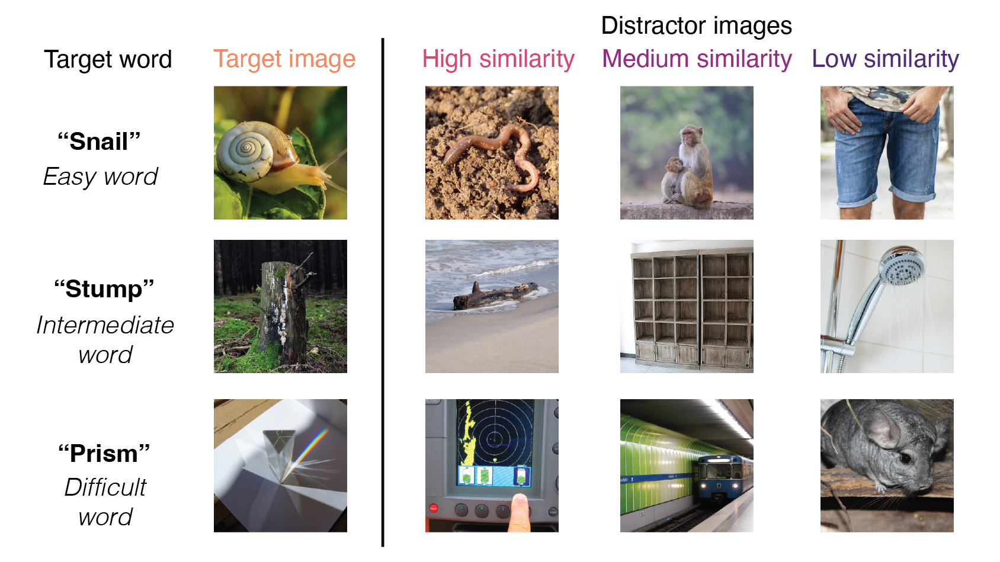

```{r setup, include = FALSE}
library("papaja")
r_refs("r-references.bib")
```

```{r analysis-preferences}
# Seed for random number generation
set.seed(42)
knitr::opts_chunk$set(echo=FALSE, cache=FALSE, warning=FALSE, message=FALSE, fig.pos='H')
```

```{r}
library(tidyverse)
library(lubridate)
library(ggthemes)
library(assertthat)
library(langcog) # for CIs
library(mirt)
library(ggpubr)
library(knitr)
library(dplyr)
library(here)
library(lme4)
library(lmerTest)
library(digest)
library(viridis)

# Create table using broom.mixed and kableExtra
library(broom.mixed)
library(kableExtra)
library(dplyr)
library(patchwork)

# mixed effect models cross validation
library(MuMIn)
```

```{r}
RAW_DATA=TRUE # if within the research team
RAW_DATA=FALSE # if exterior to the research team
```

# Introduction
Across the world’s languages, many words refer to visible things in the environment (e.g. “thermos”, “prism”, “whale”). How precise are the visual representations that underlie children’s understanding of these words—children’s visual concepts? For example, depending on how old a child is (and how much they know about whales) a child might understand that the word whale refers to blue whales—but not whale sharks—or instead only know that a whale is a large animal that lives in the ocean.  Children’s acquisition of the boundaries of visual categories and how they map onto words is a key developmental process, as children who lag behind their peers in vocabulary learning are at increased risk for language delays with significant academic and social consequences (Rescorla & Dale, 2013).

Most empirical work on the precision of children’s visual concepts has focused on the first few years of life, when children learn words at an astonishing rate (Bloom, 2000; Braginsky et al., 2019). In looking-while-listening tasks (Fernald et al., 2008), infants as young as 6 months look to events associated with common nouns like “bottle” and “banana” (Bergelson & Aslin, 2017), and 14- to 18-month-olds extend newly learned words to atypical exemplars of these categories (Weaver, Zettersten, & Saffran, 2024). By around their second birthday, children also generalize nouns to stylized, 3D exemplars (Pereira & Smith, 2009) as they learn that shape is a valuable cue to basic-level category membership. In parallel, empirical work on children’s developing ability to recognize objects (Ayzenberg & Behrmann, 2024) has focused on these first few years of childhood as an important period of developmental change.

An implicit assumption underlying much of this research is that preschoolers and school-aged children’s visual concepts—e.g., their knowledge of what whales “look like” —may not change substantially after they can understand the word “whale” in conversations. On this account, children associate words (e.g., “whale”) with high-fidelity visual information about a particular exemplar (or a few) during learning, and this is sufficient for acquiring the visual concept. Instead, the enrichment for this concept is thought to happen solely at the level of semantics (e.g., “whales eat krill”); on this semantic enrichment hypothesis, later learning during the elementary school years does not influence the content of the visual concepts per se. 

But these assumptions may be incorrect. Perhaps these visual concepts themselves undergo considerable and gradual change beyond the first few years of childhood. On this alternative view, in parallel with learning an increasingly rich semantic space of word meanings, children also develop an increasingly detailed representation of the diagnostic features of these visual concepts, and a better understanding of the boundaries of these visual categories. Indeed, classic theories have long articulated a view of this type, in which children might initially set up a place-holder concept via “fast mapping” but then gradually fill in later details (Carey & Bartlett, 1978; cf. Swingley, 2010; Dale, 1965). An example from this early work focused on a case where three-year-olds remembered that a word (“chromium”) was a color word, but they did not know which color it was.  Similarly, in foundational theories of vocabulary acquisition, children’s vocabulary knowledge has been thought of as progressing along stages (Dale, 1965; Beck et al., 1987), with an intermediate stage where children were thought to have a “vague knowledge of the word’s meaning” (Dale, 1965) before they fully grasp what a word means.  For example, there might be an intermediate phase in which children understand that “whales” are animals that live in the ocean, but have less precision on the visual features that distinguish them from fish and other sea mammals. 

Yet despite this long-standing recognition that children likely have partial word knowledge (Dale, 1965; Carey & Bartlett, 1978), all assessments of receptive vocabulary characterize word knowledge in an all-or-nothing fashion, perhaps because it is indeed difficult to quantify what it would mean to have a low-precision representation for a word (Dale, 1965; Carey & Bartlett, 1978). Both direct measures, such as the Peabody Picture Vocabulary Test (Dunn et al., 2003; Gershon et al., 2014), and parent-report measures of vocabulary knowledge (Braginsky et al., 2019) characterize children as either “knowing” a word or not. Since the distractors for these assessments are chosen carefully, children’s error patterns could in principle reveal evidence for partial knowledge (e.g., selecting a whale shark when the target word is whale), but the datasets resulting from these proprietary assessments are unavailable for re-analysis. 

In parallel, a large literature on expertise suggests that visual learning almost certainly extends throughout early and middle childhood and into adulthood (for reviews, see Curby & Gauthier, 2005; Harel, 2016). Decades of empirical work has established that birding experts, car aficionados (Tanaka & Gauthier, 1997), and graphic artists (Perdreau & Cavanagh, 2013), among others, have both qualitatively and quantitatively different kinds of visual representations for the visual concepts that they have significant expertise with that is reflected in both behavioral and neural responses. Thus, on a visual expertise hypothesis, children’s visual concepts might continually be enriched throughout early and middle childhood. More recent developmental work supports this idea (Long et al, 2024): In a large observational study, children became increasingly able to both depict and recognize line drawings of visual concepts (e.g., “whale”, “clock”, “tiger”) from 3-10 years of age, hinting at underlying changes in how children represent the diagnostic features of these visual concepts. 

Our theoretical accounts of visual concept development have thus been limited by (1) a need for larger developmental datasets with dense data on individual items and (2) the difficulty of systematically quantifying what it means to have a partial or imprecise representation of a visual concept. Here, we take steps to address both of these challenges. We created a new, open-source picture matching task and developed research partnerships with schools across the country in order to gather dense item data across a wide age range (3–14 years) from many children (N=3575 children, N=211 adults).  We built a new, open-source “visual vocabulary” task where children heard a word (e.g., “swordfish”) and had to choose a picture in order to teach aliens about their meanings. We then collected data from a large sample of representative children in both online contexts as well as through research-practice partnership with preschools and elementary school contexts across the U.S. Next, we leveraged modern computational models to choose distractor items systematically and to analyze children’s resulting responses. For each word we chose distractor items that varied in their linguistic similarity to the target word as operationalized via the similarity of the target and distractor words in the language encoder of a multimodal language model (Contrastive Language-Image Pre-training model, or CLIP; Radford et al., 2021), and we used embeddings from the visual encoder to model children’s error patterns. These advances in data and models thus allow us to quantify changes in the precision of children’s visual concepts across early and middle childhood for the first time.

With these data, we investigated three main questions. First, we examined whether we see evidence for continual learning of visual vocabulary knowledge throughout middle childhood (consistent with a visual expertise hypothesis) versus a plateau in performance in the elementary school years (consistent with a semantic enrichment hypothesis). Second, we examined evidence for changes in the precision of visual concepts before word knowledge is solidified, as per Dale (1965)’s account. If younger children's representations are initially overly broad, then we would expect younger children to select distractors of all types when they do not know a word’s exact meaning, and older children to almost exclusively choose high-similarity distractors (e.g., whale sharks); if children bypass this stage where they have lossy representations, then children should choose distractors randomly. Finally, we examined children’s error patterns: if changes in children’s error patterns are driven by their knowledge of what visual information “goes with the word”, then a combination of linguistic and visual similarity metrics should explain variance in children’s error patterns. In contrast, if children are primarily drawn to visually-similar distractors when they do not know a word’s meaning—irrespective of their linguistic similarity to the target word—then visual similarity alone should be a driving factor in children’s error patterns.  


# Method

```{r}

if (RAW_DATA==TRUE) 
{
load(file=here::here('data/preprocessed/all_trial_data.Rdata'))
}
```

```{r}
# summarized across age group/distractor, so okay to shae
load(file=here::here('data/preprocessed/summary_by_distractor.Rdata'))
```

```{r}
# Load all metadata we'll need for the items
test_corpus <- read_csv(here::here("data/item_metadata/new_test.csv")) %>%
  filter(!Word1 %in% c('honey','scrabble')) # manually excluded after piloting
```

```{r}
# Load clip correlations
item_meta_data <- read_csv(here::here("data/item_metadata/exp1_all_trials2023-04-11.csv")) %>%
  select(Word1, Word2, trial_type, AoA_Est_Word2, AoA_Est_Word1) %>%
  rename(wordPairing = trial_type, targetWord = Word1, answerWord = Word2) %>%
  filter(targetWord %in% unique(test_corpus$Word1))  %>%
  ungroup() %>%
  mutate(AoA_Bin = ntile(AoA_Est_Word1,3)) %>%
  mutate(AoA_Bin_Name = factor(AoA_Bin,  levels = c('1','2','3'), labels = c("Easy Words", "Harder Words", "Difficult Words"))) 
```


```{r}
# Join with metadata about the text/image/multimodal simialrities
item_meta_and_model_sim = read_csv(file=here::here('data/item_metadata/vv_clip_similarities.csv')) %>%
  rename(targetWord = target, answerWord = image)  %>%
  filter(answerWord != targetWord)  %>%
  right_join(item_meta_data)
```


```{r procedure-figure, echo=FALSE, fig.cap="Example trials that depicted easy, intermediate, and difficult words, as operationalized via estimated age-of-acquisition (Kuperman et al., 2013); each target word image is taken from shown alongside the three distractors that varied in similarity to the target word; distractors were chosen via the similarity of the target and distractor words in the language encoder of CLIP (Radford et al., 2021). ", out.width="100%", fig.align='center'}

```


.

## Participants

```{r}
if (RAW_DATA==TRUE){
n_by_age_group <- df.4AFC.trials.clean %>%
  group_by(age_group) %>%
  summarize(num_participants = length(unique(pid)))

trials_by_participant <- df.4AFC.trials.clean %>%
  group_by(pid) %>%
  summarize(mean_pc = mean(correct), num_trials = length(unique(targetWord)))

longitudinal_participants <- sum(trials_by_participant$num_trials>80)

by_cohort = df.4AFC.trials.clean %>%
  group_by(cohort) %>%
  summarize(num_participants = length(unique(pid))) %>%
  mutate(cohort = replace_na(cohort,'adults'))

save(n_by_age_group, trials_by_participant, longitudinal_participants, by_cohort, file=here::here('data/preprocessed/descriptives_data_structures.RData'))

}

if (RAW_DATA==FALSE){
  load(file=here::here('data/preprocessed/descriptives_data_structures.RData'))
}

```

To obtain a large sample of responses for individual items across development, we collected data from children across several different testing contexts, totaling $N$ = `r sum(by_cohort$num_participants)` unique participants. We collected data from children in an in-person preschool ($N$ = `r by_cohort$num_participants[by_cohort$cohort=='bing']`, 3-5 year-olds), from the Children Helping Science (CHS) Platform, ($N$=`r by_cohort$num_participants[by_cohort$cohort=='garden']`, 3-7 year-olds), and representative samples from schools across the United States through the [BLINDED] platform $N$=`r by_cohort$num_participants[by_cohort$cohort=='schools']`, 5-14 year-olds) (BLINDED et al.). We also recruited adults online ($N$=`r by_cohort$num_participants[by_cohort$cohort=='adults']`) via Prolific; we sampled from monolinguals and adults who spoke English as a second language to maximize our chance of finding item variability. Schools included seven public school districts (14 schools), three independent schools specializing for students with learning differences, two independent schools, and one summer program; these diverse student data were obtained through research-practice partnerships. Most school-aged participants responded directly via clicking through a laptop or tapping through a tablet  or a tablet, except those recruited online through CHS and Prolific; children’s parents responded via clicking on the image on CHS, and adults responded via clicking on the images.

Children completed, on average, `r mean(trials_by_participant$num_trials)` trials that were sampled randomly from the stimulus set (maximum = 86; different maximum numbers of trials were included in different testing contexts). 
All participants who contributed data and scored above chance (chance = 25%, threshold of >30% accuracy) were included, regardless of the number of trials they completed (minimum trials = `r min(trials_by_participant$num_trials)`, maximum trials = `r  max(trials_by_participant$num_trials)`. Some participants participated in the game more than once ($N$ = 214 children), and their data are included as if they completed additional trials; note that our statistical models include random intercepts for each participant and operate at the trial level; however, excluding these participants did not change the pattern of results.
We excluded an additional 84 participants who scored near chance on 4AFC trials (< 30% accurate) and were school-aged (>6 years of age); these participants completed an average of 17.72 trials.  

## Materials
We capitalized on publicly available existing image and audio databases to generate trials. Visual concepts were taken from the THINGS+ dataset (Stoinski et al., 2023), after filtering out non-child safe images (e.g., weapons, cigarettes) and images with low-nameability (<.3), as per Stoinski et al., 2023. We used the copyright-free, high-quality image released for each visual concept. We subset to visual concepts that had available age-of-acquisition (AoA) ratings from a previous existing dataset (Kuperman, 2012) where adults were asked to retrospect on the age that they learned a word in development; these estimated AoAs were used as a proxy for item difficulty. Audio for each target word was taken from the MALD database (Tucker et al., 2019). 

We used these stimuli to create trials that contained a target image paired with distractor images of similar difficulty (estimated using AoA) and varying similarity (estimated using a computational model). To do so, we sampled distractors with high, medium, and low similarity to the target word as operationalized via the embedding similarity of the words in the language encoder of a multimodal large language model (Radford et al., 2021).We determined high-, medium-, and low-similarity values relative to the distribution of all possible target-distractor similarity values for each word in the THINGS+ dataset. Stimuli were selected to optimize for having a maximum number of trials with unique target and distractors; in addition, we constrained the sampling such that target-distractor pairs had estimated AoA within 3 years of each other. For each target word, we first selected a high-similarity distractor that had the highest cosine similarity to the target (and was itself not one of the target words). For low-similarity words, we sampled a unique distractor word that had the lowest cosine similarity among the remaining distractors. For medium-similarity distractors, we then randomly sampled a distractor word that was the same animacy as the target word, and unique to the dataset. In our final set, we had 108 items with a range of different estimated age-of-acquisitions (e.g., hedgehog, mandolin, mulch, swordfish, waterwheel, bobsled) with all unique targets and distractors.  All stimuli and their metadata are available on the public repository for this project (BLINDED). 
	
## Model features
We obtained all model features using the Open AI available implementation of CLIP available at https://github.com/openai/CLIP. For language similarity, we computed the cosine similarity of the embeddings of the target word to each distractor word on each trial (e.g., tulip – rose, tulip – glove, tulip – hubcap). For visual similarity, we repeated this procedure but by obtaining image similarity vectors in the vision transformer for each target image and distractor image on each trial. For multimodal similarity, we computed the cosine similarity of the embedding of the target word in the language model to the embeddings for each of the distractor images; this is possible because the embedding spaces for the vision and language transformers in the CLIP model are aligned and have the same number of dimensions. All code is available on the repository associated with this project.


Procedure
Children were invited to participate in a picture matching game where they were asked to “teach aliens on another planet about some of the words on our planet”; children picked a particular alien to “accompany them on their journey.” Before the images appeared, children heard a target word (e.g., “apple”) and then were asked to “choose the picture that goes with the word”. The four images appeared in randomized locations on the screen, and one of the images always corresponded to the target word (see \ref{fig:procedure-figure}). On practice trials, the distractor images were all very dissimilar to the target concept, and the target word was relatively easy. The game played a chime sound if children chose the correct image, and a slightly unpleasant sound if they responded incorrectly; this feedback ensured that children of all ages understood the task correctly. Each child viewed a random subset of the item bank, and the items they viewed were displayed in a random order. Children were allowed to stop the game whenever they wanted to. Different versions of the game included varying amounts of total possible trials and additional items, as these games were developed as part of an additional project to create an open-sourced measure of children’s vocabulary knowledge (Blinded et al., in prep).  Here, we analyze children’s responses to items that were generated using the THINGS+ dataset with distractors of varying difficulty (see Stimuli).


## Data and code sharing
These data were collected with the secondary goal of creating an open-source measure of children's developing vocabulary knowledge. These analyses presented in the paper were not pre-registered, and children's data were analyzed both during and at the end of data collection. All pre-processed data and analysis and plotting code have been made available in an online repository. The raw, trial-by-trial data cannot be shared due to data sharing agreements between the participating schools and the institution's IRB.

```{r}
df.4AFC.distractor.summary.byAge.perc <- df.4AFC.distractor.summary.byAge.clean %>% 
  ungroup() %>%
  mutate(wordPairing = factor(wordPairing, levels = c('target', 'hard', 'easy', 'distal'), 
                             labels = c("Target word", "High sim. dist", "Med sim. dist.", "Low sim. dist.")))  %>%
  group_by(age_group, numAFC, wordPairing) %>% 
  multi_boot_standard(col = 'perc', na.rm=TRUE)  

```

```{r}
df.4AFC.distractor.summary.byAge.perc.byaoa <- df.4AFC.distractor.summary.byAge.clean %>% 
  ungroup() %>%
  mutate(wordPairing = factor(wordPairing, levels = c('target','hard','easy','distal'), labels = c("Target word", "High sim. dist", "Med sim. dist.", "Low sim. dist.")))  %>% # just reordering
  group_by(age_group, wordPairing, AoA_Bin_Name) %>% 
  multi_boot_standard(col = 'perc', na.rm=TRUE)  

```

```{r}
aoa_by_bin <- df.4AFC.distractor.summary.byAge.clean %>%
  group_by(AoA_Bin) %>%
  distinct(targetWord, AoA_Est_Word1) %>%
  summarize(avg_aoa = mean(AoA_Est_Word1), sd_aoa = sd(AoA_Est_Word1))
```

# Results
```{r accuracy-fig, out.width='90%', fig.cap="Visual vocabulary task performance as a function of the age of the child completing the task, plotted separately for relatively easy, harder, or difficult words; words are binned into terciles based on the estimated AoA from Kuperman et al., 2012. Lines refer to the proportion of words that children chose the target (red), high-similarity (green), medium similarity (turqouise), or low similarity (purple) distractor  at each age; error bars represent boostrapped confidence intervals.", fig.align='center'}
labels_graph = df.4AFC.distractor.summary.byAge.perc.byaoa %>% filter(age_group==25) %>% 
  mutate(AoA_Bin_Name = recode(AoA_Bin_Name,
                                  "Early AoA" = "Easy words",
                                  "Med AoA" = "Intermediate words", 
                                  "Late AOA" = "Difficult words"))  %>%
  filter(AoA_Bin_Name=='Difficult words')

ggplot(data = df.4AFC.distractor.summary.byAge.perc.byaoa %>% 
       mutate(age_label = ifelse(age_group == 25, "Adults", as.character(age_group)),
              age_label = factor(age_label, levels = c(as.character(3:14), "Adults")), # Added empty level for spacing
              AoA_Bin_Name = recode(AoA_Bin_Name,
                                  "Early AoA" = "Easy words",
                                  "Med AoA" = "Intermediate words", 
                                  "Late AOA" = "Difficult words")), 
       aes(x=age_group, y=mean, col=wordPairing, fill=wordPairing)) +
  geom_point(size = 1, alpha=.6) +
  geom_linerange(aes(y=mean, ymax = ci_upper, ymin = ci_lower), alpha=.6) +
  geom_smooth(aes(group=wordPairing), span=5, size=1, alpha=.2) +
  facet_wrap(~AoA_Bin_Name) +
  xlab('Age Group (in years)') +
  ylab('Proportion Chosen') +
  papaja::theme_apa(base_size=8) +
  coord_cartesian(ylim = c(0, 1)) +
   scale_x_continuous(breaks = c(seq(3, 14, 2), 25),  
                    labels = function(x) ifelse(x == 25, "Adults", as.character(x)))  +
  guides(color = guide_legend(title = NULL)) +
  scale_color_viridis(option='C', discrete=TRUE, begin=.75, end=0) +
  scale_fill_viridis(option='C', discrete=TRUE, begin=.75, end=0) +
  theme(legend.position = 'none', aspect.ratio=1.3)


ggsave('figures/fig2c-trajectory.pdf',width=6.5, units='in')
```

```{r}
if (RAW_DATA==TRUE){
df.4AFC.distractor.summary.byPid <- df.4AFC.trials.clean %>%
  group_by(targetWord,  answerWord, numAFC, wordPairing, pid, age_group) %>%
  tally() %>%
  filter(wordPairing != 'target') # only incorrect trials
}
```

## A protracted developmental trajectory
Do children gradually acquire visual vocabulary knowledge, or are precise representations for most nouns acquired by middle childhood? We found a gradual increase in children’s ability to correctly identify the target picture across our entire age range; Figure 2 shows the proportion of time that children identified the target, highlighting a protracted developmental trajectory and little evidence for a plateau in the elementary years.  Children became increasingly accurate over development at identifying the correct referent that a word referred to, with the oldest children in our sample (13- and 14-year-olds) still performing less accurately than adults. 


```{r}
item_effects <- df.4AFC.distractor.summary.byAge.clean %>%
  group_by(age_group, targetWord) %>%
  mutate(totalAttempsbyAgeBin = sum(totalAttempts, na.rm=TRUE)) %>%
  filter(totalAttempsbyAgeBin>=10) %>%
  filter(wordPairing=='target')  

slopes <- item_effects %>%
  group_by(targetWord, AoA_Est_Word1) %>%
  summarize(age_cor = cor(age_group, perc)) %>%
  ungroup() %>%
  mutate(slope_bin = ntile(age_cor, 3))  %>%
  mutate(AoA_Bin = ntile(AoA_Est_Word1,3)) 

```


```{r}
h_slope <- slopes %>%
  arrange(age_cor) %>%
  slice_max(n=40, order_by=age_cor)

l_slope <- slopes %>%
  arrange(age_cor) %>%
  slice_max(n=40, order_by=-age_cor)
```
```{r}
# example words
easiest_words <- item_effects %>% 
  filter(AoA_Bin==1) %>%
  filter(age_group==3) %>%
  distinct(targetWord, perc, AoA_Est_Word1)

medium_words <- item_effects %>% 
  filter(AoA_Bin==2) %>%
  filter(age_group==14) %>%
  distinct(targetWord, perc, AoA_Est_Word1)

hard_words <- item_effects %>% 
  filter(AoA_Bin==3) %>%
  filter(age_group==14) %>%
  distinct(targetWord, perc, AoA_Est_Word1)

# examples in above text come from this analysis -- slope$targetWord

easiest_words %>% filter(targetWord %in% c('watermelon','turtle','lollipop'))

easiest_words %>% filter(targetWord %in% c('squirrel','hamster','map'))

```

We found a slight developmental trend for relatively easy words that had an average estimated age-of-acquisition (Kuperman et al., 2012) (AoA) of `r round(aoa_by_bin$avg_aoa[aoa_by_bin$AoA_Bin==1],2)`  years (SD = 0.87; acorn, bulldozer, scoop, puddle, sprinkler), but change over development was much more pronounced for more difficult words (barrel, buffet, coaster, stump, carousel; average AoA = 6.95 years, SD = 0.65) and challenging words (e.g., tapestry, scaffolding, mandolin, aloe; average AoA = 9.60 years, SD = 1.21) (see Figure 2).  At an item level, 3-year-olds’ performance on the easiest words (watermelon, M = .93; turtle, M = .93, lollipop, M = .95) suggests that they understood the task. However, other items with relatively low AoAs (squirrel, M = .78, hamster, M = .72;  map, M = .73) were more difficult for young children. Over development, the words that showed the greatest change across age (see Figure 3a), included some animals (e.g., swordfish), as well as inanimate objects (prism, antenna, sandbag, turbine) but also other kinds of objects, including parts of buildings (scaffolding, gutter).  Some items, however, showed relatively little change across age: these tended to be easy words that children across all ages identified correctly (sunflower, rice, potato, hedgehog). Overall, these results highlight variability across individual items and suggest that children gradually build knowledge of many visual concepts throughout childhood.


```{r}
adult_acc_high_slopes <- item_effects %>% 
  filter(targetWord %in% h_slope$targetWord)  %>%
  filter(age_group==25) %>%
  group_by(targetWord) %>%
  mutate(adult_perc = mean(perc))  %>%
  select(targetWord, adult_perc) 

# adult_acc_low_slopes <- item_effects %>% 
#   filter(targetWord %in% l_slope$targetWord)  %>%
#   filter(age_group==25) %>%
#   group_by(targetWord) %>%
#   mutate(adult_perc = mean(perc))  %>%
#   select(targetWord, adult_perc) 

high_slopes = item_effects %>% 
  filter(targetWord %in% h_slope$targetWord)  %>%
  left_join(adult_acc_high_slopes, by=c('targetWord')) %>%
  mutate(targetWord = fct_reorder(targetWord, adult_perc, .desc=TRUE)) 

# low_slopes = item_effects %>% 
#   filter(targetWord %in% l_slope$targetWord)  %>%
#   left_join(adult_acc_low_slopes, by=c('targetWord')) %>%
#   mutate(targetWord = fct_reorder(targetWord, adult_perc, .desc=TRUE)) 

```


```{r slopes, out.width='50%', fig.align='center', fig.cap = "Visualization of the items that showed the greatest changes in distractor choice across age groups. Colors represent the age of the child participating in the task; triangles represent data from adults."}

ggplot(high_slopes %>% filter(age_group<25) , aes(x=fct_reorder(targetWord, adult_perc, .desc=FALSE), y=perc, col=age_group)) +
    geom_point(alpha=.5) +
    geom_point(data=high_slopes %>% filter(age_group==25),  aes(x=fct_reorder(targetWord, adult_perc, .desc=TRUE), y=perc, col=age_group), color='black', alpha=.6, size=1.5, shape=17) +
    theme_apa(base_size=) +
  ylab('Proportion correct') +
  scale_color_viridis_c(name='Age group (in years)') +
  theme(axis.text.x = element_text(angle = 90, vjust = 0.5, hjust=1)) +
  # coord_flip() +
  theme(legend.position='bottom') +
  xlab('Target word') +
  ylim(0,1)

ggsave('figures/fig2a_itemeffects.pdf', width=4, units='in')
```


## Changes in the precision of visual concepts
 
```{r}
# Make data structure that calculate RELATIVE error rates by each trial type by age
# Important to replace NAs with 0s here
if (RAW_DATA==TRUE){
dist_by_pid_4afc <- df.4AFC.distractor.summary.byPid %>%
  group_by(pid, wordPairing, age_group) %>%
  summarize(num_errors = n()) %>%
  pivot_wider(values_from = "num_errors", names_from = "wordPairing") %>%
  mutate(total_num_errors = sum(c(hard,easy,distal), na.rm=TRUE)) %>%
  mutate(prop_hard = (hard / total_num_errors)) %>%
  mutate(prop_easy = (easy / total_num_errors)) %>%
  mutate(prop_distal = (distal / total_num_errors)) %>%
  pivot_longer(cols = starts_with('prop'), names_to = "wordPairing", values_to = "prop") %>%
  select(pid, wordPairing, prop, total_num_errors, age_group) %>%
  mutate(prop = replace_na(prop, replace=0))


dist_by_cond_by_age_count <- dist_by_pid_4afc  %>%
  group_by(age_group, wordPairing) %>%
  summarize(num_errors = sum(total_num_errors))

dist_by_cond_by_age <- dist_by_pid_4afc %>%
  group_by(age_group, wordPairing) %>%
  multi_boot_standard(col= 'prop', na.rm=TRUE) %>%
  right_join(dist_by_cond_by_age_count)

# this is plotted below
dist_by_cond_by_age <- dist_by_cond_by_age %>%
  mutate(wordPairing = factor(wordPairing, levels = c('prop_hard', 'prop_easy', 'prop_distal'), 
                             labels = c("High sim. dist", "Med sim. dist.", "Low sim. dist.")))

save(dist_by_cond_by_age_count, dist_by_cond_by_age, file=here::here('data/preprocessed/dist_by_cond_by_age.RData'))


}
if (RAW_DATA==FALSE){
 load(file=here::here('data/preprocessed/dist_by_cond_by_age.RData')) 
}
```

```{R}
if (RAW_DATA==TRUE){
dist_by_pid_4afc_by_aoa <- df.4AFC.distractor.summary.byPid %>%
  left_join(item_meta_and_model_sim %>% distinct(targetWord, answerWord, AoA_Est_Word1, AoA_Bin_Name)) %>%
  ungroup() %>%
  group_by(pid, wordPairing, AoA_Bin_Name,  age_group) %>%
  summarize(num_errors = n()) %>%
  pivot_wider(values_from = "num_errors", names_from = "wordPairing") %>%
  mutate(total_num_errors = sum(c(hard,easy,distal), na.rm=TRUE)) %>%
  mutate(prop_hard = (hard / total_num_errors)) %>%
  mutate(prop_easy = (easy / total_num_errors)) %>%
  mutate(prop_distal = (distal / total_num_errors)) %>%
  pivot_longer(cols = starts_with('prop'), names_to = "wordPairing", values_to = "prop") %>%
  select(pid, wordPairing, prop, total_num_errors, age_group, AoA_Bin_Name) %>%
  mutate(prop = replace_na(prop, replace=0))


dist_by_pid_by_age_by_aoa_n <- dist_by_pid_4afc_by_aoa %>%
  group_by(age_group, wordPairing,AoA_Bin_Name) %>%
  summarize(n = length(unique(pid)), num_errors = sum(total_num_errors))

dist_by_pid_by_age_by_aoa <- dist_by_pid_4afc_by_aoa %>%
  group_by(age_group, wordPairing,AoA_Bin_Name) %>%
  multi_boot_standard(col= 'prop', na.rm=TRUE) %>%
  right_join(dist_by_pid_by_age_by_aoa_n)
}


```


Do children begin with high-fidelity representations of what word referents look like or are they acquired more slowly? Thus far, these analyses support a view where children progressively acquire visual vocabulary knowledge via precise visual concepts (e.g., that can distinguish between a whale and a whale shark) on a relatively long developmental timeline. However, they do not yet establish whether children have visual concepts that become more precise en route to mature word understanding. If children's visual concepts indeed have an intermediate stage where they are overly broad (e.g., encompass both whales and whale sharks), then we would expect younger children to be more likely to choose distractors of all types (showing evidence for a very coarse representation or no representation at all), whereas we would expect older children to almost exclusively choose related distractors (showing evidence of partial knowledge). Alternatively, if children quickly acquire relatively high-fidelity representations, then we should only observe changes in how accurate children are at identifying the target word, with no changes in the types of distractors that children choose when they choose incorrectly.


```{r}
# Make data structure so we can model the proportion of errors by age as a function of the total number of errors rather than just proportion -- nice because we could have very different rates across participants (adults make few errors, kids might make a lot but do fewer trials, etc)

if (RAW_DATA==TRUE){
trials_by_participant <- df.4AFC.trials.clean %>%
  group_by(pid) %>%
  summarize(num_trials  = length(unique(targetWord)))

error_by4afc_for_glmer <- df.4AFC.distractor.summary.byPid %>%
  group_by(pid, wordPairing, age_group) %>%
  summarize(num_errors = n()) %>%
  pivot_wider(values_from = "num_errors", names_from = "wordPairing") %>%
  mutate(hard = replace_na(hard, replace=0)) %>%
  mutate(easy = replace_na(easy, replace=0)) %>%
  mutate(distal = replace_na(distal, replace=0)) %>%
  mutate(total_num_errors = sum(c(hard,easy,distal))) %>%
  right_join(trials_by_participant) 


error_by4afc_by_item_for_glmer <- df.4AFC.distractor.summary.byPid %>%
  group_by(targetWord, wordPairing, age_group) %>%
  summarize(num_errors = n()) %>%
  pivot_wider(values_from = "num_errors", names_from = "wordPairing") %>%
  mutate(hard = replace_na(hard, replace=0)) %>%
  mutate(easy = replace_na(easy, replace=0)) %>%
  mutate(distal = replace_na(distal, replace=0)) %>%
  group_by(targetWord, age_group) %>%
  mutate(total_num_errors = sum(c(hard,easy,distal))) %>%
  left_join(item_meta_data %>% select(targetWord, AoA_Est_Word1))

save(error_by4afc_by_item_for_glmer, file=here::here('data/preprocessed/error_by4afc_by_item_for_glmer.RData'))

}

if (RAW_DATA==FALSE){

load(file=here::here('data/preprocessed/error_by4afc_by_item_for_glmer.RData'))
}

```


```{r}
#Here, dataframe is  one for each session (a few participants did it twice, and so have identical pids, but not that many)

#So, it makes sense to model this in a linear regression, where we've already averaged across participant, and to ask if age predicts the proportion of hard distractors they are choosing

if (RAW_DATA==TRUE){
model = lm(prop_hard ~ scale(age_group) + scale(total_num_errors), data = error_by4afc_for_glmer %>% mutate(prop_hard = hard/total_num_errors))


# could also do num trialsa
model_sanity = lm(prop_hard ~ scale(age_group) + scale(num_trials), data = error_by4afc_for_glmer %>% mutate(prop_hard = hard/total_num_errors))

save(model, file=here::here('data/preprocessed/model_output.RData'))
}

if (RAW_DATA==FALSE){
load(file=here::here('data/preprocessed/model_output.RData'))
} 
```

```{R}
# Here, we're looking at an item level
model_on_items = lmer(prop_hard ~ scale(age_group) + scale(total_num_errors) + scale(AoA_Est_Word1) + (1|targetWord), data = error_by4afc_by_item_for_glmer %>% mutate(prop_hard = hard/total_num_errors))

```

```{r}
# Extract and format fixed effects
table_data <- tidy(model, effects = "fixed") %>%
  mutate(
    p.value = 2 * (1 - pnorm(abs(statistic))),  # Calculate p-values for lmer
    p.value = ifelse(p.value < .001, "< .001", sprintf("%.3f", p.value)),
    term = case_when(
      term == "(Intercept)" ~ "Intercept",
      term == "scale(age_group)" ~ "Age (scaled)",
      term == "scale(total_num_errors)" ~ "Number of errors (scaled)",
      TRUE ~ term
    )
  ) %>%
  rename(
    Predictor = term,
    "b" = estimate,
    "SE" = std.error,
    "t" = statistic,  #
    "p" = p.value
  ) %>%
  mutate(across(c("b", "SE", "t"), ~round(., 2))) 

# Create kable table
kable(table_data, 
      format = "latex",
      booktabs = TRUE,
      caption = "Coefficients a linear regression assessing changes in the proportion of related distractors chosen over development. Age and number of trials were standardized prior to analysis.",
      align = c("l", "r", "r", "r", "r")) %>%
  kable_styling(full_width = FALSE) 
```


We examined whether there are systematic changes in how children made errors across development, shown in Figure 3b. Consistent with the partial knowledge hypothesis, we found that older children chose more closely related distractors than younger children. Adults were still more likely to choose the related distractors than to the oldest children in our sample (14-year-olds). We confirmed this result via a linear regression, modeling the proportion of errors that each child chose related distractors as our dependent variable as a function of children’s age (in years); we also included the number of errors each child made as a covariate as this varied widely by participant and age group. We found a main effect of age (B = `r table_data$b[2]`,  SE = `r table_data$SE[2]`,  t = `r table_data$t[2]`, p <  .001): older children were more likely to choose linguistically related vs. unrelated distractors. However, we did not find strong differences between distractors that were less related to the target word: both low-similarity and medium-similarity distractors were equally unlikely to be chosen, suggesting that even though model similarities distinguished these options, children did not. Overall, these results suggest a progression where children gradually build up detailed knowledge about the visual referents of many challenging words. 


```{r errorbyage, fig.align='center', out.width='75%', fig.cap="Changes in the proportion of errors chosen as a function of childrens age, where green lines reflected higher similarity distractors. Dot size represents the number of errors made by children in each age group. Error bars represent 95 percent bootrstrapped confidence intervals."}

ggplot(data = dist_by_cond_by_age, aes(x=age_group, y=mean, col=wordPairing, fill=wordPairing)) +
  geom_linerange(data = dist_by_cond_by_age, aes(y=mean, ymin=ci_lower, ymax = ci_upper), position=position_dodge(width=.4)) +
  geom_point(data = dist_by_cond_by_age, aes(y=mean,  size=num_errors), alpha=.8, position=position_dodge(width=.4)) +
  geom_smooth(data = dist_by_cond_by_age, aes(group=age_group, weight=num_errors)) +
  ylab('Proportion of errors') +
  xlab('Age Group (in years)') +
  papaja::theme_apa() +
  scale_size_continuous(name="") + 
  guides(size = "none") +
  scale_color_manual(values = c( '#D8476D', '#942c80','#522a79'), name="")  +
  scale_fill_manual(values = c( '#D8476D', '#942c80','#522a79'), name="")+
  scale_x_continuous(breaks = c(seq(3, 14, 2), 25),  # Show ages every 2 years plus adults
                    labels = function(x) ifelse(x == 25, "Adults", as.character(x)))  +
  ylim(0,1) +
  theme(legend.position='none') +
  geom_smooth(span=20) 
  
ggsave('figures/fig3-errors.pdf', width=4, units='in')
```

## Modeling changes in children's error patterns
```{R}
if (RAW_DATA==TRUE){
dist_by_4afc_by_item_by_age <- df.4AFC.distractor.summary.byPid %>%
  left_join(item_meta_and_model_sim %>% distinct(targetWord, answerWord, AoA_Est_Word1, AoA_Bin_Name)) %>%
  ungroup() %>%
  group_by(targetWord, wordPairing, AoA_Est_Word1, age_group) %>%
  summarize(num_errors = n()) %>%
  pivot_wider(values_from = "num_errors", names_from = "wordPairing") %>%
  group_by(age_group, targetWord, AoA_Est_Word1) %>%
  mutate(total_num_errors = sum(c(hard,easy,distal), na.rm=TRUE)) %>%
  mutate(prop_hard = (hard / total_num_errors)) %>%
  mutate(prop_easy = (easy / total_num_errors)) %>%
  mutate(prop_distal = (distal / total_num_errors)) %>%
  pivot_longer(cols = starts_with('prop'), names_to = "wordPairing", values_to = "prop") %>%
  select(targetWord, wordPairing, prop, total_num_errors, age_group, AoA_Est_Word1) %>%
  mutate(prop = replace_na(prop, replace=0)) %>%
  mutate(wordPairing = str_split_fixed(wordPairing,'_',2)[,2]) %>%
  left_join(item_meta_and_model_sim %>% distinct(targetWord, wordPairing, sim_img_img, sim_img_txt, sim_txt_txt)) 
}

if (RAW_DATA==FALSE){
save(dist_by_4afc_by_item_by_age, file=here::here('data/preprocessed/dist_by_4afc_by_item_by_age.RData'))
}

```

```{r}
target_item_visualize <- dist_by_4afc_by_item_by_age %>%
  mutate(wordPairingLabel = factor(wordPairing, levels = c('hard', 'easy', 'distal'), 
                             labels = c("High sim. dist", "Med sim. dist.", "Low sim. dist.")))  %>%
  mutate(scaled_sim_img_img = scale(sim_img_img), scaled_sim_txt_txt = scale(sim_txt_txt))  %>%
  group_by(targetWord, wordPairing, prop, age_group) %>%
  mutate(higher_semantic_sim = sim_txt_txt - sim_img_img) %>%
  left_join(item_meta_and_model_sim %>% select(targetWord, answerWord, wordPairing)) %>%
  mutate(item_pair = paste0(targetWord,'_', answerWord)) %>%
  mutate(item_pair = fct_reorder(item_pair, higher_semantic_sim, .desc=TRUE))  %>%
  distinct(targetWord, answerWord, item_pair, higher_semantic_sim, sim_txt_txt, sim_img_img, age_group, prop, age_group) %>%
  group_by(targetWord, item_pair, wordPairing, higher_semantic_sim, sim_txt_txt, sim_img_img) %>%
  summarize(mean_prop = mean(prop))  %>%
  distinct(targetWord, item_pair, higher_semantic_sim, wordPairing, mean_prop, sim_txt_txt, sim_img_img)

```

```{r}
ggplot(data = target_item_visualize, aes(x=sim_img_img, y=sim_txt_txt, col=wordPairing)) +
  geom_point(size=.5, alpha=.8) +
  theme(legend.position='none') +
  ylab('Linguistic similarity') +
  xlab('Visual similarity')  +
  theme_few(base_size=12) + 
  geom_smooth(aes(group=wordPairing), method='lm', alpha=.2) +
  geom_line(aes(group=targetWord), alpha=.1, color='grey') +
  scale_color_manual(values = c( '#522a79', '#942c80','#D8476D'), name="")  +
  scale_fill_manual(values = c( '#522a79', '#942c80','#D8476D'), name="") +
  theme(legend.position='none', aspect.ratio=1)  +
 ylim(.29, 1) +
 xlim(.29, 1)
  
ggsave('figures/fig4b-similarity_by_item.pdf', width=2.5)
```


```{r output=FALSE}
# cross validation of lmer models 
all_cor = tibble(lang = double(),
  vision = double(), multi = double(), all=double())
  dataset = dist_by_4afc_by_item_by_age 

all_model_r2 = tibble(lang = double(),
  vision = double(), multi = double(), all=double())
dataset = dist_by_4afc_by_item_by_age 

for (iter in 1:50){

  sampled =  dataset %>%
    group_by(targetWord) %>%
    sample_frac(.8)
  
  held_out = dataset %>%
  anti_join(sampled)
  
  lang_model_fit = lmer(data=sampled, prop ~ scale(sim_txt_txt)*scale(age_group) + scale(AoA_Est_Word1) + scale(total_num_errors) +  (1 | targetWord))
  
  vision_model_fit = lmer(data=sampled, prop ~ scale(sim_img_img)*scale(age_group) + scale(AoA_Est_Word1) + scale(total_num_errors) +  (1 | targetWord))
    
    multi_model_fit = lmer(data=sampled, prop ~ scale(sim_img_txt)*scale(age_group) + scale(AoA_Est_Word1) + scale(total_num_errors) +  (1 | targetWord))
    
    vision_plus_lang_model_fit = lmer(data=sampled, prop ~ scale(sim_img_img) + scale(sim_txt_txt)*scale(age_group) + scale(AoA_Est_Word1) + scale(total_num_errors) +  (1 | targetWord))
    
    all_model_fit = lmer(data=sampled, prop ~ scale(sim_img_txt)*scale(age_group) + scale(sim_img_img) + scale(sim_txt_txt) + scale(AoA_Est_Word1) + scale(total_num_errors) +  (1 | targetWord))
  
  # get predicted values
  predicted_lang = predict(lang_model_fit, newdata = held_out) 
  predicted_vision = predict(vision_model_fit, newdata = held_out) 
  predicted_mutli = predict(multi_model_fit, newdata = held_out) 
  predicted_all = predict(all_model_fit, newdata = held_out) 
  

   all_cor = all_cor %>%
     add_row(lang = cor(predicted_lang, held_out$prop), vision = cor(predicted_vision, held_out$prop), multi = cor(predicted_mutli, held_out$prop), all = cor(predicted_all, held_out$prop))
   
  vision_r2 <- r.squaredGLMM(vision_model_fit)
  lang_r2 <- r.squaredGLMM(lang_model_fit)
  multi_r2 <- r.squaredGLMM(multi_model_fit)
  all_r2 =  r.squaredGLMM(all_model_fit)
  
  all_model_r2 = all_model_r2 %>%
     add_row(vision = vision_r2[2], lang = lang_r2[2], multi = multi_r2[2],all = all_r2[2])
   
}
```


```{r output=FALSE}
# plot of model r^2 for 50 samples of 80% of the dataset
all_model_r2_long <- all_model_r2 %>%
  rename('all predictors' = all, 'multimodal embeddings' = multi, 'language embeddings' = lang, 'vision embeddings' = vision) %>%
  pivot_longer(cols=everything(), values_to="cor", names_to = "model")  %>%
  mutate(model = fct_relevel(model,  'all predictors','multimodal embeddings','language embeddings','vision embeddings'))
  # mutate(model = fct_relevel(model, 'language','vision', 'multimodal','all predictors')) 

all_model_r2_cis <- all_model_r2_long %>%
  group_by(model) %>%
  multi_boot_standard(col='cor')  
  
```


```{r modelfigure, out.width='50%', fig.align='center', fig.cap = "Average explained variance in children's error patterns (conditional R-squared in linear mixed effect models) by linguistic, visual, multimodal, or combined predictors in cross-validated mixed efffect models. Error bars represent bootstrapped 95 percent confidence intervals across 50 iterations." }
ggplot(data=all_model_r2_cis, aes(x=model, y=mean, color=model)) +
  geom_linerange(aes(ymin=ci_lower, ymax=ci_upper)) +
  geom_point(size=3, alpha=.8) +
  geom_point(data=all_model_r2_long, aes(x=model, y=cor), alpha=.2) +
  xlab('') +
  theme_few(base_size=14) +
  papaja::theme_apa() +
  ylab('Average conditional R^2 in mixed-effect models')  +
    scale_color_manual(values = c('#146816','#66bc45','#3897bc','#e4ab24'), name="")  +
  scale_fill_manual(values = c('#146816','#66bc45','#3897bc','#e4ab24'), name="") +
  theme(axis.text.x = element_text(angle = 90, vjust = 0.5, hjust=1)) +
  theme(legend.position='none') +
  coord_flip() +
theme(aspect.ratio=2/4)
  
ggsave('figures/fig4c-model_comparison.pdf', height=3, units='in')
  
  
```


```{r}
# could include this is a table, maybe in SI?
# all_model_fit_full_dataset = lmer(data=dataset, prop ~ scale(sim_img_txt)*scale(age_group) + scale(sim_img_img) + scale(sim_txt_txt) + scale(AoA_Est_Word1) + scale(total_num_errors) +  (1 | targetWord))

# summary(all_model_fit_full_dataset)
```
In a final set of analyses, we aimed to understand the source of changes in children’s error patterns by leveraging similarity metrics derived from a large, multimodal language model (Radford et al., 2021). When we created our stimuli, we paired targets and distractors by using word similarity in a linguistic embedding space, but of course the corresponding visual stimuli naturally vary in their visual similarity to each other.  This is true both at a category level— that is, animals are more similar visually to each other than to inanimate objects (Long et al., 2017; Krigeskorte et al., 2008) but also can be true at an image level—e.g., the flowers in the images of rose and tulip were both pink. Thus, some stimuli on certain trials could be more related to the target concept semantically and less related visually, or vice versa. For example, the words scoop and sauce had high similarity in the language encoder (r = .924), and their corresponding images had lower similarity in the vision encoder (r = .560).  Conversely, the words tulip and rose had relatively lower similarity in the vision encoder (r = .785) than their corresponding images in the vision encoder (r = .872) (see Figure 4A, Figures 4B). Thus, our large and varied set of stimuli—and the ability to easily parameterize the relative linguistic and visual similarity of all target-distractor pairs—affords the opportunity to examine what drives item-level variability in this task. We thus examined the degree to which children’s error patterns reflected changes in how they processed the visual similarity of the targets and distractors, their semantic similarity, or—perhaps most likely—some combination.
To do so, we used a series of cross-validated linear mixed effect models, where we examined the degree to which visual, linguistic, and multimodal similarity metrics (and their combination) derived from multimodal large language model embeddings could explain children’s error patterns. Specifically, we modeled the proportion of time that children chose each distractor for a target word as a function of the age (in years) of the children participating, and (1) the similarity of the target word to each distractor word (linguistic embeddings), (2) the similarity of the target image to each distractor image (visual embeddings), and (3) the similarity of the target word to each distractor image (multimodal embeddings), and (4) a model with all predictors combined; we additionally added the total number of errors per item as a covariate, with random intercepts for each target word. We iteratively sampled 80 percent of the dataset 50 times, and then evaluated the conditional R-squared for each model for each split; these values are plotted in Figure 4C.  These results revealed that combining both the visual and linguistic embeddings—either together in one, large mixed-effect model, or via multimodal embeddings—led to increased explained variance in children’s error patterns. These results thus suggest that changes in children’s error patterns across age are not solely due to changes in children’s ability to reject the distractor images that are visually similar to the target concept. Rather, children’s errors are driven by a combination of both visual and linguistic similarity.


# Discussion

How precise is children’s visual concept knowledge, and how does this change across development?  Here, we collect and analyze a large dataset of picture matching performance across development, finding evidence for a transition from coarse to finer-grained visual representations over early and middle childhood. Children became more accurate at identifying the referents of words over this entire age range, and their error patterns progressed from relatively random towards related distractors.

Broadly, these data support a theoretical view where these is substantial enrichment and change in existing representations for everyday visual concepts throughout childhood.  For example, certain visual features may become more or less salient in children's visual concepts as children understand their functional roles (e.g., camels have humps to store water) or the degree to which they help delineate a category boundary (e.g., between whales and whale sharks). On this account, even school-aged children’s visual representations may undergo substantial change as they learn more about the world around them. 

This protraction of the timeline for visual concept learning into middle childhood substantially broadens the scope of potential learning mechanisms beyond associative label-object matching. For example, children's learning environments extend beyond the home and into structured educational contexts; children's learning partners include their peers, teachers, and siblings (who may be more or less reliable), and children's individualized experiences, interests, and hobbies may influence which words they have detailed visual representations for. As children begin to learn why animals and objects are classified the way they are, this semantic learning likely influences the visual features that are prioritized in children’s representations. To make matters even more complicated, children also likely learn about visual features from generic utterances (e.g., "Tigers have stripes") [@gelman2010effects] in verbal conversations where visual referents are nowhere to be found. Thus in order for our models and theories of visual concept learning to account for this full developmental trajectory, we need to think beyond labelled (or even captioned) photos or videos of referents. 

Indeed, we suspect that visual concept learning extends into adulthood, and that many adults have coarse visual representations for many different words (and indeed, we culled some items during pilot testing because adults could not discriminate them!). Consider that while  many adults in Western contexts experience the referents of some visual concepts relatively frequently e.g., trees, computers, cups, cars -- other words refer to visual concepts that different individuals may have varying amounts of interest in and frequency in interacting with -- like telescopes, or antelopes. Visual concept learning is likely influenced by both individuals pre-occupations and very intense interests, be they professional or not.  And indeed decades of work has established that birding experts, car aficionados, [@tanaka1997expertise] and graphic artists [@perdreau2013artists] have both qualitatively and quantitatively different kinds of visual representations for the visual concepts that they engage with. 

There are several limitations to the current work that future work could address. While we include data from a diverse group of children over a wide developmental age range, at present our conclusions are drawn primarily from around one hundred experimental items and distractors; further work that expands the range and diversity of the visual concepts -- and that expands to populations outside of the continental U.S.[@henrich2010most] will be necessary to understand the generalizability of these findings. In addition, the present data are large but cross-sectional, and thus cannot provide  evidence for changes in the precision of representations within individual minds. Dense data collected from children over longer ranges of developmental time could confirm the hypotheses and theories raised by these analyses. Nonetheless, the present work highlights the promise of large-scale, online games for collecting large datasets that can be used to examine the consistency and variability in visual concept representations across childhood. 

Overall, these findings suggest that children's visual concepts gradually become more precise across childhood, and broaden our view on the timeline and mechanisms for visual concept learning. We hope that future work will build on the tools and ideas developed here to understand the visual mind in both children and adults.


\newpage

# Acknowledgments
This was was supported by a [BLINDED] to [BLINDED]. We gratefully acknowledge the children, families, and schools who participated in these studies, and members of the [BLINDED] and [BLINDED] labs who provided valuable feedback on the design of these studies. We also thank [BLINDED] for aiding with initial stimuli and task design.

# Appendix


# References
```{r create_r-references}
r_refs(file = "r-references.bib")
```
::: {#refs custom-style="Bibliography"}
:::
