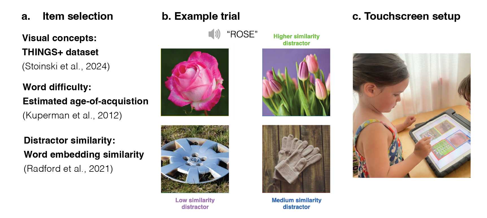
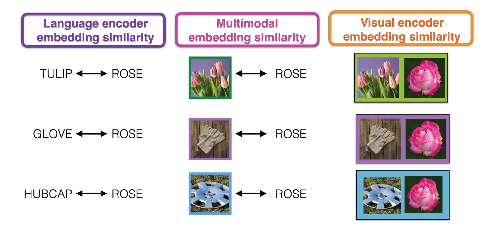

```{r setup, include = FALSE}
library("papaja")
r_refs("r-references.bib")
```

```{r analysis-preferences}
# Seed for random number generation
set.seed(42)
knitr::opts_chunk$set(echo=FALSE, cache=TRUE, warning=FALSE, message=FALSE, fig.pos='H')
```

```{r}
library(tidyverse)
library(lubridate)
library(ggthemes)
library(assertthat)
library(langcog) # for CIs
library(mirt)
library(ggpubr)
library(knitr)
library(dplyr)
library(here)
library(lme4)
library(lmerTest)
library(digest)
library(viridis)

# Create table using broom.mixed and kableExtra
library(broom.mixed)
library(kableExtra)
library(dplyr)

# mixed effect models cross validation
library(MuMIn)
```

# Introduction
When a child hears a word — like a “whale” — this activates a mental representation of its referent in the visual world.  Depending on how old a child is -- and how much they know about whales -- a child might imagine a canonical exemplar of a blue whale, a specific whale from a picture book, or perhaps just vaguely an animal that lives in the ocean. How precise are the visual representations that underlie children’s understandings of words across early and middle childhood? 

Early in development, children experience an astonishing rate of vocabulary growth as they begin to communicate with their caregivers about the objects, people, and places around them [@bloom_how_2000;@braginsky_consistency_2019]. Infants as young as 6-months of age associate some shape information with common words (Bergelson et al., 2009), and 14-18 month-olds extend newly learned words to atypical exemplars of these categories in looking-while-listening tasks (Weaver et al., 2024). By around their second birthday, children also extend nouns to stylized, 3D exemplars (Smith, 2003) as they learn that shape is a valuable cue to basic-level category membership (Rosch et al., 1976). Thus, at least for within-category exemplars, very young children exhibit relatively sophisticated generalization abilities for common visual concepts, in line with a broad-to-narrow view of category development (Waxman & Gelman, 2009), where infants construe words as initially referring to many items and subsequently refine their representations across development.

From this perspective, children’s visual representations may change relatively little beyond these first early years; instead, children may continue to gradually acquire new visual concepts and then change in how they represent the relationships between categories. For example, children may learn that whales are mammals, and then appropriately group them with other land mammals vs. with fish when asked to make taxonomic classifications [@vales_lumping_2020]. Accordingly, empirical work on children’s developing ability to recognize objects [@ayzenberg_development_2024] has also focused on the first few years of childhood as the most critical period in which object recognition abilities develop.


To overcome these methodological barriers, we created a gamified picture-matching task where children heard a word (e.g., “swordfish”) and had to choose the picture “that goes with the word”.  Critically, we chose distractor items with high, medium, and low concept similarity to each target word; distractors were paired via cosine similarity of the target and distractor words in a large multimodal language model (CLIP, Radford et al., 2021). This task was then deployed in online, preschool, and school contexts to 3599 children aged 3-15 years and 211 adults years of age. Using this large dataset, we find gradual changes in how children represent visual concepts across childhood, with older children becoming both more accurate at identifying the correct referents throughout this extended age range; however, we also found that even young children were more likely to choose the related vs. unrelated distractors, highlighting a gradual change from coarse, representations that encompass both the target and related distractors to fine-grained, specific representations that the visual information that words refer to. We then use both unimodal and multimodal embeddings from this same model to examine how visual, linguistic, and multimodal similarity explain children’s error patterns across development.

Contrary to this simplified account, here we provide evidence that children’s visual concepts continue to change throughout childhood, with an extended developmental trajectory that continues in parallel with later vocabulary learning and formal schooling. Children’s vocabulary knowledge -- often assessed via paper-and-pencil, closed, expensive traditional assessments -- grows and expands across childhood, but there has been relatively little consideration of the visual representations that support children’s performance on picture vocabulary tasks. Some work on children’s production and recognition of line drawings of common objects hints at this kind of protracted developmental timeline (Long et al., 2024): in a large observational study, children became increasingly able to both depict and recognize line drawings of common object categories. However,  no work has directly tested children’s visual recognition behaviors for a wide variety of visual concepts, in part because of the difficulty of obtaining data from large samples of children on a consistent set of items with variability over a large developmental age range.

To overcome these methodological barriers, we created a gamified picture-matching task where children heard a word (e.g., “swordfish”) and had to choose the picture “that goes with the word”.  Critically, we chose distractor items with high, medium, and low concept similarity to each target word; distractors were paired via cosine similarity of the target and distractor words in the language encoder of a large multimodal language model (Contrastive Language-Image Pre-training model, or CLIP, Radford et al., 2021) (see overview in Figure \ref{fig:procedure-figure}a). This task was then deployed in online, preschool, and school contexts to 3467 participants aged 3-14 years and 211 adults. Using this large dataset, we found gradual changes in how children represent visual concepts across childhood, with older children becoming both more accurate at identifying the correct referents throughout this extended age range. We also found that even young children were more likely to choose the related vs. unrelated distractors, highlighting a gradual change from coarse, representations that encompass both the target and related distractors to fine-grained, specific representations that the visual information that words refer to. We then use both unimodal and multimodal embeddings from this same model to examine how visual, linguistic, and multimodal similarity explain changes in children’s error patterns across development.


# Methods

```{r}
load(file=here::here('data/preprocessed/all_trial_data.Rdata'))
```

```{r}
load(file=here::here('data/preprocessed/summary_by_distractor.Rdata'))
```

```{r}
# First load all metadata we'll need for the items
test_corpus <- read_csv(here::here("data/item_metadata/new_test.csv")) %>%
  filter(!Word1 %in% c('honey','scrabble')) # manually excluded after piloting
```

```{r}
# Load clip correlations
item_meta_data <- read_csv(here::here("data/item_metadata/exp1_all_trials2023-04-11.csv")) %>%
  select(Word1, Word2, trial_type, AoA_Est_Word2, AoA_Est_Word1) %>%
  rename(wordPairing = trial_type, targetWord = Word1, answerWord = Word2) %>%
  filter(targetWord %in% unique(test_corpus$Word1))  %>%
  ungroup() %>%
  mutate(AoA_Bin = ntile(AoA_Est_Word1,3)) %>%
  mutate(AoA_Bin_Name = factor(AoA_Bin,  levels = c('1','2','3'), labels = c("Easy Words", "Harder Words", "Difficult Words"))) 
```


```{r}
item_meta_and_model_sim = read_csv(file=here::here('data/item_metadata/vv_clip_similarities.csv')) %>%
  rename(targetWord = target, answerWord = image)  %>%
  filter(answerWord != targetWord)  %>%
  right_join(item_meta_data)
```

```{r procedure-figure, echo=FALSE, fig.cap="Overview of the (a) databases and models involved in item selection, (b) an example trial, and (c) a touchscreen setup for younger participants. ", out.width="100%", fig.align='center'}

```


## Procedure
Children were invited to participate in a picture matching game where children were asked to help "teach aliens on another planet about some of the words on our planet" and children picked a particular alien to "accompany them on their journey." Before the stimuli appeared, children heard a target word (e.g., "apple") and then were asked to "choose the picture that goes with the word". The four images appeared in randomized locations on the screen, and one of the images always corresponded to the target word (see example trial in Figure \ref{fig:procedure-figure}b). On practice trials, the distractor images were all very dissimilar to the target concept, and the target word was relatively easy. The tablet played a chime sound if children chose the correct image, and a slightly unpleasant sound if they responded incorrectly. Each child viewed a random subset of the item bank, and the items they viewed were displayed in a random order. Children were allowed to stop the game whenever they wanted to.  Different versions of the game included varying amounts of trials or items; these games were developed as part of a project to develop an open-sourced measure of children's vocabulary knowledge. Here, we analyze children's responses to items that were generated using the THINGS+ dataset with distractors of varying difficulty (see Stimuli).

## Participants

```{r}
n_by_age_group <- df.4AFC.trials.clean %>%
  group_by(age_group) %>%
  summarize(num_participants = length(unique(pid)))

trials_by_participant <- df.4AFC.trials.clean %>%
  group_by(pid) %>%
  summarize(mean_pc = mean(correct), num_trials = length(unique(targetWord)))

```

```{r}
by_cohort = df.4AFC.trials.clean %>%
  group_by(cohort) %>%
  summarize(num_participants = length(unique(pid))) %>%
  mutate(cohort = replace_na(cohort,'adults'))
```


To obtain a large sample, we collected data from children in several different testing contexts. We collected data from children in an in-person preschools ($N$ = `r by_cohort$num_participants[by_cohort$cohort=='bing']`, 3-5 year-olds), from the Children Helping Science Platform, ($N$=`r by_cohort$num_participants[by_cohort$cohort=='garden']`, 3-7 year-olds), 6 elementary schools, and 9 charter schools across multiple states ($N$=`r by_cohort$num_participants[by_cohort$cohort=='schools']`, 5-14 year-olds) and adults online ($N$=`r by_cohort$num_participants[by_cohort$cohort=='adults']` adults, recruited via Prolific; half of the adults spoke English as a second language). Most participants responded via a touch-screen tablet, except those recruited online: however, children's parents responded via clicking on the image on Children Helping Science,  and adults responded via clicking on the images.
<! --WAM: I think most school participants used keyboard. If you need precise number on this, I could check my preprocess data and see their response modality.--> 

<! --WAM: I think the 9 charter schools are also elementary schools. are the 6 elementary schools public schools? I can help to confirm the school category if you give me the school prefix. --> 

After pre-processing, we included for a total of from `r length(unique(df.4AFC.trials.clean$pid))`  participants from preschools, schools, and online testing contexts around the United States (range `r min(n_by_age_group$num_participants)` to `r max(n_by_age_group$num_participants)`), who completed, on average, `r mean(trials_by_participant$num_trials)` 4AFC trials that were sampled randomly from the stimuli set (max=86; different maximum numbers of trials were included in different testing contexts). We tested an additional 84 participants who scored near chance on 4AFC trials (chance=25%, threshold=30%) and were school-aged (>6 years of age) and who we excluded from analyses; these participants completed an average of 17.72 trials.

<! --WAM: state your pre-processing criteria. also, not only include max number of trials, but min number of trials you decided to include. --> 

To obtain a large sample, we collected data from children across several different testing contexts. We collected data from children in an in-person, on-campus preschool ($N$ = `r by_cohort$num_participants[by_cohort$cohort=='bing']`, 3-5 year-olds), from children who participated via the Children Helping Science Platform, ($N$=`r by_cohort$num_participants[by_cohort$cohort=='garden']`, 3-7 year-olds), and in-person via tablets at elementary and charter schools across multiple states ($N$=`r by_cohort$num_participants[by_cohort$cohort=='schools']`, 5-14 year-olds) as well as adults online ($N$=`r by_cohort$num_participants[by_cohort$cohort=='adults']` adults, recruited via Prolific; half of the adults spoke English as a second language). Most participants responded via a touch-screen tablet (see Figure \ref{fig:procedure-figure}c)., except those recruited online: on Children Helping Science, children's parents responded via clicking on the image,  nd adults responded via clicking on the images.

After pre-processing, we included data from a total of `r length(unique(df.4AFC.trials.clean$pid))` participants, who completed, on average, `r mean(trials_by_participant$num_trials)` 4AFC trials that were sampled randomly from the stimuli set (max = 86; different maximum numbers of trials were included in different testing contexts). We tested an additional 84 participants who scored near chance on 4AFC trials (chance = 25%, threshold = 30%) and were school-aged (>6 years of age) and who we excluded from analyses; these participants completed an average of 17.72 trials.


## Stimuli selection
We capitalized on publicly available existing image and audio databases to generate stimuli. Visual concepts were taken from the THINGS+ dataset (Stoinski et all., 2023), after filtering out non-child safe images (e.g., weapons, cigarettes) and images with low nameability (<.3), as per the released norming data. We used the copy-right free, high-quality image released for each visual concept. We then subset to visual concepts that had available audio recordings in the MALD database as well as age-of-acquisition (AoA) ratings from a previous existing dataset (Kuperman, 2012). 

Using this subset, we sampled distractors with high, medium, and low similarity to the target word as operationalized via embedding similarity of the words in the language encode of a multimodal large language model (CLIP, Contrastive Language-Image Pre-training, Radford et al., 2021). High-, medium, and low similarity values were determined relative to the distribution of all possible target-distractor pairing values for each word in the THINGS+ dataset, and were sampled to optimize for having a maximum number of trials with unique target and distractors. In our final set, we had 108 items with a range of different estimated age-of-acquisitions (e.g., hedgehog, mandolin, mulch, swordfish, waterwheel, bobsled) with all unique targets and distractors; in addition, we constrained the sampling such that target-distractor pairs had estimated age of acquisition within 3 years of each other. All stimuli and their meta-data are available on the public repository for this project.

<! --WAM: describe in detail how you define high, medium, and low similarity. 1. Are the pairs obtained by a certain threshold of similarity? or it is a relative measure? 2. Can we say Sim(word1,high distractor) and Sim(word2, high distractor) are numerically comparable? i think clarifying the definition here will help to explain why you observe high similarity differs from medium, but not medium vs. low > 

## Model features
We obtained all model features features using the Open AI available implementation of CLIP available at https://github.com/openai/CLIP. For language similarity, we computed the cosine similarity of the embeddings of the target to each distractor word on each trial (e.g,. rose -- tulip, rose -- glove, rose -- hubcap). For visual similarity, we repeated this procedure but by obtaining image similarity vectors in the vision transformer.  For multimodal similarity, we computed the cosine similarity of the embedding of the target word in the language model to the embeddings for each of the distractor images; this is possible because the embedding spaces for the vision and language transformers in the CLIP model are aligned and have the same number of dimensions.

<! --WAM: so when you mean you obtained visual embedding, is it the embedding of the specific picture or just the visual embedding of the word?--> 

```{r}
df.4AFC.distractor.summary.byAge.perc <- df.4AFC.distractor.summary.byAge.clean %>% 
  ungroup() %>%
  mutate(wordPairing = factor(wordPairing, levels = c('target', 'hard', 'easy', 'distal'), 
                             labels = c("Target word", "High sim. dist", "Med sim. dist.", "Low sim. dist.")))  %>%
  group_by(age_group, numAFC, wordPairing) %>% 
  multi_boot_standard(col = 'perc', na.rm=TRUE)  


```

```{r}
df.4AFC.distractor.summary.byAge.perc.byaoa <- df.4AFC.distractor.summary.byAge.clean %>% 
  ungroup() %>%
  mutate(wordPairing = factor(wordPairing, levels = c('target','hard','easy','distal'), labels = c("Target word", "High sim. dist", "Med sim. dist.", "Low sim. dist.")))  %>% # just reordering
  group_by(age_group, wordPairing, AoA_Bin_Name) %>% 
  multi_boot_standard(col = 'perc', na.rm=TRUE)  

```

```{r}
aoa_by_bin <- df.4AFC.distractor.summary.byAge.clean %>%
  group_by(AoA_Bin) %>%
  distinct(targetWord, AoA_Est_Word1) %>%
  summarize(avg_aoa = mean(AoA_Est_Word1), sd_aoa = sd(AoA_Est_Word1))
```

# Results
```{r accuracy-fig, out.width='90%', fig.cap="Visual vocabulary task performance as a function of the age of the child completing the task, plotted separately for relatively easy, harder, or difficult words; words are binned into terciles based on the estimated AoA from Kuperman et al., 2012. Lines refer to the proportion of words that children chose the target (red), high-similarity (green), medium similarity (turqouise), or low similarity (purple) distractor  at each age; error bars represent boostrapped confidence intervals.", fig.align='center'}

ggplot(data = df.4AFC.distractor.summary.byAge.perc.byaoa %>% 
       mutate(age_label = ifelse(age_group == 25, "Adults", as.character(age_group)),
              age_label = factor(age_label, levels = c(as.character(3:14), "Adults")), # Added empty level for spacing
              AoA_Bin_Name = recode(AoA_Bin_Name,
                                  "Early AoA" = "Easy words",
                                  "Med AoA" = "Harder Words", 
                                  "Late AOA" = "Difficult Words")), 
       aes(x=age_group, y=mean, col=wordPairing, fill=wordPairing)) +
  geom_point(size = 1, alpha=.8) +
  geom_linerange(aes(y=mean, ymax = ci_upper, ymin = ci_lower), alpha=.8) +
  geom_smooth(aes(group=wordPairing), span=5, alpha=.2) +
  facet_wrap(~AoA_Bin_Name) +
  xlab('Age Group') +
  ylab('Proportion Chosen') +
  papaja::theme_apa() +
  coord_cartesian(ylim = c(0, 1)) +
   scale_x_continuous(breaks = c(seq(3, 14, 2), 25),  # Show ages every 2 years plus adults
                    labels = function(x) ifelse(x == 25, "Adults", as.character(x)))  +
  theme(legend.position="bottom",
        text = element_text(size = 12),
        strip.text = element_text(size = 12),
        axis.title = element_text(size = 12),
        plot.margin = unit(c(5.5, 5.5, 5.5, 5.5), "points"),
        aspect.ratio = 1.3) # Makes plot wider relative to height
```
```{r}
df.4AFC.distractor.summary.byPid <- df.4AFC.trials.clean %>%
  group_by(targetWord,  answerWord, numAFC, wordPairing, pid, age_group) %>%
  tally() %>%
  filter(wordPairing != 'target') # only incorrect trials
```

## A protracted developmental trajectory
We found a gradual increase in children's ability to correctly identify the target word across our entire age range, extending into early adolescence; Figure \ref{fig:accuracy-fig} shows the proportion of time that children identified the target word, highlighting a protracted developmental trajectory.  We found this developmental trend for both relatively "easy" words, with an average estimated age-of-acquisition (AoA) of `r round(aoa_by_bin$avg_aoa[aoa_by_bin$AoA_Bin==1],2)` years (SD = `r round(aoa_by_bin$sd_aoa[aoa_by_bin$AoA_Bin==1],2)`),  more difficult words  (Average AoA =`r round(aoa_by_bin$avg_aoa[aoa_by_bin$AoA_Bin==2],2)` years, $SD$ = `r round(aoa_by_bin$sd_aoa[aoa_by_bin$AoA_Bin==2],2)` years), and challenging words (Average AoA =`r round(aoa_by_bin$avg_aoa[aoa_by_bin$AoA_Bin==3],2)` years, $SD$ = `r round(aoa_by_bin$sd_aoa[aoa_by_bin$AoA_Bin==3],2)`)). 

```{r}
item_effects <- df.4AFC.distractor.summary.byAge.clean %>%
  mutate(perc = replace_na(perc,0)) %>%
  group_by(targetWord, wordPairing, age_group) %>%
  summarize(perc = mean(perc))  %>%
  filter(wordPairing=='hard')

slope <- item_effects %>%
  group_by(targetWord) %>%
  summarize(age_cor = cor(age_group, perc)) %>%
  arrange(age_cor) %>%
  slice_max(n=25, order_by=-age_cor)

# examples in above text come from this analysis -- slope$targetWord
```
At an item level, the words that showed the greatest change across age included some animals (e.g., "swordfish") as well as inanimate objects ("prism","antenna","gutter","sandbag", "turbine") but also parts of larger buildings ("scaffolding","gutter"). However, some of our developmental trends likely also stem from differences in executive control: for some words that had very semantically similar distractors but were relatively easy (e.g., "cheese" vs "butter"), we still saw steep developmental changes, highlighting that this "simple" picture vocabulary matching tasks still assess many different cognitive abilities beyond the fidelity of children's visual representations.


## Changes in the precision of visual concepts

 
```{r}
# Make data structure that calculate RELATIVE error rates by each trial type by age
# Important to replace NAs with 0s here
dist_by_pid_4afc <- df.4AFC.distractor.summary.byPid %>%
  group_by(pid, wordPairing, age_group) %>%
  summarize(num_errors = n()) %>%
  pivot_wider(values_from = "num_errors", names_from = "wordPairing") %>%
  mutate(total_num_errors = sum(c(hard,easy,distal), na.rm=TRUE)) %>%
  mutate(prop_hard = (hard / total_num_errors)) %>%
  mutate(prop_easy = (easy / total_num_errors)) %>%
  mutate(prop_distal = (distal / total_num_errors)) %>%
  pivot_longer(cols = starts_with('prop'), names_to = "wordPairing", values_to = "prop") %>%
  select(pid, wordPairing, prop, total_num_errors, age_group) %>%
  mutate(prop = replace_na(prop, replace=0))


```

```{r}
dist_by_cond_by_age_count <- dist_by_pid_4afc  %>%
  group_by(age_group, wordPairing) %>%
  summarize(num_errors = sum(total_num_errors))

dist_by_cond_by_age <- dist_by_pid_4afc %>%
  group_by(age_group, wordPairing) %>%
  multi_boot_standard(col= 'prop', na.rm=TRUE) %>%
  right_join(dist_by_cond_by_age_count)
```

```{R}
dist_by_pid_4afc_by_aoa <- df.4AFC.distractor.summary.byPid %>%
  left_join(item_meta_and_model_sim %>% distinct(targetWord, answerWord, AoA_Est_Word1, AoA_Bin_Name)) %>%
  ungroup() %>%
  group_by(pid, wordPairing, AoA_Bin_Name,  age_group) %>%
  summarize(num_errors = n()) %>%
  pivot_wider(values_from = "num_errors", names_from = "wordPairing") %>%
  mutate(total_num_errors = sum(c(hard,easy,distal), na.rm=TRUE)) %>%
  mutate(prop_hard = (hard / total_num_errors)) %>%
  mutate(prop_easy = (easy / total_num_errors)) %>%
  mutate(prop_distal = (distal / total_num_errors)) %>%
  pivot_longer(cols = starts_with('prop'), names_to = "wordPairing", values_to = "prop") %>%
  select(pid, wordPairing, prop, total_num_errors, age_group, AoA_Bin_Name) %>%
  mutate(prop = replace_na(prop, replace=0))
```


```{r}
dist_by_pid_by_age_by_aoa_n <- dist_by_pid_4afc_by_aoa %>%
  group_by(age_group, wordPairing,AoA_Bin_Name) %>%
  summarize(n = length(unique(pid)), num_errors = sum(total_num_errors))

dist_by_pid_by_age_by_aoa <- dist_by_pid_4afc_by_aoa %>%
  group_by(age_group, wordPairing,AoA_Bin_Name) %>%
  multi_boot_standard(col= 'prop', na.rm=TRUE) %>%
  right_join(dist_by_pid_by_age_by_aoa_n)

```


Next, we thus aimed to understand whether we were observing  changes in the precision of children's visual concepts, or instead a product of changes in task performance as children become more accurate at ignoring relevant distractors. To examine this, we focused on changes in error patterns across age, shown in Figure \ref{fig:errorbyage}. If children's visual concepts are changing——proceeding from a coarse representations that is overly broad, or starting from no representation at all——then we should observe changes in how children choose distractors when they make errors. Specifically, we would expect younger children to be more likely to choose distractors of all types, whereas we would expect older children to almost exclusively choose related distractors. Consistent with this hypothesis, we found that children increasingly choose related distractors throughout development, with adults being still more likely to choose the related distractors relative to the oldest children (14-year-olds) in our sample. 


```{r}
# Make data structure so we can model the proportion of errors by age as a function of the total number of errors rather than just proportion -- nice because we could have very different rates across participants (adults make few errors, kids might make a lot but do fewer trials, etc)

trials_by_participant <- df.4AFC.trials.clean %>%
  group_by(pid) %>%
  summarize(num_trials  = length(unique(targetWord)))

error_by4afc_for_glmer <- df.4AFC.distractor.summary.byPid %>%
  group_by(pid, wordPairing, age_group) %>%
  summarize(num_errors = n()) %>%
  pivot_wider(values_from = "num_errors", names_from = "wordPairing") %>%
  mutate(hard = replace_na(hard, replace=0)) %>%
  mutate(easy = replace_na(easy, replace=0)) %>%
  mutate(distal = replace_na(distal, replace=0)) %>%
  mutate(total_num_errors = sum(c(hard,easy,distal))) %>%
  right_join(trials_by_participant) 


error_by4afc_by_item_for_glmer <- df.4AFC.distractor.summary.byPid %>%
  group_by(targetWord, wordPairing, age_group) %>%
  summarize(num_errors = n()) %>%
  pivot_wider(values_from = "num_errors", names_from = "wordPairing") %>%
  mutate(hard = replace_na(hard, replace=0)) %>%
  mutate(easy = replace_na(easy, replace=0)) %>%
  mutate(distal = replace_na(distal, replace=0)) %>%
  group_by(targetWord, age_group) %>%
  mutate(total_num_errors = sum(c(hard,easy,distal))) 
```


```{r}
# this is a singular fit, but significant
# summary(glmer(cbind(hard,total_num_errors) ~  scale(age_group) + scale(num_trials) + 
# (1 | pid), error_by4afc_for_glmer, family = "binomial", control=glmerControl(optCtrl=list(maxfun=20000),optimizer=c("bobyqa"))))


# this is conceptually similar, same results
model = lmer(prop_hard ~ scale(age_group) + scale(num_trials) + (1|pid), data = error_by4afc_for_glmer %>% mutate(prop_hard = hard/total_num_errors))
```

```{R}
model_on_items = lmer(prop_hard ~ scale(age_group) + scale(total_num_errors) + (1|targetWord), data = error_by4afc_by_item_for_glmer %>% mutate(prop_hard = hard/total_num_errors))

```

```{r}
# Extract and format fixed effects
table_data <- tidy(model, effects = "fixed") %>%
  mutate(
    p.value = 2 * (1 - pnorm(abs(statistic))),  # Calculate p-values for lmer
    p.value = ifelse(p.value < .001, "< .001", sprintf("%.3f", p.value)),
    term = case_when(
      term == "(Intercept)" ~ "Intercept",
      term == "scale(age_group)" ~ "Age (scaled)",
      term == "scale(num_trials)" ~ "Number of trials (sxcaled)",
      TRUE ~ term
    )
  ) %>%
  rename(
    Predictor = term,
    "b" = estimate,
    "SE" = std.error,
    "t" = statistic,  # Note: changed from z to t for lmer
    "p" = p.value
  ) %>%
  mutate(across(c("b", "SE", "t"), ~round(., 2)))

# Create kable table
kable(table_data, 
      format = "latex",
      booktabs = TRUE,
      caption = "Fixed effect coefficients a linear mixed effects model assessing changes in the proportion of related distractors chosen over defvelopment. The model included random intercepts for participants. Age and number of trials were standardized prior to analysis.",
      align = c("l", "r", "r", "r", "r")) %>%
  kable_styling(full_width = FALSE) 
```


<! --WAM: curious why you included number of trials as a fixed effect here? maybe worth mentioning it in the writing. --> 


We confirmed this result via a linear regression, modeling the proportion of errors that each children chose related distractors as our dependent variable as a function of children's age (in years), finding a main effect of age (see Table 1): older children were more likely to choose related distractors relative to unrelated distractors. We also modeled these effects at the item level in a linear mixed-effect model, with random intercepts for each item, finding a fixed effect of age (see SI), and thus the pattern of effects. Children become more likely to choose related distractors across development, suggesting a progression where children gradually build detailed knowledge about the visual referents of many challenging words.


```{r errorbyage, fig.align='center', out.width='75%', fig.cap="Changes in the proportion of errors chosen as a function of childrens age, where green lines reflected higher similarity distractors. Dot size represents the number of errors made by children in each age group. Error bars represent 95 percent bootrstrapped confidence intervals."}

ggplot(data = dist_by_cond_by_age, aes(x=age_group, y=mean, col=wordPairing, fill=wordPairing)) +
  geom_linerange(data = dist_by_cond_by_age, aes(y=mean, ymin=ci_lower, ymax = ci_upper), position=position_dodge(width=.4)) +
  geom_point(data = dist_by_cond_by_age, aes(y=mean,  size=num_errors), alpha=.8, position=position_dodge(width=.4)) +
  geom_smooth(data = dist_by_cond_by_age, aes(group=age_group, weight=num_errors)) +
  ylab('Proportion of errors') +
  xlab('Age (in years)') +
  papaja::theme_apa() +
  scale_color_manual(values = c( '#C265FF', '#31BAC0','#70BF41'))  +
  scale_fill_manual(values = c( '#C265FF', '#31BAC0','#70BF41'))+
  scale_x_continuous(breaks = c(seq(3, 14, 2), 25),  # Show ages every 2 years plus adults
                    labels = function(x) ifelse(x == 25, "Adults", as.character(x)))  +
  theme(legend.position='none') +
  geom_smooth(span=20) 
```

## Modeling changes in children's error patterns
```{R}
dist_by_4afc_by_item_by_age <- df.4AFC.distractor.summary.byPid %>%
  left_join(item_meta_and_model_sim %>% distinct(targetWord, answerWord, AoA_Est_Word1, AoA_Bin_Name)) %>%
  ungroup() %>%
  group_by(targetWord, wordPairing, AoA_Est_Word1, age_group) %>%
  summarize(num_errors = n()) %>%
  pivot_wider(values_from = "num_errors", names_from = "wordPairing") %>%
  mutate(total_num_errors = sum(c(hard,easy,distal), na.rm=TRUE)) %>%
  mutate(prop_hard = (hard / total_num_errors)) %>%
  mutate(prop_easy = (easy / total_num_errors)) %>%
  mutate(prop_distal = (distal / total_num_errors)) %>%
  pivot_longer(cols = starts_with('prop'), names_to = "wordPairing", values_to = "prop") %>%
  select(targetWord, wordPairing, prop, total_num_errors, age_group, AoA_Est_Word1) %>%
  mutate(prop = replace_na(prop, replace=0)) %>%
  mutate(wordPairing = str_split_fixed(wordPairing,'_',2)[,2]) %>%
  left_join(item_meta_and_model_sim %>% distinct(targetWord, wordPairing, sim_img_img, sim_img_txt, sim_txt_txt)) 

```


```{r output=FALSE}
# cross validation of lmer models 
all_cor = tibble(lang = double(),
  vision = double(), multi = double(), all=double())
  dataset = dist_by_4afc_by_item_by_age 

all_model_r2 = tibble(lang = double(),
  vision = double(), multi = double(), all=double())
dataset = dist_by_4afc_by_item_by_age 

for (iter in 1:50){

  sampled =  dataset %>%
    group_by(targetWord) %>%
    sample_frac(.8)
  
  held_out = dataset %>%
  anti_join(sampled)
  
  lang_model_fit = lmer(data=sampled, prop ~ scale(sim_txt_txt) + scale(age_group) + scale(AoA_Est_Word1) + scale(total_num_errors) +  (1 | targetWord))
  
  vision_model_fit = lmer(data=sampled, prop ~ scale(sim_img_img) + scale(age_group) + scale(AoA_Est_Word1) + scale(total_num_errors) +  (1 | targetWord))
    
    multi_model_fit = lmer(data=sampled, prop ~ scale(sim_img_txt) + scale(age_group) + scale(AoA_Est_Word1) + scale(total_num_errors) +  (1 | targetWord))
    
    all_model_fit = lmer(data=sampled, prop ~ scale(sim_img_txt) + scale(age_group) + scale(sim_img_img) + scale(sim_txt_txt) + scale(AoA_Est_Word1) + scale(total_num_errors) +  (1 | targetWord))
  
  # get predicted values
  predicted_lang = predict(lang_model_fit, newdata = held_out) 
  predicted_vision = predict(vision_model_fit, newdata = held_out) 
  predicted_mutli = predict(multi_model_fit, newdata = held_out) 
  predicted_all = predict(all_model_fit, newdata = held_out) 
  

   all_cor = all_cor %>%
     add_row(lang = cor(predicted_lang, held_out$prop), vision = cor(predicted_vision, held_out$prop), multi = cor(predicted_mutli, held_out$prop), all = cor(predicted_all, held_out$prop))
   
  vision_r2 <- r.squaredGLMM(vision_model_fit)
  lang_r2 <- r.squaredGLMM(lang_model_fit)
  multi_r2 <- r.squaredGLMM(multi_model_fit)
  all_r2 =  r.squaredGLMM(all_model_fit)
  
  all_model_r2 = all_model_r2 %>%
     add_row(vision = vision_r2[2], lang = lang_r2[2], multi = multi_r2[2],all = all_r2[2])
  
   
}
```


```{r output=FALSE}
# plot of model r^2 for 50 samples of 80% of the dataset
all_model_r2_long <- all_model_r2 %>%
  rename('all predictors' = all, 'multimodal' = multi, 'language' = lang) %>%
  pivot_longer(cols=everything(), values_to="cor", names_to = "model")  %>%
  mutate(model = fct_relevel(model,  'all predictors','multimodal','language','vision')) 

all_model_r2_cis <- all_model_r2_long %>%
  group_by(model) %>%
  multi_boot_standard(col='cor')  
  
```

```{r clip-figure, echo=FALSE, fig.cap="Schematic of the three different ways that embedding simialrity was calculated in CLIP (Radford et al., 2021)", out.width="100%", fig.align='center'}

```


In a final analyses, we aimed to understand the source of these changes in children's error patterns by leveraging the high-dimensional embeddings of our linguistic and visual stimuli in a large, multi-modal language model (CLIP, Radford et al., 2021), acknowledging that our stimuli were not necessarily designed to pull apart the contributions of changes in semantic vs. visual similarity. Nonetheless, our stimuli were generated by using similarity in a linguistic embedding space, and so some stimuli on certain trials were nonetheless related to the target concept semantically but not necessarily visually (e.g, gardening "gloves" were a distractor for the target word "rose"). We thus sought to understand the degree to which children's error patterns in this task reflected changes in how they processed the visual similarity of the targets and distractors, their semantic similarity, or--perhaps most likely--some combination.

To do so, we used a series of cross-validated linear mixed effect models, where we examined the degree to which visual, linguistic, and multimodal similarity metrics (and their combination) derived by large language model embeddings could explain children's error patterns. Specifically, we modeled children's proportion of time that children chose each distractor for a target word as a function of the difficulty of the target word (as estimated by the estimated AoA metric), the age (in years) of the children participating, and (1) the similarity of the target word to each distractor word (linguistic embeddings), (2) the similarity of the target image to each distractor image (visual embeddings),  and (3) the similarity of the target word to each distractor image (multi-modal embeddings), and (4) a combined model with all predictors combined. We iteratively sampled 80/% of the dataset, and then evaluated the conditional r-squared for each model for each split; these values are plotted in Figure \ref{fig:modelfigure}. These exploratory results revealed that combining both the visual and linguistic embeddings -- either in one, large mixed-effect model, or via multi-modal embeddings -- led to increase explained variance in children's error patters. These results thus suggest that changes in children's error patterns across age are not solely due to changes in children's ability to reject the distractor images that are visually similar to the target concept.


```{r modelfigure, out.width='50%', fig.align='center', fig.cap = "Average explained variance in children's error patterns (conditional R-squared in linear mixed effect models) by linguistic, visual, multimodal, or combined predictors in cross-validated mixed efffect models. Error bars represent bootstrapped 95 percent confidence intervals across 50 iterations." }
ggplot(data=all_model_r2_cis, aes(x=model, y=mean, color=model)) +
  geom_linerange(aes(ymin=ci_lower, ymax=ci_upper)) +
  geom_point(size=2, alpha=.8) +
  geom_point(data=all_model_r2_long, aes(x=model, y=cor), alpha=.2) +
  xlab('') +
  theme_few(base_size=14) +
  papaja::theme_apa() +
  ylab('Average conditional R^2 \n in mixed-effect models')  +
  theme(axis.text.x = element_text(angle = 90, vjust = 0.5, hjust=1)) +
  theme(legend.position='none') +
    scale_color_viridis(discrete=TRUE, option="C", end=.8) +
theme(aspect.ratio=4/3) 
  # y
  
```


In a final analyses, we aimed to understand the source of these changes in children's error patterns by leveraging high-dimensional embeddings of our linguistic and visual stimuli in a large, multimodal language model (CLIP, Radford et al., 2021). We chose a set of stimuli where visual similarity was colinear with semantic similarity to a large degree, as it often is in the real-world for most visaul concepts. Thus, our stimuli were not necessarily designed to pull apart the contributions of changes in semantic vs. visual similarity. Nonetheless, our stimuli were generated by using similarity in a linguistic embedding space, and so some stimuli on certain trials were nonetheless related to the target concept semantically but not necessarily visually (e.g, gardening gloves were a distractor for "rose"). We thus sought to understand the degree to which children's error patterns in this task reflected changes in how they processed the visual similarity of the targets and distractors, their semantic similarity, or--perhaps most likely--some combination.

To do so, our approach used a series of cross-validated linear mixed effect mdoels, where we examined the degree to which visaul, linguistic, multimodal, and a combination of similarity metrics derived by large lanuage model embeddigns could predict the errors that children made. Overall, we found that....

<! --WAM: The plot shows interesting findings. On suggestion: organize the order of x-axis as language, visision, multimodal, and add a separate line, then all predictions. --> 


# Discussion

How precise is children’s visual concept knowledge, and how does this change across development?  Here, we leverage a large dataset of picture matching performance across development to suggest a transition from coarse to finer-grained visual representations over early and middle childhood.

These data support a theoretical view where these is substantial enrichment and change in existing representations for everyday visual concepts throughout childhood.  or example, children may have grossly misrepresented the sizes of certain objects (e.g., how big whales are relative to other sea mammals) and certain visual features may become more or less salient as they understand their functional roles or the degree to which they help delineate a category boundary. On this account, even school-aged children’s visual representations may undergo substantial change as they learn more about the world around them, even as their vocabulary growth tapers. 

This protraction of the timeline for visual concept learning into middle childhood substantially broadens the scope of potential learning mechanisms beyond associative label-object matching. For example, children's learning environments extend beyond the home and into structured educational contexts; children's learning partners include their peers, teachers, and siblings (who may be more or less reliable), and children's individualized experiences, interests, and hobbies may influence which words they have detailed visual representations for. As children begin to learn why animals and objects are classified the way they are, this semantic learning likely influences the visual features that are prioritized in children’s representations. To make matters even more complicated, children also likely learn about visual features from generic utterances (e.g., "Tigers have stripes") in verbal conversations where visual referents are nowhere to be found. Thus in order for our models and theories of visual concept learning to account for this full developmental trajectory, we need to think beyond labelled (or even captioned) photos or videos of referents. 

Indeed, we suspect that visual concept learning extends into adulthood, and that many adults have coarse visual representations for many different words (and indeed, we culled some items during pilot testing because adults could not discriminate them!). Consider that while  many adults in Western contexts experience the referents of some visual concepts relatively frequently e.g., trees, computers, cups, cars -- other words refer to visual concepts that different individuals may have varying amounts of interest in and frequency in interacting with -- like telescopes, or antelopes. Visual concept learning is likely influenced by both individuals pre-occupations and very intense interests, be they professional or not.  And indeed decades of work has established that birding experts, car aficionados, and graphic artists have both qualitatively and quantitatively different kinds of visual representations for the visual concepts that they engage with (CITE, CITE).

There are several limitations to the current work that future work could address. While we include data from a diverse group of children over a wide developmental age range, at present our conclusions are drawn primarily from around one hundred experimental items and distractors; further work that expands the range and diversity of the visual concepts -- and that expands to populations outside of the continental U.S. (Henrich et al., 2010) will be necessary to understand the generalizability of these findings. In addition, the present data are large but cross-sectional, and thus cannot provide  evidence for changes in the precision of representations within individual minds. Dense data collected from children over longer ranges of developmental time could confirm the hypotheses and theories raised by these analyses. Nonetheless, the present work highlights the promise of large-scale, online games for collecting large datasets that can be used to examine the consistency and variability in visual concept representations across childhood. 

Overall, these findings suggest that children's visual concepts gradually become more precise across childhood, and broaden our view on the timeline and mechanisms for visual concept learning. We hope that future work will build on the tools and ideas developed here to understand the visual mind in both children and adults.


<! --WAM: I like the discussion! I am sure you will include a limitation + future direction paragraph. Just one idea to add: we didn't recruit participants from K-12 from the same population, which might add noise of the finding. --> 

\newpage

# References
```{r create_r-references}
r_refs(file = "r-references.bib")
```
::: {#refs custom-style="Bibliography"}
:::
