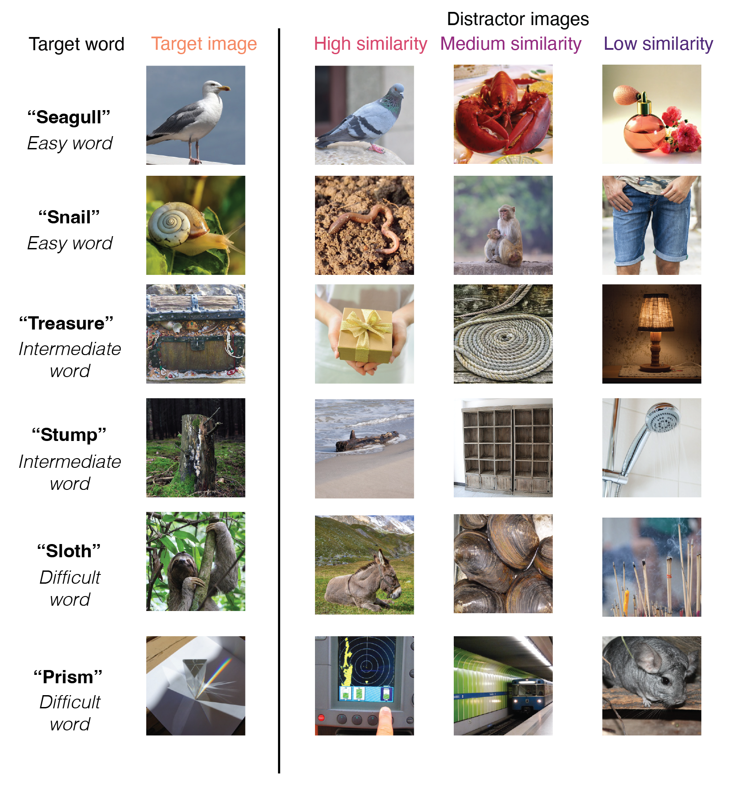

```{r setup, include = FALSE}
library("papaja")
r_refs("r-references.bib")
```

```{r analysis-preferences}
# Seed for random number generation
set.seed(42)
knitr::opts_chunk$set(echo=FALSE, cache=FALSE, warning=FALSE, message=FALSE, fig.pos='H')
```

```{r libraries}
library(tidyverse)
library(lubridate)
library(ggthemes)
library(assertthat)
library(langcog) # for CIs
library(mirt)
library(ggpubr)
library(knitr)
library(dplyr)
library(here)
library(lme4)
library(lmerTest)
library(digest)
library(viridis)

# Create table using broom.mixed and kableExtra
library(broom.mixed)
library(kableExtra)
library(dplyr)
library(patchwork)

# mixed effect models cross validation
library(MuMIn)
```

```{r load-data}
RAW_DATA=TRUE # if within the research team
# RAW_DATA=FALSE # if exterior to the research team
```

# Introduction

How precise are children’s representations of nouns, and how does this change across development? Consider a child who has recently learned the word “whale” but might incorrectly represent that the word “whale” refers to whales, sharks, and dolphins. Alternatively, a child could have a very precise understanding of what whales are—distinguishing them from whale sharks and correctly including atypical beluga whales. Here, we examine the precision of children’s representations for nouns and how they change across both early and middle childhood.

Most empirical work on how children represent the meanings of nouns has focused on the first few years of life, when children learn words at an astonishing rate [@bloom_how_2000; @braginsky_consistency_2019]. In looking-while-listening tasks [@fernald2008looking], infants as young as 6 months look to pictures associated with common nouns like “bottle” and “banana” [@bergelson_at_2012], and 14- to 18-month-olds extend newly learned words to atypical exemplars of these categories [@weaver2024becoming]. By around their second birthday, children also generalize nouns to stylized, 3D exemplars [@pereira2009developmental] as they learn that shape is a valuable cue to basic-level category membership. Empirical work on children’s developing ability to recognize shapes [@ayzenberg_development_2024] has also focused on these first few years of childhood as the most important period of rapid developmental change.

Yet classic theories of word learning have long articulated that children have partial knowledge about many words en route to mature understanding. One account suggests that young children might initially set up a place-holder concept via “fast mapping” but then gradually fill in later details about what words refer to [@carey1978acquiring; @dale1965vocabulary; @swingley2010fast]. For example, in one study three-year-olds remembered that a word (“chromium”) was a color word, but they did not know which color it was [@carey1978acquiring]. Theories of later vocabulary acquisition have also characterized children’s word knowledge as progressing through stages [@dale1965vocabulary; @beck2014effects], with an intermediate stage where children were thought to have a “vague knowledge of the word’s meaning” [@dale1965vocabulary] before they fully grasp what a word means.

Thus, in parallel with acquiring increasingly rich semantic knowledge, children likely also develop increasingly detailed representations of the referents of nouns. Children may become better able to recognize the specific visual features that distinguish similar categories from one another—for example, that distinguish between hedgehogs vs. porcupines, blue whales vs. whale sharks, or tulips vs. roses. In addition, children might develop a more refined representation of a typical exemplar of a category as they become fluent in producing drawings themselves. Some recent work supports this idea: in a large observational study, children became increasingly able to both depict and recognize line drawings of visual concepts (e.g., “whale”, “clock”, “tiger”) from 3-10 years of age, hinting at underlying changes in how children represent the diagnostic features of individual categories [@long2024parallel].

Despite this long-standing recognition that children likely have partial word knowledge [@carey1978acquiring; @dale1965vocabulary], relatively little work has systematically examined children’s partial knowledge of word meanings. All assessments of receptive vocabulary characterize word knowledge in an all-or-nothing fashion, perhaps because it is indeed difficult to quantify what it would mean to have a low-precision representation for a word. Both direct measures, such as the Peabody Picture Vocabulary Test [PPVT\; @dunn2003peabody; @gershon2014language], and parent-report measures of vocabulary knowledge [@fenson1994variability; @marchman2023macarthur] characterize children as either “knowing” a word or not; these open-source parent-report measures are questionnaires that lack distractors. Since the distractors for the PPVT assessments are chosen carefully, children’s error patterns could in principle reveal evidence for partial knowledge (e.g., selecting a shark when the target word is whale), but all item data resulting from these proprietary assessments are unavailable for re-analysis (including, for example, data that results from the NIH Toolbox Assessment). Further, all assessments stop once a child has answered incorrectly on several difficult words rather than assessing the extent of their partial knowledge.

In parallel, a large literature on expertise suggests that visual learning almost certainly extends throughout early and middle childhood and into adulthood [@curby2010trained; @harel2016special]. Decades of empirical work has established that birding experts, car aficionados [@tanaka1997expertise], and graphic artists [@perdreau2013artist], among others, have both qualitatively and quantitatively different kinds of visual representations for the visual concepts that they have significant expertise with that is reflected in both behavioral and neural responses. Children’s visual representations are thus likely continually refined as they also acquire expertise and become experts in their own particular domains (e.g., dinosaurs).

Our empirical and theoretical accounts of the development of how children represent the referents of words have thus been limited by (1) a need for larger developmental datasets with dense data on individual items and (2) the difficulty of systematically quantifying what it means to have a partial or imprecise representation. Here, we take steps to address both of these challenges. First, we created a new, open-source picture matching task and developed research partnerships with schools across the U.S. in order to gather dense item data across a wide age range (3–14 years) from many children (N=3995 children, N=211 adults). We built a new, open-source “visual vocabulary” task where children heard a word (e.g., “swordfish”) and had to choose a picture in order to teach aliens about their meanings. We then collected data from a large sample of representative children in both online contexts as well as through research-practice partnership with preschools and elementary school contexts across the U.S.

We leveraged modern computational models to both choose distractor items systematically and to analyze children’s resulting responses. Prior work suggests that similarity metrics derived from multimodal models trained to associate text and images are strongly (though imperfectly) related to behavioral and neural human similarity judgements [@muttenthaler2021thingsvision; @conwell2022can]. In particular, responses from language encoders can be used to approximate the semantic relatedness between any two words (e.g., “antelope” and “gazelle”), and responses from visual encoders can capture how related any two images are in terms of their visual features (e.g., color, shape, and category membership). And in multimodal models, these similarity metrics can be used to estimate how related a given word (e.g., “antelope”) is to a given image (e.g., a picture of a gazelle).

To choose distractor items, we used the similarity of the target and distractor words in the language encoder of a multimodal language model (Contrastive Language-Image Pre-training model, or CLIP; [@radford2021learning]). To analyze error patterns, we first used this same model to extract additional metrics for the visual similarity and multimodal similarity of each target and distractor pairing on each trial; we then used these similarity metrics to understand trial-by-trial error patterns in the larger dataset.

We then investigated three main questions. First, we examined how accurate children’s representations for nouns were throughout this large developmental age range, highlighting nouns with more or less variability. Second, we examined evidence for changes in the precision of representations before word knowledge is solidified, as per @dale1965vocabulary’s account. To do so, we examined error patterns: if children have an imprecise representation of a noun’s meaning, then when they do not know the exact meaning of a word they may still systematically choose distractors that are similar to the target word. Third, we examined what explains the structure in children’s error patterns, by systematically examining the variance explained by multimodal, semantic, and visual similarity metrics between each distractor and target noun, adding covariates for phonological similarity. If children’s error patterns are explained by changes in how they represent which images “go with the word”, then multimodal similarity should explain the most variance in children’s trial-by-trial error patterns.


# Method

```{r load-data-files}
if (RAW_DATA==TRUE) 
{
# all raw data is not avaliable for this paper, due to IRB restrictions within our school partnerships. 
load(file=here::here('data/raw/all_trial_data.Rdata'))
school_type_meta = read_csv(file=here::here('data/raw/pid_with_school_type.csv'))
}
```

```{r load-data-files-preprocessed}
# load in both cases -- from step1_wrangle_dataset.Rmd in analysis folder
# summarized across age group/distractor, so okay to share
load(file=here::here('data/preprocessed/summary_by_distractor.Rdata'))

```

```{r load-item-data}
# load item data in either case for all items
item_meta_and_model_sim = read_csv(file=here::here('data/item_metadata/item_meta_and_model_sim.csv')) 
```


```{r procedure-figure, echo=FALSE, fig.cap="Example trials that depicted easy, intermediate, and difficult words, as operationalized via estimated age-of-acquisition (Kuperman et al., 2012); each target word image is taken from shown alongside the three distractors that varied in similarity to the target word; distractors were chosen via the similarity of the target and distractor words in the language encoder of CLIP (Radford et al., 2021); this is operationalized as semantic similarity.", out.width="100%", fig.align='center'}

```


## Participants

```{r participants}
if (RAW_DATA==TRUE){
n_by_age_group <- df.4AFC.trials.clean %>%
  group_by(age_group) %>%
  summarize(num_participants = length(unique(pid)))

trials_by_participant <- df.4AFC.trials.clean %>%
  group_by(pid) %>%
  summarize(mean_pc = mean(correct), num_trials = length(unique(targetWord)))

trials_by_age <- df.4AFC.trials.clean %>%
  group_by(pid,age_group) %>%
  summarize(mean_pc = mean(correct), num_trials = length(unique(targetWord))) %>%
  group_by(age_group) %>%
  summarize(mean_num_trials = mean(num_trials), sd_num_trials = sd(num_trials), n=length(unique(pid)))

longitudinal_participants <- sum(trials_by_participant$num_trials>80)

by_cohort = df.4AFC.trials.clean %>%
  group_by(cohort) %>%
  summarize(num_participants = length(unique(pid))) %>%
  mutate(cohort = replace_na(cohort,'adults'))


### school type analysis

garden_only <- df.4AFC.trials.clean %>%
  filter(cohort %in% c('garden')) %>%
  mutate(school_type='CHS') %>%
  group_by(pid, age_group,school_type) %>%
  summarize(mean_pc = mean(correct)) %>%
  group_by(age_group, school_type) %>%
  multi_boot_standard(col='mean_pc') 

adults_only <- df.4AFC.trials.clean %>%
  filter(cohort %in% c('adults_monolingual','adults_ell')) %>%
  mutate(age_group=25) %>%
  group_by(pid, age_group, cohort) %>%
  summarize(mean_pc = mean(correct)) %>%
  mutate(school_type = cohort) %>%
  group_by(age_group, school_type) %>%
  multi_boot_standard(col='mean_pc') 

accuracy_by_cohort_by_age <- trials_by_participant %>%
  left_join(school_type_meta) %>%
  # filter(!is.na(school_type)) %>%
  filter(school_type!='test') %>%
  mutate(age_group = floor(ageMonths/12)) %>%
  group_by(school_type, age_group) %>%
  multi_boot_standard(col='mean_pc') %>%
  full_join(adults_only) %>%
  full_join(garden_only)


save(n_by_age_group, trials_by_participant, longitudinal_participants, by_cohort, accuracy_by_cohort_by_age, file=here::here('data/preprocessed/descriptives_data_structures.RData'))

}

if (RAW_DATA==FALSE){
  load(file=here::here('data/preprocessed/descriptives_data_structures.RData'))
}

```

To obtain a large sample of responses for individual items across development, we collected data from children across several different testing contexts, totaling $N$ = `r sum(by_cohort$num_participants)` unique participants. We collected data from children in an in-person preschool ($N$ = `r by_cohort$num_participants[by_cohort$cohort=='bing']`, 3-5 year-olds) and from the Children Helping Science (CHS) Platform ($N$=`r by_cohort$num_participants[by_cohort$cohort=='garden']`, 3-7 year-olds), We also recruited adults online via Prolific; we sampled from monolinguals ($N$=`r by_cohort$num_participants[by_cohort$cohort=='adults_monolingual']`) and adults who spoke English as a second language ($N$=`r by_cohort$num_participants[by_cohort$cohort=='adults_ell']`) to maximize our chance of finding item variability, and to measure a range of adult abilities.  

In addition, we recruited representative samples from schools across the United States through the [BLINDED] platform $N$=`r by_cohort$num_participants[by_cohort$cohort=='schools']`, 5-14 year-olds) (BLINDED et al.). Schools included seven public or public charter school districts (33 schools), three independent schools focused on supporting students with learning differences, two independent schools, and one summer program.  This task was offered as a pilot vocabulary assessment along with other foundational reading measures that were developed for use in school-research partnerships throughout the United States [@wentworth2023brokering; @coburn2016research].

Most participants responded directly via clicking through the games on a laptop or tapping through the games on a tablet, except those recruited online through CHS and Prolific; children’s parents responded via clicking on the image that the child indicated on CHS, and adults responded via clicking on the images. Children completed, on average, `r mean(trials_by_participant$num_trials)` distinct target-word trials (SD = `r sd(trials_by_participant$num_trials)`) that were sampled randomly from the stimulus set (maximum = 86; different maximum numbers of trials were included in different testing contexts; see Supplemental Materials Table 1 for further details). All participants who contributed data were included, regardless of the number of trials they completed (minimum trials = 2, maximum trials = 86).^[Some participants participated in the game more than once ($N$ = `r longitudinal_participants` children), and their data are included as if they completed additional trials; these were often additional items due to random sampling. Excluding these participants did not change the pattern of results.]


## Materials
We capitalized on publicly available existing image and audio databases to generate trials. All images were taken from the THINGS+ dataset [@stoinski2024thingsplus], after filtering out non-child safe images (e.g., weapons, cigarettes) and images with low-nameability (<.3), as per Stoinski et al., 2024. We used the copyright-free, high-quality image released for each noun. We subset to nouns that had available age-of-acquisition (AoA) ratings from a previous existing dataset [@kuperman2012age] where adults were asked to retrospect on the age that they learned a word in development; these estimated AoAs were used as a proxy for item difficulty. Audio for each target word was taken from the MALD database [@tucker2019massive].

From this subset, our goal was to create the largest number of trials with target words that had unique distractor items that varied in similarity. To do so, we first paired target words with distractor words of similar difficulty; all potential target-distractor pairs had estimated AoA within 3 years of each other. Then, we sampled distractors with high, medium, and low similarity to the target word as operationalized via the cosine similarity of the target and distractor word embeddings in the language encoder of a multimodal large language model [@radford2021learning]. For each target word, we first selected a high-similarity distractor that had the highest cosine similarity to the target (and was itself not one of the target words). For low-similarity words, we sampled a unique distractor word that had the lowest cosine similarity among the remaining distractors. For medium-similarity distractors, we then randomly sampled a distractor word that was the same animacy as the target word. These similarity values were determined relative to the distribution of all possible target-distractor similarity values for each word in the THINGS+ dataset. In our final set, we had 108 items with a range of different estimated age-of-acquisitions (e.g., hedgehog, mandolin, mulch, swordfish, waterwheel, bobsled) with all unique targets and distractors.

For modeling item-level variance, we used the word frequency (SUBTLEX) measures taken directly from Stoinski et al., 2024, as well as their aggregated word typicality judgements for the 84/108 target words for which it was available. All stimuli and their metadata are available on the public repository for this project (BLINDED). 

	
## Model features
We extracted embeddings for all of the words and the images used in the study in the same multimodal large language model [@radford2021learning]. This model has both a language and vision encoder and is trained on the contrastive loss between pairs of images and their corresponding captions. In these encoders, each word or image can be represented by a 512 dimensional vector in either semantic or visual similarity space, respectively.

We first used the computed semantic similarity scores from item selection; recall these were obtained by taking the cosine similarity between the embeddings for each target and distractor word on each trial in the language encoder (e.g., tulip – rose, tulip – glove, tulip – hubcap); this metric calculates the angle between any given two high-dimensional vectors. For visual similarity, we repeated this procedure but by using image similarity vectors from the vision transformer for each target image and distractor image on each trial. For multimodal similarity, we computed the cosine similarity of the embedding of the target word in the language encoder to the embeddings for each of the distractor images in the vision encoder; this is possible because the embedding spaces for the vision and language transformers in this model are aligned and have the same number of dimensions. This procedure thus yielded semantic, visual, and multimodal similarity scores for each target-distractor pairing on each trial. We obtained all model features using an implementation of CLIP available at https://github.com/openai/CLIP; All code is available on the repository associated with this project.

## Procedure
Children were invited to participate in a picture matching game where they were asked to “teach aliens on another planet about some of the words on our planet”; children picked a particular alien to “accompany them on their journey.” Before the images appeared, children heard a target word (e.g., “apple”) and then were asked to “choose the picture that goes with the word”. The four images appeared in randomized locations on the screen, and one of the images always corresponded to the target word. On practice trials, the distractor images were of words that were all very dissimilar to the target word, and the target word was relatively easy (e.g., “apple”). The game played a chime sound if children chose the correct image, and a slightly unpleasant sound if they responded incorrectly; this feedback ensured that children of all ages understood the task correctly. Each child viewed a random subset of the item bank, and the items they viewed were displayed in a random order. Children were allowed to stop the game whenever they wanted to. Different versions of the game included varying amounts of total possible trials and additional items, as these games were developed as part of an additional project to create an open-sourced measure of children’s vocabulary knowledge (Blinded et al., in prep); all experimental code is available via [BLINDED] and can be used via their platform. Here, we analyze children’s responses to items that were generated using the THINGS+ dataset with distractors of varying difficulty (see Stimuli).


## Data and code sharing
These data were collected with the secondary goal of creating an open-source measure of children's developing vocabulary knowledge. These analyses presented in the paper were not pre-registered, and children's data were analyzed both during and at the end of data collection.

All pre-processed data and analysis and plotting code have been made available in an online repository. We are able to publicly share the trial-by-trial raw data for the preschool, CHS, and adult cohorts; however, due to strict data-sharing agreements with the schools in which the testing was conducted, we do not have permission to share the raw data from the school cohort. These student data are protected under FERPA and thus cannot be shared as we did not obtain a data usage agreement prior to collection. However, we share preprocessed, item-level averages and standard deviations for each age group, including the number of children who completed each particular trial.


```{r summarize-distractor-data}
df.4AFC.distractor.summary.byAge.perc <- df.4AFC.distractor.summary.byAge.clean %>% 
  ungroup() %>%
  mutate(wordPairing = factor(wordPairing, levels = c('target', 'hard', 'easy', 'distal'), 
                             labels = c("Target word", "High sim. dist", "Med sim. dist.", "Low sim. dist.")))  %>%
  group_by(age_group, numAFC, wordPairing) %>% 
  multi_boot_standard(col = 'perc', na.rm=TRUE)  

```

```{r summarize-distractor-data-aoa}
df.4AFC.distractor.summary.byAge.perc.byaoa <- df.4AFC.distractor.summary.byAge.clean %>% 
  ungroup() %>%
  mutate(wordPairing = factor(wordPairing, levels = c('target','hard','easy','distal'), labels = c("Target word", "High sim. dist", "Med sim. dist.", "Low sim. dist.")))  %>% # just reordering
  group_by(age_group, wordPairing, AoA_Bin_Name) %>% 
  multi_boot_standard(col = 'perc', na.rm=TRUE)  

```

```{r aoa-by-bin}
aoa_by_bin <- df.4AFC.distractor.summary.byAge.clean %>%
  group_by(AoA_Bin) %>%
  distinct(targetWord, AoA_Est_Word1) %>%
  summarize(avg_aoa = mean(AoA_Est_Word1), sd_aoa = sd(AoA_Est_Word1))
```

# Results
```{r accuracy-fig, out.width='90%', fig.cap="Task performance as a function of the age of the child completing the task, plotted separately for relatively easy, harder, or difficult words; words are binned based on the estimated AoA from Kuperman et al., 2012 solely for visualization purposes. Lines refer to the proportion of words that children chose the target (orange), high-similarity (pink), medium similarity (purple), or low similarity (dark purple) distractor at each age; error bars represent bootstrapped 95% confidence intervals.", fig.align='center'}
labels_graph = df.4AFC.distractor.summary.byAge.perc.byaoa %>% filter(age_group==25) %>% 
  mutate(AoA_Bin_Name = recode(AoA_Bin_Name,
                                  "Early AoA" = "Easy words",
                                  "Med AoA" = "Intermediate words", 
                                  "Late AOA" = "Difficult words"))  %>%
  filter(AoA_Bin_Name=='Difficult words')

ggplot(data = df.4AFC.distractor.summary.byAge.perc.byaoa %>% 
       mutate(age_label = ifelse(age_group == 25, "Adults", as.character(age_group)),
              age_label = factor(age_label, levels = c(as.character(3:14), "Adults")), # Added empty level for spacing
              AoA_Bin_Name = recode(AoA_Bin_Name,
                                  "Early AoA" = "Easy words",
                                  "Med AoA" = "Intermediate words", 
                                  "Late AOA" = "Difficult words")), 
       aes(x=age_group, y=mean, col=wordPairing, fill=wordPairing)) +
  geom_point(size = 1, alpha=.6) +
  geom_linerange(aes(y=mean, ymax = ci_upper, ymin = ci_lower), alpha=.6) +
  geom_smooth(aes(group=wordPairing), span=5, size=1, alpha=.2) +
  facet_wrap(~AoA_Bin_Name) +
  xlab('Age Group (in years)') +
  ylab('Proportion Chosen') +
  papaja::theme_apa(base_size=10) +
  coord_cartesian(ylim = c(0, 1)) +
   scale_x_continuous(breaks = c(seq(3, 14, 2), 25),  
                    labels = function(x) ifelse(x == 25, "Adults", as.character(x)))  +
  guides(color = guide_legend(title = NULL)) +
  scale_color_viridis(option='C', discrete=TRUE, begin=.75, end=0) +
  scale_fill_viridis(option='C', discrete=TRUE, begin=.75, end=0) +
  theme(legend.position = 'none', aspect.ratio=1.3)


ggsave('figures/fig2c-trajectory.pdf',width=6.5, units='in')
```


```{r now-with-meta}
df.4AFC.distractor.summary.byAge.clean.withmeta <- df.4AFC.distractor.summary.byAge.clean %>%
  left_join(item_meta_and_model_sim %>% distinct(targetWord, log_freq_target_word, concreteness_target_word, superordinate_category_target_word, mean_typicality), by=c('targetWord'))

```

```{r include=FALSE}
# some of the words that were never seen in each age group, have NAs
what <- df.4AFC.distractor.summary.byAge.clean.withmeta %>%
  filter(is.na(perc))
```

```{r category-for-supplement}
# supplemental analyses
by_category <- df.4AFC.distractor.summary.byAge.clean.withmeta %>%
  filter(wordPairing=='target') %>%
  filter(!is.na(superordinate_category_target_word)) %>%
  filter(!is.na(perc)) %>%
  group_by(superordinate_category_target_word) %>%
  multi_boot_standard(col = 'perc') 

words_in_each_category <- df.4AFC.distractor.summary.byAge.clean.withmeta %>%
  filter(wordPairing=='target') %>%
  filter(!is.na(superordinate_category_target_word)) %>%
  filter(!is.na(perc)) %>%
   group_by(superordinate_category_target_word) %>%
  distinct(targetWord, superordinate_category_target_word)
  
```

```{r main-lmer}
## Main results lmer adding in covarates
d <- df.4AFC.distractor.summary.byAge.clean.withmeta %>%
  filter(wordPairing=='target')

main_results = lmer(data = d, perc ~  scale(log_freq_target_word)*scale(concreteness_target_word) + scale(mean_typicality) + scale(totalAttempts) + scale(age_group)*scale(AoA_Est_Word1) + (1|targetWord))

```


```{r}
if (RAW_DATA==TRUE){
df.4AFC.distractor.summary.byPid <- df.4AFC.trials.clean %>%
  group_by(targetWord,  answerWord, numAFC, wordPairing, pid, age_group) %>%
  tally() %>%
  filter(wordPairing != 'target') # only incorrect trials
}
```

## A protracted developmental trajectory
We found a gradual increase across our age groups in how well children could correctly identify the referents for many nouns. Figure 2 shows the proportion of time that children identified the target picture, highlighting a protracted developmental trajectory. Older children were more accurate at identifying the correct visual image that a word referred to, with the oldest children in our sample (13- and 14-year-olds) still performing less accurately than adults (see Supplemental Figure 1 for a visualization of results across cohorts).

```{r}
item_effects <- df.4AFC.distractor.summary.byAge.clean %>%
  group_by(age_group, targetWord) %>%
  filter(wordPairing=='target') %>%
  mutate(totalAttempsbyAgeBin = sum(totalAttempts, na.rm=TRUE)) %>%
  filter(totalAttempsbyAgeBin>=10)   

slopes <- item_effects %>%
  group_by(targetWord, AoA_Est_Word1) %>%
  summarize(age_cor = cor(age_group, perc)) %>%
  ungroup() %>%
  mutate(slope_bin = ntile(age_cor, 3))  %>%
  mutate(AoA_Bin = ntile(AoA_Est_Word1,3)) 

```

```{r}
h_slope <- slopes %>%
  arrange(age_cor) %>%
  slice_max(n=40, order_by=age_cor)

l_slope <- slopes %>%
  arrange(age_cor) %>%
  slice_max(n=40, order_by=-age_cor)
```

```{r, results='hide'}
# example words
easiest_words <- item_effects %>% 
  filter(AoA_Bin==1) %>%
  filter(age_group==3) %>%
  distinct(targetWord, perc, AoA_Est_Word1) %>%
  arrange(-perc)

# medium_words <- item_effects %>% 
#   filter(AoA_Bin==2) %>%
#   filter(age_group==14) %>%
#   distinct(targetWord, perc, AoA_Est_Word1) %>%
#   arrange(perc)
# 
# hard_words <- item_effects %>% 
#   filter(AoA_Bin==3) %>%
#   filter(age_group==14) %>%
#   distinct(targetWord, perc, AoA_Est_Word1) %>%
#   arrange(perc)
```

```{r}
# examples in above text come from this analysis -- slope$targetWord
# easiest_words %>% filter(targetWord %in% c('watermelon','turtle','lollipop'))
# easiest_words %>% filter(targetWord %in% c('squirrel','hamster','map'))

```

We found a slight developmental trend for relatively easy words that had an average estimated age-of-acquisition (Kuperman et al., 2012) (AoA) of `r round(aoa_by_bin$avg_aoa[aoa_by_bin$AoA_Bin==1],2)` years (SD = 0.87; acorn, bulldozer, scoop, puddle, sprinkler). However, change in children’s accuracy over development was much more pronounced for more difficult words (barrel, buffet, coaster, stump, carousel; average AoA = 6.95 years, SD = 0.65) and challenging words (e.g., tapestry, scaffolding, mandolin, aloe; average AoA = 9.60 years, SD = 1.21) (see Figure 2). Statistically, this was reflected as an interaction between estimated AoA and the age group of participants in a linear mixed effect model (see Table 1), where AoA was modeled as a continuous predictor (see Supplemental Figure 3). While “easy” words with overall low AoA tended to be words that were relatively concrete and high frequency, these factors (or their interaction) did not explain additional variance in children’s overall accuracy.^[Words that were learned earlier tended to be more concrete and also more frequent in the English language; however, estimated AoA was collinear with concreteness ratings (correlation between concreteness of the target word and estimated AoA, $r$ = -0.40) and word frequency (correlation between the log frequency of the target word and estimated AoA, $r$ = -0.56). Nonetheless, the variance inflation factor (VIF) for all terms in model described in Table 1 were less than 2.1, indicating that the coefficient estimates and their standard errors were not meaningfully inflated.]
```{r}
# footnote

concrete_vs_aoa = cor.test(item_meta_and_model_sim$concreteness_target_word, item_meta_and_model_sim$AoA_Est_Word1)
#Concreteness correlation
#round(concrete_vs_aoa$estimate,3)
 
## frequency correlation
freq_vs_aoa = cor.test(item_meta_and_model_sim$log_freq_target_word, item_meta_and_model_sim$AoA_Est_Word1)

# round(freq_vs_aoa$estimate,3)
```


```{r prettify-terms, include=FALSE}
# Rewrite the term/Predictor column of an apa_print()/tidy() table so the docx
# tables show human-readable labels instead of raw `scale(varname)` strings.
prettify_terms <- function(tab) {
  col <- intersect(c("Predictor", "predictor", "term", "Term"), names(tab))[1]
  if (is.na(col)) return(tab)
  raw <- as.character(tab[[col]])

  raw <- gsub("\\$\\\\times\\$", "×", raw)
  raw <- gsub("$\\times$", "×", raw, fixed = TRUE)
  raw <- gsub("\\\\times", "×", raw)
  raw <- gsub("\\bScale", "", raw)
  raw <- gsub("scale\\(([^)]+)\\)", "\\1", raw)
  raw <- gsub(":", " × ", raw, fixed = TRUE)
  raw <- trimws(raw)

  # Variable-name renames. Each entry: c(underscore_form, space_form, pretty).
  renames <- list(
    c("log_freq_target_word",     "log freq target word",     "Log. freq. (target)"),
    c("log_freq_answer_word",     "log freq answer word",     "Log. freq. (answer)"),
    c("concreteness_target_word", "concreteness target word", "Concreteness (target)"),
    c("sim_img_img",              "sim img img",              "Visual sim."),
    c("sim_img_txt",              "sim img txt",              "Multimodal sim."),
    c("sim_txt_txt",              "sim txt txt",              "Semantic sim."),
    c("sem_resid",                "sem resid",                "Semantic residual"),
    c("phon_sim",                 "phon sim",                 "Phonological sim."),
    c("AoA_Est_Word1",            "AoA Est Word1",            "AoA (target)"),
    c("AoA_Est_Word2",            "AoA Est Word2",            "AoA (answer)"),
    c("age_group",                "age group",                "Age"),
    c("total_num_errors",         "total num errors",         "Total errors"),
    c("totalAttempts",            "total Attempts",           "Total attempts"),
    c("mean_typicality",          "mean typicality",          "Typicality")
  )
  for (r in renames) {
    raw <- gsub(r[1], r[3], raw, fixed = TRUE)
    raw <- gsub(r[2], r[3], raw, fixed = TRUE)
  }
  tab[[col]] <- raw
  tab
}
```

```{r main-modeling-table}
apa_lm <- apa_print(main_results)
apa_table(
  prettify_terms(apa_lm$table)
  , caption = "Linear mixed-effect model coefficients predicting the proportion correct for each item in each age group as a function of the frequency, concreteness, typicality, total attempts at the item, estimated AoA of the target word, the age group of the child (in years), and their interaction. All predictors were standardized before analysis. variance inflation factor (VIF) for all terms in e less than 2.1, indicating that the coefficient estimates and their standard errors were not substantially inflated by collinearity."
)
```

```{r vif-check, include=FALSE}
library(car)

vif_tidy <- function(m) {
  v <- car::vif(m)
  if (is.matrix(v)) v <- v[, "GVIF^(1/(2*Df))"]^2  # GVIF -> VIF scale
  round(sort(v, decreasing = TRUE), 2)
}
vif_tidy(main_results)

```

At an item level, 3-year-olds’ performance on the easiest words (watermelon, M = .93; turtle, M = .93, lollipop, M = .95) suggests that they understood the task. However, other items with relatively low AoAs (squirrel, M = .78, hamster, M = .72; map, M = .73) were more difficult for young children. Over development, the words that showed the greatest change across age (see Figure 3a), included some animals (e.g., swordfish), as well as inanimate objects (prism, antenna, sandbag, turbine) but also other kinds of objects, including parts of buildings (scaffolding, gutter). Some items, however, showed relatively little change across age: these tended to be easy words that children across all ages identified correctly (sunflower, rice, potato, hedgehog). Overall, these results highlight variability across individual words and document the protracted developmental trajectory for learning noun meanings throughout childhood.


```{r include=FALSE}
adult_acc_high_slopes <- item_effects %>% 
  filter(targetWord %in% h_slope$targetWord)  %>%
  filter(age_group==25) %>%
  group_by(targetWord) %>%
  mutate(adult_perc = mean(perc))  %>%
  select(targetWord, adult_perc) 

adult_acc_low_slopes <- item_effects %>%
  filter(targetWord %in% l_slope$targetWord)  %>%
  filter(age_group==25) %>%
  group_by(targetWord) %>%
  mutate(adult_perc = mean(perc))  %>%
  select(targetWord, adult_perc)

high_slopes = item_effects %>% 
  filter(targetWord %in% h_slope$targetWord)  %>%
  left_join(adult_acc_high_slopes, by=c('targetWord')) %>%
  mutate(targetWord = fct_reorder(targetWord, adult_perc, .desc=TRUE)) 

low_slopes = item_effects %>%
  filter(targetWord %in% l_slope$targetWord)  %>%
  left_join(adult_acc_low_slopes, by=c('targetWord')) %>%
  mutate(targetWord = fct_reorder(targetWord, adult_perc, .desc=TRUE))

```


```{r slopes, out.width='50%', fig.align='center', fig.cap = "(a) Visualization of the top 30 items that showed the largest differences across age groups; values represent the proportion of correct responses on each target word (e.g., swordfish) within each age group. Triangles represent data from both English monolinguals and second-language learners collected via Prolific. Items are ordered by difficulty for adults."}

ggplot(high_slopes %>% filter(age_group<25) , aes(x=fct_reorder(targetWord, adult_perc, .desc=FALSE), y=perc, col=age_group)) +
    geom_point(alpha=.5) +
    geom_point(data=high_slopes %>% filter(age_group==25),  aes(x=fct_reorder(targetWord, adult_perc, .desc=TRUE), y=perc, col=age_group), color='black', alpha=.6, size=1.5, shape=17) +
    theme_apa(base_size=8) +
  ylab('Proportion correct') +
  scale_color_viridis_c(name='Age group (in years)') +
  theme(axis.text.x = element_text(angle = 90, vjust = 0.5, hjust=1, size=6)) +
  # coord_flip() +
  theme(legend.position='none') +
   xlab('') +
  ylim(0,1)

ggsave('figures/fig3a_itemeffects.pdf', width=3.5, height=3, units='in')
```


## Changes in the precision of noun representations
 
```{r}
# Make data structure that calculate RELATIVE error rates by each trial type by age
# Important to replace NAs with 0s here
if (RAW_DATA==TRUE){
dist_by_pid_4afc <- df.4AFC.distractor.summary.byPid %>%
  group_by(pid, wordPairing, age_group) %>%
  summarize(num_errors = n()) %>%
  pivot_wider(values_from = "num_errors", names_from = "wordPairing") %>%
  mutate(total_num_errors = sum(c(hard,easy,distal), na.rm=TRUE)) %>%
  mutate(prop_hard = (hard / total_num_errors)) %>%
  mutate(prop_easy = (easy / total_num_errors)) %>%
  mutate(prop_distal = (distal / total_num_errors)) %>%
  pivot_longer(cols = starts_with('prop'), names_to = "wordPairing", values_to = "prop") %>%
  select(pid, wordPairing, prop, total_num_errors, age_group) %>%
  mutate(prop = replace_na(prop, replace=0))


dist_by_cond_by_age_count <- dist_by_pid_4afc  %>%
  group_by(age_group, wordPairing) %>%
  summarize(num_errors = sum(total_num_errors))

dist_by_cond_by_age <- dist_by_pid_4afc %>%
  group_by(age_group, wordPairing) %>%
  multi_boot_standard(col= 'prop', na.rm=TRUE) %>%
  right_join(dist_by_cond_by_age_count)

# this is plotted below
dist_by_cond_by_age <- dist_by_cond_by_age %>%
  mutate(wordPairing = factor(wordPairing, levels = c('prop_hard', 'prop_easy', 'prop_distal'), 
                             labels = c("High sim. dist", "Med sim. dist.", "Low sim. dist.")))

save(dist_by_cond_by_age_count, dist_by_cond_by_age, file=here::here('data/preprocessed/dist_by_cond_by_age.RData'))


}
if (RAW_DATA==FALSE){
 load(file=here::here('data/preprocessed/dist_by_cond_by_age.RData')) 
}
```

```{R}
if (RAW_DATA==TRUE){
dist_by_pid_4afc_by_aoa <- df.4AFC.distractor.summary.byPid %>%
  left_join(item_meta_and_model_sim %>% distinct(targetWord, answerWord, AoA_Est_Word1, AoA_Bin_Name)) %>%
  ungroup() %>%
  group_by(pid, wordPairing, AoA_Bin_Name,  age_group) %>%
  summarize(num_errors = n()) %>%
  pivot_wider(values_from = "num_errors", names_from = "wordPairing") %>%
  mutate(total_num_errors = sum(c(hard,easy,distal), na.rm=TRUE)) %>%
  mutate(prop_hard = (hard / total_num_errors)) %>%
  mutate(prop_easy = (easy / total_num_errors)) %>%
  mutate(prop_distal = (distal / total_num_errors)) %>%
  pivot_longer(cols = starts_with('prop'), names_to = "wordPairing", values_to = "prop") %>%
  select(pid, wordPairing, prop, total_num_errors, age_group, AoA_Bin_Name) %>%
  mutate(prop = replace_na(prop, replace=0))


dist_by_pid_by_age_by_aoa_n <- dist_by_pid_4afc_by_aoa %>%
  group_by(age_group, wordPairing,AoA_Bin_Name) %>%
  summarize(n = length(unique(pid)), num_errors = sum(total_num_errors))

dist_by_pid_by_age_by_aoa <- dist_by_pid_4afc_by_aoa %>%
  group_by(age_group, wordPairing,AoA_Bin_Name) %>%
  multi_boot_standard(col= 'prop', na.rm=TRUE) %>%
  right_join(dist_by_pid_by_age_by_aoa_n)
}


```


Do children begin with high-fidelity representations of what noun referents look like or are they acquired more gradually? Thus far, these analyses support a view where children progressively acquire precise representations for new nouns on a relatively long developmental timeline. However, they do not yet provide evidence for the longstanding account that children have partial representations of noun meanings that becomes more precise en route to mature word understanding. If children have coarse representations for nouns, then we would expect children to choose a related distractors (showing evidence of partial knowledge) when they do not know the precise visual meaning of a word. Alternatively, if children quickly acquire relatively precise representations, then we should only observe changes in how accurate children are at identifying the target word, with no changes in the types of errors that children make.


```{r}
# Make data structure so we can model the proportion of errors by age as a function of the total number of errors rather than just proportion -- nice because we could have very different rates across participants (adults make few errors, kids might make a lot but do fewer trials, etc)

if (RAW_DATA==TRUE){
trials_by_participant <- df.4AFC.trials.clean %>%
  group_by(pid) %>%
  summarize(num_trials  = length(unique(targetWord)))

error_by4afc_for_glmer <- df.4AFC.distractor.summary.byPid %>%
  group_by(pid, wordPairing, age_group) %>%
  summarize(num_errors = n()) %>%
  pivot_wider(values_from = "num_errors", names_from = "wordPairing") %>%
  mutate(hard = replace_na(hard, replace=0)) %>%
  mutate(easy = replace_na(easy, replace=0)) %>%
  mutate(distal = replace_na(distal, replace=0)) %>%
  mutate(total_num_errors = sum(c(hard,easy,distal))) %>%
  right_join(trials_by_participant) 


error_by4afc_by_item_for_glmer <- df.4AFC.distractor.summary.byPid %>%
  group_by(targetWord, wordPairing, age_group) %>%
  summarize(num_errors = n()) %>%
  pivot_wider(values_from = "num_errors", names_from = "wordPairing") %>%
  mutate(hard = replace_na(hard, replace=0)) %>%
  mutate(easy = replace_na(easy, replace=0)) %>%
  mutate(distal = replace_na(distal, replace=0)) %>%
  group_by(targetWord, age_group) %>%
  mutate(total_num_errors = sum(c(hard,easy,distal))) %>%
  left_join(item_meta_and_model_sim %>% select(targetWord, AoA_Est_Word1))

save(error_by4afc_by_item_for_glmer, file=here::here('data/preprocessed/error_by4afc_by_item_for_glmer.RData'))

}

if (RAW_DATA==FALSE){

load(file=here::here('data/preprocessed/error_by4afc_by_item_for_glmer.RData'))
}

```


```{r}
#Here, dataframe is  one for each session (a few participants did it twice, and so have identical pids, but not that many)

#So, it makes sense to model this in a linear regression, where we've already averaged across participant, and to ask if age predicts the proportion of hard distractors they are choosing

if (RAW_DATA==TRUE){
  
model = lm(prop_hard ~ scale(age_group) + scale(total_num_errors), data = error_by4afc_for_glmer %>% mutate(prop_hard = hard/total_num_errors))

# could also do num trials
model_sanity = lm(prop_hard ~ scale(age_group) + scale(num_trials), data = error_by4afc_for_glmer %>% mutate(prop_hard = hard/total_num_errors))

save(model, file=here::here('data/preprocessed/model_output.RData'))

### with school type -- random effects explain no real variance
error_by4afc_for_glmer_school_type = error_by4afc_for_glmer %>% 
  mutate(prop_hard = hard/total_num_errors) %>%
  right_join(school_type_meta) 
  
## 
model_school_type = lmer(prop_hard ~ scale(age_group) + scale(total_num_errors) + (1|school_type), data = error_by4afc_for_glmer_school_type)


}

if (RAW_DATA==FALSE){
load(file=here::here('data/preprocessed/model_output.RData'))
} 
```

```{R}
# Here, we're looking at an item level
model_on_items = lmer(prop_hard ~ scale(age_group) + scale(total_num_errors) + scale(AoA_Est_Word1) + (1|targetWord), data = error_by4afc_by_item_for_glmer %>% mutate(prop_hard = hard/total_num_errors))

```

```{r modeling-on-items-table, include=FALSE}
# Item-level model retained for reference but not displayed in the main text;
# the manuscript's Table 2 is the participant-level model below.
apa_lm <- apa_print(model_on_items)
apa_table(
  apa_lm$table
  , caption = "Coefficients of a linear regression assessing changes in the proportion of related distractors chosen over development. Age and number of trials were standardized prior to analysis."
)
```


```{r}
# Extract and format fixed effects
table_data <- tidy(model, effects = "fixed") %>%
  mutate(
    p.value = 2 * (1 - pnorm(abs(statistic))),  # Calculate p-values for lmer
    p.value = ifelse(p.value < .001, "< .001", sprintf("%.3f", p.value))
  ) %>%
  rename(
    Predictor = term,
    "b" = estimate,
    "SE" = std.error,
    "t" = statistic,
    "p" = p.value
  ) %>%
  mutate(across(c("b", "SE", "t"), ~round(., 2)))

apa_table(
  prettify_terms(table_data),
  caption = "Coefficients of a linear regression at the participant level assessing changes in the proportion of related distractors chosen over development. The dependent variable is each participant's proportion of error trials that fell on the high-similarity distractor; age and total number of errors were standardized prior to analysis.",
  align = c("l", "r", "r", "r", "r")
)
```

We thus examined whether there are systematic changes in how children made errors across development, shown in Figure 3b. Consistent with the longstanding view that children have partial knowledge, we found that older children chose more closely related distractors than younger children. Adults were still more likely to choose the related distractors than the oldest children in our sample (14-year-olds) when they made errors. We confirmed this result via a linear regression, modeling the proportion of errors that each child chose related distractors as our dependent variable as a function of children’s age (in years); we also included the number of errors each child made as a covariate as this varied widely by participant and age group. We found a main effect of age: each standard-deviation increase in age (SD = 3.84 years) was associated with a `r table_data$b[2]` increase in the proportion of semantically related vs. unrelated distractors ($\beta$ = `r table_data$b[2]`, SE = `r table_data$SE[2]`, t = `r table_data$t[2]`, p < .001) while including the total number of errors made by each participant.

Unexpectedly, we did not find strong differences between distractors that were less related to the target word. We found that both low-similarity and medium-similarity distractors were equally unlikely to be chosen—even though the model similarities distinguished between these options, children did not. These results suggest that when children know something about the referents of a word, they know enough to reject both the low and medium similarity distractors.


```{r errorbyage, fig.align='center', out.width='75%', fig.cap="(b) Changes in the proportion of errors chosen as a function of children's age; pink lines reflect higher similarity distractors. Dot size represents the number of errors made by children in each age group. Error bars represent 95% bootstrapped confidence intervals."}

errors_by_age_plot = ggplot(data = dist_by_cond_by_age, aes(x=age_group, y=mean, col=wordPairing, fill=wordPairing)) +
  geom_linerange(data = dist_by_cond_by_age, aes(y=mean, ymin=ci_lower, ymax = ci_upper), position=position_dodge(width=.4)) +
  geom_point(data = dist_by_cond_by_age, aes(y=mean,  size=num_errors), alpha=.8, position=position_dodge(width=.4)) +
  geom_smooth(data = dist_by_cond_by_age, aes(group=age_group, weight=num_errors)) +
  ylab('Proportion of errors') +
  xlab('Age Group (in years)') +
  papaja::theme_apa() +
  scale_size_continuous(name="Num. errors") + 
  # guides(size = "none") +
  scale_color_manual(values = c( '#D8476D', '#942c80','#522a79'), name="")  +
  scale_fill_manual(values = c( '#D8476D', '#942c80','#522a79'), name="")+
  scale_x_continuous(breaks = c(seq(3, 14, 2), 25),  # Show ages every 2 years plus adults
                    labels = function(x) ifelse(x == 25, "Adults", as.character(x)))  +
  ylim(0,1) +
  theme(legend.position='bottom') +
  geom_smooth(span=20) 
  
ggsave(errors_by_age_plot, filename='figures/fig3b-errors.pdf', width=5, height=5.5, units='in')
```

## Modeling changes in children's error patterns
```{R}
if (RAW_DATA==TRUE){
dist_by_4afc_by_item_by_age <- df.4AFC.distractor.summary.byPid %>%
  left_join(item_meta_and_model_sim %>% distinct(targetWord, answerWord, AoA_Est_Word1, AoA_Bin_Name)) %>%
  ungroup() %>%
  group_by(targetWord, wordPairing, AoA_Est_Word1, age_group) %>%
  summarize(num_errors = n()) %>%
  pivot_wider(values_from = "num_errors", names_from = "wordPairing") %>%
  group_by(age_group, targetWord, AoA_Est_Word1) %>%
  mutate(total_num_errors = sum(c(hard,easy,distal), na.rm=TRUE)) %>%
  mutate(prop_hard = (hard / total_num_errors)) %>%
  mutate(prop_easy = (easy / total_num_errors)) %>%
  mutate(prop_distal = (distal / total_num_errors)) %>%
  pivot_longer(cols = starts_with('prop'), names_to = "wordPairing", values_to = "prop") %>%
  select(targetWord, wordPairing, prop, total_num_errors, age_group, AoA_Est_Word1) %>%
  mutate(prop = replace_na(prop, replace=0)) %>%
  mutate(wordPairing = str_split_fixed(wordPairing,'_',2)[,2]) %>%
  left_join(item_meta_and_model_sim %>% distinct(targetWord, wordPairing, sim_img_img, sim_img_txt, sim_txt_txt, phon_sim, log_freq_target_word, log_freq_answer_word, concreteness_target_word, AoA_Est_Word2)) 

save(dist_by_4afc_by_item_by_age, file=here::here('data/preprocessed/dist_by_4afc_by_item_by_age.RData'))
}

if (RAW_DATA==FALSE){
load(file=here::here('data/preprocessed/dist_by_4afc_by_item_by_age.RData'))
}

```

```{r}
target_item_visualize <- dist_by_4afc_by_item_by_age %>%
  mutate(wordPairingLabel = factor(wordPairing, levels = c('hard', 'easy', 'distal'), 
                             labels = c("High sim. dist", "Med sim. dist.", "Low sim. dist.")))  %>%
  mutate(scaled_sim_img_img = scale(sim_img_img), scaled_sim_txt_txt = scale(sim_txt_txt))  %>%
  group_by(targetWord, wordPairing, prop, age_group) %>%
  mutate(higher_semantic_sim = sim_txt_txt - sim_img_img) %>%
  left_join(item_meta_and_model_sim %>% select(targetWord, answerWord, wordPairing)) %>%
  mutate(item_pair = paste0(targetWord,'_', answerWord)) %>%
  mutate(item_pair = fct_reorder(item_pair, higher_semantic_sim, .desc=TRUE))  %>%
  distinct(targetWord, answerWord, item_pair, higher_semantic_sim, sim_txt_txt, sim_img_img, age_group, prop, age_group) %>%
  group_by(targetWord, item_pair, wordPairing, higher_semantic_sim, sim_txt_txt, sim_img_img) %>%
  summarize(mean_prop = mean(prop))  %>%
  distinct(targetWord, item_pair, higher_semantic_sim, wordPairing, mean_prop, sim_txt_txt, sim_img_img)

```

```{r modelfigure, out.width='20%', fig.align='center', fig.cap = "(b) Visualization of the collinearity between visual and semantic similarity at the item level, with each dot a target-distractor pair colored by the distractor type, highlighting relative collinearity." }
visualize_target_item = ggplot(data = target_item_visualize, aes(x=sim_img_img, y=sim_txt_txt, col=wordPairing)) +
  geom_point(size=.5, alpha=.8) +
  theme(legend.position='none') +
  ylab('Semantic similarity') +
  xlab('Visual similarity')  +
  theme_few(base_size=12) + 
  geom_smooth(aes(group=wordPairing), method='lm', alpha=.2) +
  geom_line(aes(group=targetWord), alpha=.1, color='grey') +
  scale_color_manual(values = c( '#522a79', '#942c80','#D8476D'), name="")  +
  scale_fill_manual(values = c( '#522a79', '#942c80','#D8476D'), name="") +
  theme(legend.position='none', aspect.ratio=1)  +
 ylim(.29, 1) +
 xlim(.29, 1)
  
ggsave(visualize_target_item, filename='figures/fig4b-similarity_by_item.pdf', width=2.5)
```


```{r output=FALSE}

# create semantic residual metric for modeling
dist_by_4afc_by_item_by_age$sem_resid <- resid(
  lm(sim_txt_txt ~ sim_img_img, data = dist_by_4afc_by_item_by_age)
)

# cross validation of lmer models 
all_cor = tibble(sem_resid = double(), phon=double(), lang = double(),
  vision = double(), multi = double(), all=double())
  dataset = dist_by_4afc_by_item_by_age %>% filter(age_group<25)

all_model_r2 = tibble(sem_resid = double(), phon=double(), lang = double(),
  vision = double(), multi = double(), all=double())


## Only model children for this part?
all_data_to_model = dist_by_4afc_by_item_by_age   %>% filter(age_group<25)
```

```{r cross-validation}

# conduct the model fitting
for (iter in 1:50){

  sampled =  all_data_to_model %>%
    group_by(targetWord) %>%
    sample_frac(.8)
  
  held_out = dataset %>%
  anti_join(sampled)
  
    phon_model_fit = lmer(data=sampled, prop ~ scale(phon_sim)*scale(age_group) + scale(AoA_Est_Word1) + scale(total_num_errors) +  (1 | targetWord))

    lang_model_fit = lmer(data=sampled, prop ~ scale(sim_txt_txt)*scale(age_group) + scale(AoA_Est_Word1) + scale(total_num_errors) +  (1 | targetWord))
  
  vision_model_fit = lmer(data=sampled, prop ~ scale(sim_img_img)*scale(age_group) + scale(AoA_Est_Word1) + scale(total_num_errors) +  (1 | targetWord))
    
    multi_model_fit = lmer(data=sampled, prop ~ scale(sim_img_txt)*scale(age_group) + scale(AoA_Est_Word1) + scale(total_num_errors) +  (1 | targetWord))
    
    sem_resid_fit = lmer(data=sampled, prop ~ scale(sem_resid)*scale(age_group) + scale(AoA_Est_Word1) + scale(total_num_errors) +  (1 | targetWord))
    
    vision_plus_lang_model_fit = lmer(data=sampled, prop ~ scale(sim_img_img) + scale(sim_txt_txt)*scale(age_group) + scale(AoA_Est_Word1) + scale(total_num_errors) +  (1 | targetWord))
    
    # got rid of sim_txt_txt because rank-deficient
    all_model_fit = lmer(data=sampled, prop ~ scale(sim_img_txt)*scale(age_group) + scale(sim_img_img)  + scale(phon_sim) + scale(sem_resid) + scale(AoA_Est_Word1) + scale(total_num_errors) +  (1 | targetWord))
  
  # get predicted values
  predicted_resid = predict(sem_resid_fit, newdata = held_out) 
  predicted_phon = predict(phon_model_fit, newdata = held_out) 
  predicted_lang = predict(lang_model_fit, newdata = held_out) 
  predicted_vision = predict(vision_model_fit, newdata = held_out) 
  predicted_mutli = predict(multi_model_fit, newdata = held_out) 
  predicted_all = predict(all_model_fit, newdata = held_out) 
  

   all_cor = all_cor %>%
     add_row(sem_resid = cor(predicted_resid, held_out$prop), phon = cor(predicted_phon, held_out$prop), lang = cor(predicted_lang, held_out$prop), vision = cor(predicted_vision, held_out$prop), multi = cor(predicted_mutli, held_out$prop), all = cor(predicted_all, held_out$prop))
   
  sem_resid_r2 <- r.squaredGLMM(sem_resid_fit)
  phon_r2 <- r.squaredGLMM(phon_model_fit)
  vision_r2 <- r.squaredGLMM(vision_model_fit)
  lang_r2 <- r.squaredGLMM(lang_model_fit)
  multi_r2 <- r.squaredGLMM(multi_model_fit)
  all_r2 =  r.squaredGLMM(all_model_fit)
  
  all_model_r2 = all_model_r2 %>%
     add_row(sem_resid = sem_resid_r2[2], phon = phon_r2[2], vision = vision_r2[2], lang = lang_r2[2], multi = multi_r2[2],all = all_r2[2])
   
}
```


```{r output=FALSE}
# plot of model r^2 for 50 samples of 80% of the dataset
all_model_r2_long <- all_model_r2 %>%
  rename('semantic - visual residuals' = sem_resid, 'phonological similarity' = phon, 'all predictors' = all, 'multimodal embeddings' = multi, 'semantic sim.' = lang, 'visual sim.' = vision) %>%
  pivot_longer(cols=everything(), values_to="cor", names_to = "model")  %>%
  mutate(model = fct_relevel(model,  'all predictors','multimodal embeddings','semantic sim.','visual sim.','semantic - visual residuals','phonological similarity'))

all_model_r2_cis <- all_model_r2_long %>%
  group_by(model) %>%
  multi_boot_standard(col='cor')  
  
```


```{r modelfigurecis, out.width='50%', fig.align='center', fig.cap = "(c) Average explained variance (conditional R-squared) in children's error patterns in cross-validated linear mixed-effect models. Each y-axis row represents a separate linear mixed-effect model run 50 times on 80% subsamples of the data to assess the explanatory power of each predictor independently; individual model runs are plotted underneath bootstrapped 95% CIs." }
modelfigurecis = ggplot(data=all_model_r2_cis, aes(x=model, y=mean, color=model)) +
  geom_linerange(aes(ymin=ci_lower, ymax=ci_upper)) +
  geom_point(size=3, alpha=.8) +
  geom_point(data=all_model_r2_long, aes(x=model, y=cor), alpha=.2) +
  xlab('') +
  theme_few(base_size=14) +
  papaja::theme_apa() +
  ylab('Average conditional R^2 in mixed-effect models')  +
    scale_color_manual(values = c('#000000','#66bc45','#3897bc','#e4ab24','#146816','#add8e6'), name="")  +
  scale_fill_manual(values = c('#000000','#66bc45','#3897bc','#e4ab24','#146816','#add8e6'), name="") +
  theme(axis.text.x = element_text(angle = 90, vjust = 0.5, hjust=1)) +
  theme(legend.position='none') +
  coord_flip() +
theme(aspect.ratio=2/4) +
  ylim(0,.3)
  
ggsave(modelfigurecis, filename='figures/fig4c-model_comparison.pdf', height=3, units='in')
  
  
```


```{r include=FALSE}
# ggplot(all_data_to_model, aes(x=phon_sim, y=prop, col=sim_img_txt)) +
#   geom_point(alpha=.8) +
#   geom_smooth(method='lm') +
#   facet_wrap(~age_group)+
#   theme_few() +
#   ylab('Proportion distractor chosen (errors)') +
#   xlab('Ling ~ Visual Sim. Resid.')
```


```{r}
# fit exploratory model with all predictors -- supplemental materials
exploratory_model_fit  = lmer(data=dist_by_4afc_by_item_by_age, prop ~ scale(AoA_Est_Word1) + scale(AoA_Est_Word2) + scale(sim_img_txt) + scale(sem_resid)*scale(age_group) + scale(phon_sim) + scale(sim_img_txt) + scale(log_freq_target_word) + scale(log_freq_answer_word) + scale(concreteness_target_word) + scale(total_num_errors) +  (1 | targetWord))

```

```{r vif-check-exploratory-model, include=FALSE}
vif_tidy(exploratory_model_fit)
```

```{r}
# fit exploratory model with all predictors -- supplemental materials
exploratory_model_fit_no_adults  = lmer(data=dist_by_4afc_by_item_by_age %>% filter(age_group<25), prop ~ scale(AoA_Est_Word1) + scale(AoA_Est_Word2) + scale(sim_img_txt) + scale(sem_resid)*scale(age_group) + scale(phon_sim) + scale(sim_img_txt) + scale(log_freq_target_word) + scale(log_freq_answer_word) + scale(concreteness_target_word) + scale(total_num_errors) +  (1 | targetWord))

```

```{r}
# on request from reviewer but not included in SI for now.
low_acc_items_adults <- item_effects %>%
  filter(age_group == 25) %>%      
  ungroup() %>%                    
  select(targetWord, perc) %>%
  slice_min(perc, n = 10, with_ties = FALSE)

# items that share some semantic AND phonological overla
# items with some different levels of representation maybe
flagged_items <- c("teapot", "waterwheel", "swordfish", "sprinkler",
                   "tulip", "lollipop", "squash")


filtered_data <- dist_by_4afc_by_item_by_age %>%
  filter(!targetWord %in% c(low_acc_items_adults$targetWord)) %>%
  filter(!targetWord %in% flagged_items)

exploratory_model_fit_no_outliers = lmer(data=filtered_data, prop ~ scale(AoA_Est_Word1) + scale(AoA_Est_Word2) + scale(sim_img_txt) + scale(sem_resid)*scale(age_group) + scale(phon_sim) + scale(sim_img_txt) + scale(log_freq_target_word) + scale(log_freq_answer_word) + scale(concreteness_target_word) + scale(total_num_errors) +  (1 | targetWord))

```


```{r}
scoop = item_meta_and_model_sim %>% filter(targetWord=='scoop')
tulip = item_meta_and_model_sim %>% filter(targetWord=='tulip')
```
In a final set of analyses, we aimed to understand the source of changes in children’s error patterns by leveraging additional similarity metrics derived from the same multimodal language model (Radford et al., 2021). When we created our stimuli, we paired targets and distractors by using word similarity in a language model as a proxy for semantic similarity—but of course the corresponding images naturally vary in their visual similarity to each other. This is true both at a category level—that is, animals are more similar visually to each other than to inanimate objects [@kriegeskorte2008RSA; @long2017mid] but also can be true at an image level—e.g., the flowers in the images of rose and tulip were both pink. Thus, some stimuli on certain trials could be more related to the target concept semantically and less related visually, or vice versa. For example, the words scoop and sauce had high similarity in the language encoder (r = .924), and their corresponding images had lower similarity in the vision encoder (r = .560). Conversely, the words tulip and rose had relatively lower similarity in the language encoder (r = .785) than their corresponding images in the vision encoder (r = .872) (see Figure 4A, Figures 4B). Thus, our large and varied set of stimuli, combined with the ability to easily parameterize the relative semantic and visual similarity of all target-distractor pairs, affords the opportunity to examine what drives item-level variability in this task. We thus examined the degree to which children’s error patterns reflected changes in how they processed the visual similarity of the targets and distractors, their semantic similarity, or—perhaps most likely—some combination.

We thus examined the degree to which visual, semantic, and multimodal similarity metrics derived from multimodal large language model embeddings could explain children’s error patterns. As we did not design our stimuli to dissociate between visual and semantic similarity and were somewhat colinear (see Figure 4B), we examine the amount of variance that each predictor could explain in separate series of cross-validated linear mixed effect models. In addition, we computed a residual semantic-similarity index by regressing semantic similarity on visual similarity and taking the residuals; this index thus allows us to examine the contributions of semantic similarity over and above the visual similarity of the images themselves. Finally, we examined how additional linguistic features of the words themselves might influence which distractors children chose—the phonological similarity of the target to the distractor words (as operationalized via the standardized Levenshtein distance between the phonological representations of the words, obtained using eSpeak NG; @vitolins2022espeak), the concreteness of the target word, and the frequency of the target word in speech corpora (as computed in @stoinski2024thingsplus).

We then modeled the proportion of time that participants chose each distractor for a target word in cross-validated linear mixed effect models. We examined the relative contributions of each of the above predictors as well as the age (in years) of the participants. To do so, we iteratively sampled 80 percent of the dataset 50 times, and then evaluated the conditional R-squared for each model for each split; these values are plotted in Figure 4C.^[The coefficients for a model with all predictors on the entire dataset is shown in Supplemental Table 3.]

Overall, these results revealed that the multimodal similarity of the targets and distractors was the strongest explainer of variance (see Figure 4C): children’s errors are primarily driven by the similarity of the target word to the distractor images on each trial. In addition, we observed smaller but significant effects of the residual semantic similarity of the target and distractor words, accounting for their visual similarity. These results thus suggest that changes in error patterns across age are not solely due to changes in children’s ability to reject the distractor images that are visually or phonologically similar to the target concept.


# Discussion

How do children’s conceptual representations change across childhood? As a window into children’s developing knowledge, we examined how children represent the referents of nouns. To do so, we collected a large dataset of picture-matching performance in adults and children 3–14 years of age where distractors were systematically related to the target word; we analyzed both children’s ability at accurately identifying visual referents and their error patterns.

As expected, children from older vs. younger age groups were more accurate at identifying the referents of words, especially for difficult words, highlighting a protracted developmental trajectory. With these data, we examined evidence for an “intermediate” stage of word learning as suggested by @dale1965vocabulary: we found that when children made errors, they tended to choose highly related distractors (e.g., tulip instead of a rose), and this tendency increased throughout middle childhood—highlighting their partial knowledge. Our analyses also provide insight into just *how* precise children’s representations are—children chose the low and medium-similarity distractors equally infrequently, suggesting that children had representations that were precise enough to exclude both the medium- and low-similarity options. For example, children might not know exactly what a “prism” is, but they know it is not likely to be a type of mouse or a type of subway train (see examples in Figure 1)—even though trains are technically more similar to prisms than mice.

When we examined children’s error patterns for individual words, we found that errors were best explained by incorporating measures that captured the multimodal similarity. That is, a metric that captured the similarity between each specific target word and the exact distractor images children saw explained the most variance. Our analyses also pointed towards a smaller but unique effect of semantic similarity on error patterns—some of children’s errors were specifically towards semantically—but not visually—related images. Together, these results suggest that children are gradually refining their knowledge of what a word refers to: children’s partial knowledge about many nouns is enriched on a protracted developmental timeline.

What kind of learning processes support this protracted learning? Children’s representations are likely refined through iterative, repeated interactions with real-life or depicted versions of many categories in learning contexts. During learning, certain features may become more salient in children’s representations as children understand their functional roles (e.g., whales have baleen to filter feed) or the degree to which they delineate a category boundary (e.g., between whales and whale sharks). In these learning contexts, children likely learn about the diagnostic features of categories both from generic utterances (e.g., “tigers have stripes”) [@gelman2010effects], and explicit instruction about taxonomy (e.g., “whales are mammals”) likely interacts with which features become prioritized in children’s representations. Thus, even after a child can successfully understand a word in a supportive context (i.e., a picture book for young children), their underlying representations may still change as a function of their particular interests or learning experiences. Indeed, while adults likely have precise representations for categories they interact with frequently, they likely cannot distinguish between many categories unless they are relative experts in that particular domain, for example, gazelles vs. antelopes.

At the same time, these findings raise new questions about how exactly children’s concepts are changing. For example, if a child picks a related distractor (e.g., shark) when they hear a target word (“whale”), we cannot tell exactly why from these data. One idea is that the child’s representation may include the shark as a referent of the word “whale”. But another possibility is that children’s “whale” representation could be too narrow—perhaps excluding the particular image of the whale that was included. Future studies that iteratively test the boundaries of individual children’s representations—for example, allowing children to choose multiple options—could help delineate the evolving content, how they vary across individuals, and how they change across development [@leon2022uncovering].

To what degree do these results reflect more general changes in children’s developing conceptual representations? Here, we focused on how children represent the referents of nouns: our picture matching task afforded us the opportunity to parametrize similarity in a concrete and scalable way. But of course, these nouns are only a small slice of what children are learning about. An open question for future work concerns whether similar gradients from partial to solidified knowledge exists in other, non-visual tasks and domains across early and middle childhood.

There are several limitations to the current work. While we include data from a diverse group of children over a wide developmental age range, our conclusions are drawn from just over one hundred experimental stimuli; expanding the range and diversity of both the participants and items in our study [@henrich2010most] is necessary to understand the generalizability of these findings. Further, our data are cross-sectional, and thus cannot provide evidence for changes in the precision of representations within individual minds. Longitudinal data could confirm the theories suggested here. 

Together, the present work highlights the promise of large-scale, online platforms for collecting datasets to examine the development of children’s conceptual representations, and we hope that future researchers will build upon the paradigm, data, and findings presented here. Our results provide evidence that children have abundant partial knowledge for many nouns before they learn their precise meanings, and highlight that children’s knowledge accumulates gradually throughout middle childhood.


\newpage

# Acknowledgments
This work was supported by a [BLINDED] to [BLINDED]. We gratefully acknowledge the children, families, and schools who participated in these studies, and members of the [BLINDED] and [BLINDED] labs who provided valuable feedback on the design of these studies. We also thank [BLINDED] for aiding with initial stimuli and task design.

# Supplemental Materials


```{r trials_by_age}
trials_by_age <- trials_by_age %>%
  rename('Age Group (yrs)'=age_group, "Mean Num Trials"=mean_num_trials) %>%
  rename('SD Num Trials'=sd_num_trials, "Participants"=n) 
```


```{r fig.width=6}
apa_table(
  trials_by_age, caption = "Average number and SD of completed trials for participants in each age group in the dataset (adults as marked as age group=25)."
)
```


```{r supp-cohort-figure, fig.cap="Proportion correct as a function of the age group of the child participating as well as the cohort in which the task was administered. All error bars are bootstrapped confidence intervals."}
accuracy_by_cohort_plot = ggplot(accuracy_by_cohort_by_age %>% mutate(cohort = school_type), aes(x=age_group, y=mean, col=cohort, fill=cohort)) +
  geom_point(size = 1, alpha=.6) +
  geom_linerange(aes(y=mean, ymax = ci_upper, ymin = ci_lower), alpha=.6)  +
  geom_smooth(alpha=.2, span=10) +
  theme_few(base_size=10) +
  ylim(0,1) +
  xlim(2,26) +
  ylab('Average proportion correct') +
  xlab('Age group (years old)') +
  theme(legend.position = 'bottom')


ggsave(accuracy_by_cohort_plot,filename='figures/fig-S1-accuracy_by_cohort_plot.png', width=7, height=4.5, units='in')

```


```{r supp-school-clustering}
# Supplementary analysis: school-type clustering for the participant-level  model. School-type information is available only for a subset of participants (joined via school_type_meta). 

if (RAW_DATA == TRUE) {

  # Build participant-level prop_hard data and join school metadata
  err_school <- df.4AFC.trials.clean %>%
    filter(numAFC == 4, !is.na(correct), as.logical(correct) == FALSE) %>%
    group_by(pid, age_group, wordPairing) %>%
    summarise(n = n(), .groups = "drop") %>%
    pivot_wider(names_from = wordPairing, values_from = n, values_fill = 0) %>%
    mutate(total_num_errors = hard + easy + distal,
           prop_hard = hard / total_num_errors) %>%
    filter(total_num_errors > 0) %>%
    inner_join(school_type_meta %>% distinct(pid, school_type), by = "pid") %>%
    filter(school_type != "test")

  model_school_type <- lmer(
    prop_hard ~ scale(age_group) + (1 | school_type),
    data = err_school,
    control = lmerControl(optimizer = "bobyqa", optCtrl = list(maxfun = 1e5))
  )

  MuMIn::r.squaredGLMM(model_school_type)

}
```


```{r supp-category-figure, fig.width=5, fig.cap="Proportion correct as a superordinate category of the target word, as classified by Stoinski et al., 2023."}
# supplemental figure
ggplot(by_category, aes(x=fct_reorder(superordinate_category_target_word, mean, .desc = FALSE), y=mean)) +
  geom_point() +
  geom_linerange(aes(ymin=ci_lower, ymax=ci_upper)) +
  theme_few() +
  theme(axis.text.x = element_text(angle = 90, vjust = 0.5, hjust = 1)) +
  ylab('Average accuracy') +
  xlab('') +
  coord_flip()

ggsave('figures/fig-S2-broad_category_accuracy.png', width=5, height=4, units='in')
  
```


```{r supplemental-aoa-plot, fig.cap="Proportion correct as a function of the AoA of the target word, shown continously. Vertical lines connect data points for individual words across age groups."}
ggplot(d, aes(x=AoA_Est_Word1, y=perc, col=age_group, fill=age_group, size=n)) +
  scale_color_viridis_c() +
  scale_fill_viridis_c() +
  scale_size_area(name="", guide = "none") +
  geom_line(aes(group=targetWord), col='grey', alpha=.1) +
  geom_point(alpha=.3) +
  geom_smooth(aes(group=age_group), method='lm', alpha=.1) +
  theme_few(base_size=10) +
  ylab('Proportion correct') +
  xlab('Estimated AoA')  +
  theme(legend.position='bottom')
  # facet_wrap(~age_group)

ggsave('figures/Fig-S3-supplemental-aoa-plot.png', width=6, height=4, units='in')

```

```{r}
apa_lm <- apa_print(exploratory_model_fit)
apa_table(
  prettify_terms(apa_lm$table)
  , caption = "Full model coefficients for the exploratory linear mixed-effect model of error proportions. Predictors include the multimodal similarity (target word to distractor image), the residual of the semantic similarity after regressing on visual similarity, the phonological similarity, the AoA of the target and answer words, the log frequency of the target and answer words, the concreteness of the target word, the total number of errors per (item, age) cell, the age group of the participant, and the interaction of the residual semantic similarity with age. Random intercepts for target word. All predictors were standardized prior to analysis."
)
```

```{r supp-modeling-table}
apa_lm_no_adults <- apa_print(exploratory_model_fit_no_adults)
apa_table(
  prettify_terms(apa_lm_no_adults$table)
  , caption = "Full model coefficients modeling the proportion of errors children (excluding adults) made on each trial."
)
```


```{r supplemental-multimodal-plot, fig.cap="Proportion times an image was choen multimodal similarity between the target word and distractor image. Dot size scales with the number of errors for that image in the dataset. Trend lines show weighted best fit lines by the number of errors, faceted by each age group the dataset."}

plot_df <- dist_by_4afc_by_item_by_age %>%
  filter(wordPairing %in% c("hard", "easy", "distal")) %>%
  mutate(wordPairing = factor(wordPairing,
                              levels = c("hard", "easy", "distal"),
                              labels = c("High sim.", "Med sim.", "Low sim.")))

ggplot(plot_df, aes(x = sim_img_txt, y = prop, color = wordPairing)) +
  geom_point(aes(size = total_num_errors), alpha = .2) +
  geom_smooth(aes(weight = total_num_errors), method = "lm",
              color = "black", linewidth = .7) +
  facet_wrap(~age_group, nrow=2) +
  scale_color_manual(values = c("#D8476D", "#942c80", "#522a79")) +
  scale_size_continuous(name = "Num. errors", range = c(.3, 4)) +
  labs(x = "Multimodal similarity (target word – distractor image)",
       y = "Proportion chvosen") +
  theme_few(base_size = 8) +
  theme(legend.position = "bottom", aspect.ratio = 1)

ggsave('figures/suppfigures-multimodalsim.pdf',width=6.5, units='in')
```
```{r semantic-resid-plot, fig.cap="Proportion times an image was chosen as a function of the residualized semantic similarity between the target and distractor images (semantic - visual similarity). Dot size scales with the number of errors for that image in the dataset. Trend lines show weighted best fit lines by the number of errors, faceted by each age group the dataset."}

plot_df <- dist_by_4afc_by_item_by_age %>%
  filter(wordPairing %in% c("hard", "easy", "distal")) %>%
  mutate(wordPairing = factor(wordPairing,
                              levels = c("hard", "easy", "distal"),
                              labels = c("High sim.", "Med sim.", "Low sim.")))

ggplot(plot_df, aes(x = sem_resid, y = prop, color = wordPairing)) +
  geom_point(aes(size = total_num_errors), alpha = .2) +
  geom_smooth(aes(weight = total_num_errors), method = "lm",
              color = "black", linewidth = .7) +
  facet_wrap(~age_group, nrow=2) +
  scale_color_manual(values = c("#D8476D", "#942c80", "#522a79"), guide = "none") +
  scale_size_continuous(name = "Num. errors", range = c(.3, 4)) +
  labs(x = "Residualized semantic vs. linguistic similarity",
       y = "Proportion chosen") +
  theme_few(base_size = 8) +
  theme(legend.position = "bottom", aspect.ratio = 1)


ggsave('figures/suppfigures-semanticresiduals.pdf',width=6.5, units='in')
```


# References
```{r create_r-references}
r_refs(file = "r-references.bib")
```
::: {#refs custom-style="Bibliography"}
:::
