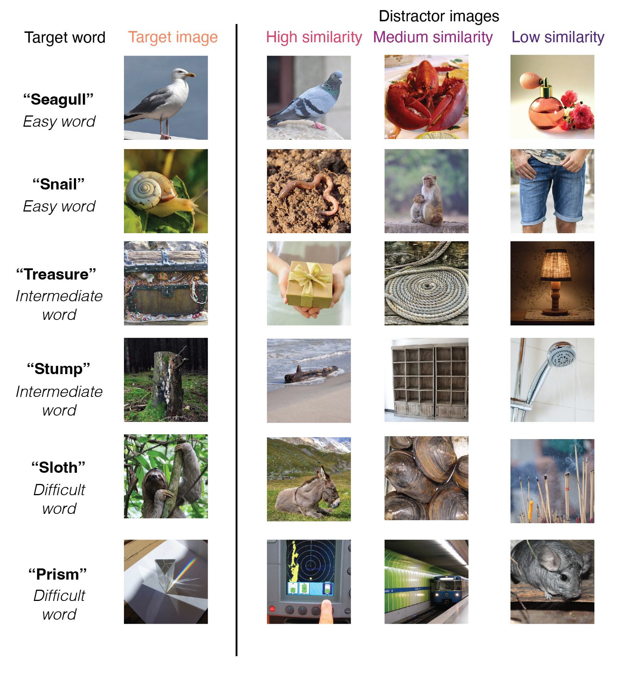
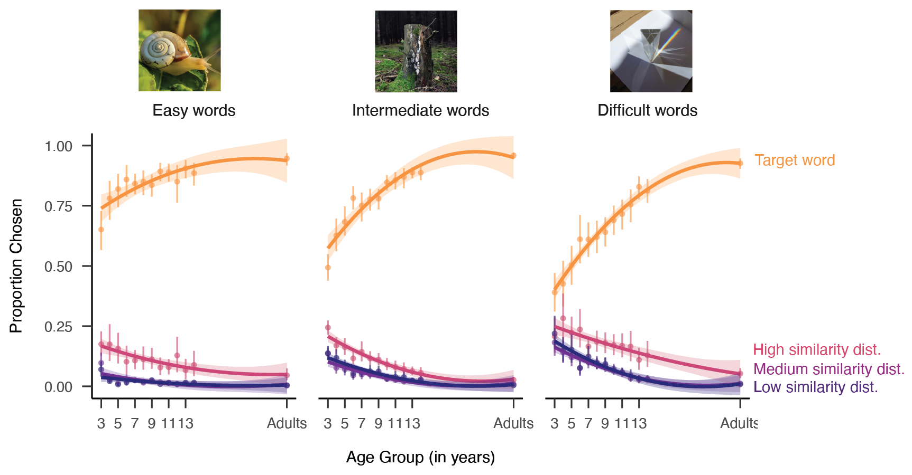
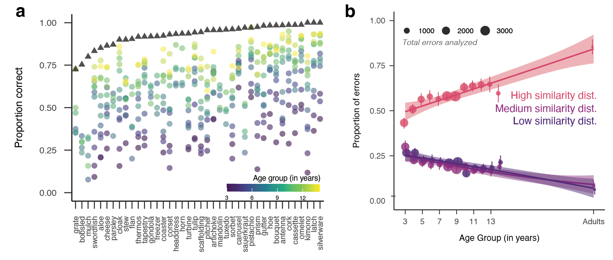
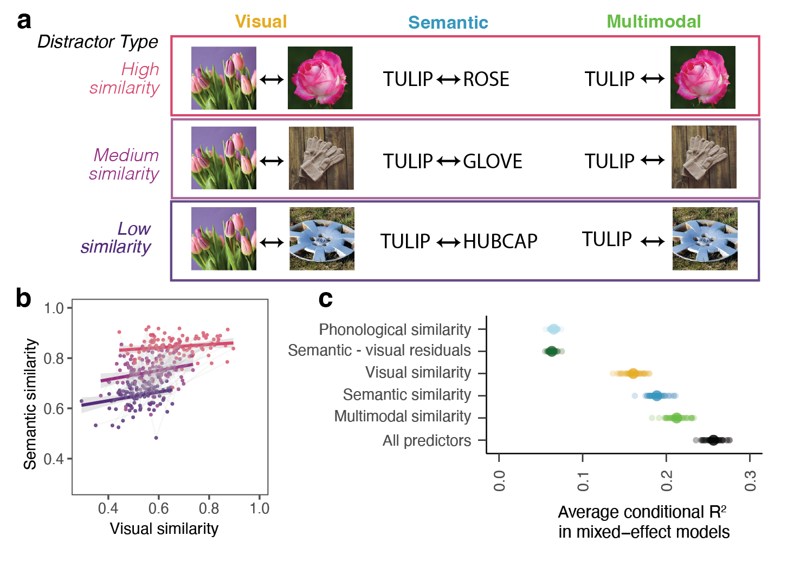

<!--
==============================================================================
 visual_vocab_manuscript_r4.Rmd

 Second-revision manuscript for PSCI-25-0881, made fully reproducible.

 Provenance: prose is propagated verbatim from
   writing/revision_materials/second_revision/visual_vocab_r3_july24.docx
 Every numeric value that appeared as literal text in that .docx has been
 replaced with inline R so that the reported values cannot drift from the
 data. See writing/REPRODUCIBILITY_NOTES.md for the full audit trail.

 This file supersedes visual_vocab_manuscript_r3.Rmd, which is left untouched.
==============================================================================
-->

```{r setup, include = FALSE}
library("papaja")
r_refs("r-references.bib")
```

```{r analysis-preferences}
# Seed for random number generation. Set once here; all downstream
# bootstraps and cross-validation splits inherit this stream, so the
# knitted document is deterministic given the same data and package versions.
set.seed(42)
knitr::opts_chunk$set(echo = FALSE, cache = FALSE, warning = FALSE,
                      message = FALSE, fig.pos = 'H')
```

```{r libraries}
library(tidyverse)
library(lubridate)
library(ggthemes)
library(assertthat)
library(langcog) # for bootstrapped CIs
library(ggpubr)
library(knitr)
library(here)
library(lme4)
library(lmerTest)
library(viridis)
library(broom.mixed)
library(kableExtra)
library(patchwork)
library(car)     # VIFs

# assert_that() returns TRUE *visibly*, which knitr would print into the
# rendered document as "## [1] TRUE". Wrap it so checks stay silent unless
# they fail, in which case they still halt the knit.
# assert_that() resolves its assertions in parent.frame(), so the caller's
# environment must be threaded through explicitly or checks inside other
# functions cannot see local variables.
check <- function(..., env = parent.frame()) {
  invisible(assertthat::assert_that(..., env = env))
}

library(MuMIn)   # conditional R^2 for cross-validated mixed models
```

```{r reproducibility-switches}
# RAW_DATA = TRUE  -> recompute everything from trial-level data (research team only).
# RAW_DATA = FALSE -> load the preprocessed, shareable summaries written by the
#                     TRUE branch. All values reported in the paper are identical
#                     either way; the FALSE branch exists because the school
#                     cohort's trial-level data cannot be shared (see RTS).
RAW_DATA <- TRUE

# Panel regeneration. The four numbered figures in this paper are Illustrator
# composites; the data-bearing panels inside them are generated by the chunks
# below and written to writing/figures/. Set to TRUE to re-export those panels.
# The composites themselves (figures/fig*.png) are assembled by hand from these
# panels and are what the manuscript displays.
REGEN_PANELS <- TRUE

# Analysis constants, referenced by BOTH the code and the prose so that the two
# can never disagree.
N_CV_ITER   <- 50    # cross-validation iterations for Figure 4C
CV_FRACTION <- 0.8   # proportion of the dataset sampled on each iteration
N_TOP_ITEMS <- 40    # number of high-change items displayed in Figure 3A
MIN_ATTEMPTS <- 10   # minimum attempts per (item, age group) cell to be plotted
```

```{r load-data-files}
if (RAW_DATA == TRUE) {
  # Trial-level data. Not publicly shareable in full: the school cohort is
  # governed by data-sharing agreements and FERPA (see Research Transparency
  # Statement). The preprocessed summaries below are shareable.
  load(file = here::here('data/raw/all_trial_data.Rdata'))
  school_type_meta <- read_csv(file = here::here('data/raw/pid_with_school_type.csv'))
}
```

```{r load-data-files-preprocessed}
# Written by analysis/step1_wrangle_datasets.Rmd. Summarized across
# age group and distractor type, so shareable.
load(file = here::here('data/preprocessed/summary_by_distractor.Rdata'))
```

```{r load-item-data}
# Item metadata and all CLIP-derived similarity metrics.
item_meta_and_model_sim <- read_csv(
  file = here::here('data/item_metadata/item_meta_and_model_sim.csv'))
```

```{r item-level-constants}
# Values used in the Method and Results prose, computed rather than typed.
n_target_words <- length(unique(item_meta_and_model_sim$targetWord))

n_words_with_typicality <- item_meta_and_model_sim %>%
  distinct(targetWord, mean_typicality) %>%
  filter(!is.na(mean_typicality)) %>%
  nrow()
```

# Introduction

How precise are children's representations of nouns, and how does this change across development? Consider a child who has recently learned the word "whale" but might incorrectly represent that the word "whale" refers to whales, sharks, and dolphins. Or perhaps an older child could have a precise understanding of what whales are---distinguishing them from whale sharks and correctly including atypical beluga whales. Here, we examine the precision of children's representations for nouns and how they change across both early and middle childhood.

Most empirical work on how children represent the meanings of nouns has focused on the first few years of life, when children learn words at an astonishing rate [@bloom_how_2000; @braginsky_consistency_2019]. In looking-while-listening tasks [@fernald2008looking], infants as young as 6 months look to pictures associated with common nouns like "bottle" and "banana" [@bergelson_at_2012], and 14- to 18-month-olds extend newly learned words to atypical exemplars of these categories [@weaver2024becoming]. By around their second birthday, children also generalize nouns to stylized, 3D exemplars [@pereira2009developmental] as they learn that shape is a valuable cue to basic-level category membership.

Yet classic theories of word learning have long articulated that children have partial knowledge about many words *en route* to mature understanding. One account suggests that young children might initially set up place-holder concepts via "fast mapping" but then gradually fill in later details about what words refer to [@carey1978acquiring; @dale1965vocabulary; @swingley2010fast]. For example, in one study three-year-olds remembered that a word ("chromium") was a color word, but they did not know which color it was [@carey1978acquiring]. Theories of later vocabulary acquisition have also characterized children's word knowledge as progressing through stages [@dale1965vocabulary], with an intermediate stage where children were thought to have a "vague knowledge of the word's meaning" [@dale1965vocabulary] before they fully grasp what a word means.

Indeed, children likely construct increasingly detailed representations of the categories that words refer to throughout early and middle childhood. For example, children may become better able to recognize the specific visual features that distinguish similar categories from one another---between hedgehogs vs. porcupines, blue whales vs. whale sharks, or tulips vs. roses. Children might also develop a more refined representation of a typical category exemplar as they become fluent in producing depictions of these categories. Some work supports this idea: in a large observational study, children became increasingly able to both depict and recognize line drawings (e.g., "whale", "clock", "tiger") from 3-10 years of age, hinting at changes in how children represent their diagnostic features [@long2024parallel]. Indeed, category learning almost certainly extends throughout middle childhood and into adulthood [@curby2010trained; @harel2016special]: birding experts, car aficionados [@tanaka1997expertise], and graphic artists [@perdreau2013artist] have more precise representations for categories that they have significant expertise with. Children's representations of noun meanings are thus likely refined as they become experts in their own preferred domains (e.g., dinosaurs) [@deloache2007planes].

Despite this long-standing recognition that children likely have partial word knowledge [@carey1978acquiring; @dale1965vocabulary], relatively little work has systematically examined changes in children's knowledge of word meanings. Most assessments of receptive vocabulary characterize word knowledge as all-or-nothing, perhaps because it is difficult to quantify what it would mean to have a low-precision representation for a word. Both direct measures, such as the Peabody Picture Vocabulary Test [PPVT\; @dunn2003peabody; @gershon2014language], and parent-report measures of vocabulary knowledge [@fenson1994variability; @marchman2023macarthur] characterize children as either "knowing" a word or not, but these open-source parent-report questionnaires lack distractors. Since the distractors for the PPVT assessments are chosen carefully, children's error patterns could in principle reveal evidence for partial knowledge, but all item data resulting from these proprietary assessments are unavailable for re-analysis (including data from the NIH Toolbox Assessments). Further, most assessments typically stop once a child has answered incorrectly on several difficult words rather than assessing their partial knowledge.

Our empirical and theoretical accounts of the development of how children represent the meanings of nouns have thus been limited by (1) a need for larger developmental datasets with dense data on individual items and (2) the difficulty of systematically quantifying what it means to have a partial or imprecise representation. Here, we take steps to address both of these challenges. To create a larger dataset, we built a new, open-source "visual vocabulary" task where children heard a word (e.g., "swordfish") and had to choose a picture in order to teach aliens about their meanings. We then developed research-practice partnerships with preschools and school contexts across the U.S. in order to gather dense item data across a wide age range (3--14 years) from many children (*N* = 3995) in both online and school contexts, as well as adults online (*N* = 211).

To quantify partial representations, we leveraged multimodal language models both to choose distractor items systematically and to analyze children's resulting responses. Prior work suggests that similarity metrics derived from multimodal models trained to associate text and images are strongly (though imperfectly) related to behavioral and neural human similarity judgments [@conwell2022can; @muttenthaler2021thingsvision]. In particular, responses from language encoders can be used to approximate the semantic relatedness between any two words (e.g., "antelope" and "gazelle"), and responses from visual encoders can capture how related any two images are in terms of their visual features (e.g., color, shape, and category membership). And in multimodal models, these metrics can also estimate how related a given word (e.g., "antelope") is to a given image (e.g., a photo of a gazelle). To choose distractor items, we first used the similarity of the target and distractor words in a language encoder of a multimodal model [CLIP\; @radford2021learning]. To analyze error patterns, we used this same model to quantify the visual similarity and multimodal similarity of each target and distractor pairing on each trial; we then used these similarity metrics to analyze trial-by-trial error patterns.

With this data, we then investigated three main questions. First, we examined how accurate children's representations for nouns were throughout this large developmental age range, highlighting nouns with more or less variability. Second, we examined evidence for changes in the precision of representations before word knowledge is solidified, as per @dale1965vocabulary. To do so, we examined error patterns. If children have an imprecise representation of a noun's meaning, then when they do not know the exact meaning of a word they may still systematically choose distractors that are similar to the target word. Third, we examined the structure in children's error patterns by systematically exploring the variance explained by semantic, visual, and multimodal similarity metrics between each target and distractor, adding covariates for phonological similarity. If children's errors reflect how they represent the meanings of nouns, then the multimodal similarity between the target word and distractor images should explain the most variance in error patterns.

```{r procedure-figure, echo=FALSE, fig.cap="Example trials of easy, intermediate, and difficult words, as operationalized via terciles from the estimated age-of-acquisition (AoA; Kuperman et al., 2012); actual AoAs are used in analyses. Each target image is shown alongside the three distractors that varied in similarity to the target word; distractors were chosen via the similarity of the target and distractor words in the language encoder of CLIP (Radford et al., 2021).", out.width="100%", fig.align='center'}
# Figure 1 is a hand-assembled stimulus montage (not data-derived).

```

# Method

## Participants

```{r participants}
if (RAW_DATA == TRUE) {

  n_by_age_group <- df.4AFC.trials.clean %>%
    group_by(age_group) %>%
    summarize(num_participants = length(unique(pid)))

  trials_by_participant <- df.4AFC.trials.clean %>%
    group_by(pid) %>%
    summarize(mean_pc = mean(correct), num_trials = length(unique(targetWord)))

  trials_by_age <- df.4AFC.trials.clean %>%
    group_by(pid, age_group) %>%
    summarize(mean_pc = mean(correct), num_trials = length(unique(targetWord))) %>%
    group_by(age_group) %>%
    summarize(mean_num_trials = mean(num_trials),
              sd_num_trials = sd(num_trials),
              n = length(unique(pid)))

  # Participants who played the game more than once; identified as those who
  # completed more trials than the largest single-session item bank (80).
  longitudinal_participants <- sum(trials_by_participant$num_trials > 80)

  by_cohort <- df.4AFC.trials.clean %>%
    group_by(cohort) %>%
    summarize(num_participants = length(unique(pid))) %>%
    mutate(cohort = replace_na(cohort, 'adults'))

  # Child age range, reported in the abstract and introduction.
  child_ages <- df.4AFC.trials.clean %>%
    filter(!cohort %in% c('adults_monolingual', 'adults_ell')) %>%
    pull(age_group)

  # Participants who contributed data at more than one age (played across a
  # birthday). Needed by the Supplemental Table 1 caption, which must explain
  # why that table's Participants column sums to more than the total sample.
  # Computed here so it lands in the shareable summary below and the supplement
  # does not need trial-level data.
  n_spanning_two_ages <- df.4AFC.trials.clean %>%
    group_by(pid) %>%
    summarize(n_ages = n_distinct(age_group)) %>%
    filter(n_ages > 1) %>%
    nrow()

  ### school-type breakdown, used for Supplemental Figure 1
  garden_only <- df.4AFC.trials.clean %>%
    filter(cohort %in% c('garden')) %>%
    mutate(school_type = 'CHS') %>%
    group_by(pid, age_group, school_type) %>%
    summarize(mean_pc = mean(correct)) %>%
    group_by(age_group, school_type) %>%
    multi_boot_standard(col = 'mean_pc')

  adults_only <- df.4AFC.trials.clean %>%
    filter(cohort %in% c('adults_monolingual', 'adults_ell')) %>%
    mutate(age_group = 25) %>%
    group_by(pid, age_group, cohort) %>%
    summarize(mean_pc = mean(correct)) %>%
    mutate(school_type = cohort) %>%
    group_by(age_group, school_type) %>%
    multi_boot_standard(col = 'mean_pc')

  accuracy_by_cohort_by_age <- trials_by_participant %>%
    left_join(school_type_meta) %>%
    filter(school_type != 'test') %>%
    mutate(age_group = floor(ageMonths / 12)) %>%
    group_by(school_type, age_group) %>%
    multi_boot_standard(col = 'mean_pc') %>%
    full_join(adults_only) %>%
    full_join(garden_only)

  save(n_by_age_group, trials_by_participant, trials_by_age,
       longitudinal_participants, by_cohort, accuracy_by_cohort_by_age,
       child_ages, n_spanning_two_ages,
       file = here::here('data/preprocessed/descriptives_data_structures.RData'))
}

if (RAW_DATA == FALSE) {
  load(file = here::here('data/preprocessed/descriptives_data_structures.RData'))
}

# Convenience accessors so the prose below reads cleanly.
n_total     <- sum(by_cohort$num_participants)
n_adults    <- sum(by_cohort$num_participants[
                     by_cohort$cohort %in% c('adults_monolingual', 'adults_ell')])
n_children  <- n_total - n_adults
n_preschool <- by_cohort$num_participants[by_cohort$cohort == 'bing']
n_chs       <- by_cohort$num_participants[by_cohort$cohort == 'garden']
n_mono      <- by_cohort$num_participants[by_cohort$cohort == 'adults_monolingual']
n_ell       <- by_cohort$num_participants[by_cohort$cohort == 'adults_ell']
n_schools   <- by_cohort$num_participants[by_cohort$cohort == 'schools']

mean_trials <- mean(trials_by_participant$num_trials)
sd_trials   <- sd(trials_by_participant$num_trials)
min_trials  <- min(trials_by_participant$num_trials)
max_trials  <- max(trials_by_participant$num_trials)

# Internal consistency checks: these must hold or the reported Ns are wrong.
check(n_children + n_adults == n_total)
check(n_preschool + n_chs + n_schools == n_children)
check(n_mono + n_ell == n_adults)
```

To obtain a large sample of responses for individual items across development, we collected data from children across several different testing contexts, totaling $N$ = `r n_total` unique participants. We collected data from children in an in-person preschool ($N$ = `r n_preschool`, 3--5-year-olds) and from the Children Helping Science (CHS) Platform ($N$ = `r n_chs`, 3--7-year-olds). We also recruited adults online via Prolific; we sampled from monolinguals ($N$ = `r n_mono`) and adults who spoke English as a second language ($N$ = `r n_ell`) to maximize our chance of finding item variability and to measure a range of adult abilities.

In addition, we recruited representative samples from schools across the United States through the [BLINDED] platform ($N$ = `r n_schools`, 5--14-year-olds) (BLINDED et al.). Schools included seven public or public charter school districts (33 schools), three independent schools focused on supporting students with learning differences, two independent schools, and one summer program. This task was offered as a pilot vocabulary assessment along with other foundational reading measures that were developed for use in school-research partnerships throughout the United States [@coburn2016research; @wentworth2023brokering].

Most participants responded directly via clicking through the games on a laptop or tapping through the games on a tablet, except those recruited online through CHS and Prolific; children's parents responded via clicking on the image that the child indicated on CHS, and adults responded via clicking on the images. Children completed, on average, `r printnum(mean_trials)` distinct target-word trials (*SD* = `r printnum(sd_trials)`) that were sampled randomly from the stimulus set (*max* = `r max_trials`; different maximum numbers of trials were included in different testing contexts; see Supplemental Materials Table 1 for further details). All participants who contributed data were included, regardless of the number of trials they completed (*range* = `r min_trials`, *max* = `r max_trials`). Some children participated in the game more than once (*N* = `r longitudinal_participants`), and their data are included; these were often additional items due to random sampling. However, excluding these participants did not change the pattern of results.

## Materials

We capitalized on publicly available existing image and audio databases to generate trials. All images were taken from the THINGS+ dataset [@stoinski2024thingsplus], after filtering out non-child-safe images (e.g., weapons, cigarettes) and images with low-nameability (<.3), as per Stoinski et al., 2024. We used the copyright-free, high-quality image released for each noun. We subset to nouns that had available age-of-acquisition (AoA) ratings from a previous existing dataset [@kuperman2012age] where adults were asked to retrospect on the age that they learned a word in development; these estimated AoAs were used as a proxy for item difficulty. Audio for each target word was taken from the MALD database [@tucker2019massive].

From this subset, our goal was to create the largest number of trials with target words that had unique distractor items that varied in similarity. To do so, we first paired target words with distractor words of similar difficulty; all potential target-distractor pairs had estimated AoA ratings within 3 years of each other. Then, we sampled distractors with high, medium, and low similarity to the target word as operationalized via the cosine similarity of the target and distractor word embeddings in the language encoder of a multimodal language model [@radford2021learning]. For each target word, we first selected a high-similarity distractor by choosing the distractor word with the highest cosine similarity to the target word (and was itself not one of the target words). For low-similarity distractors, we sampled a unique distractor word that had the lowest cosine similarity among the remaining distractors. For medium-similarity distractors, we then randomly sampled a distractor word that was the same animacy as the target word. Similarity values were determined relative to the distribution of all possible target-distractor similarity values for each word in the THINGS+ dataset. In our final set, we had `r n_target_words` items with a range of different estimated age-of-acquisition ratings (e.g., hedgehog, mandolin, mulch, swordfish, waterwheel, bobsled) with all unique targets and distractors.

For modeling item-level variance, we used the word frequency (SUBTLEX) measures taken directly from Stoinski et al., 2024, as well as their aggregated word typicality judgments for the `r n_words_with_typicality`/`r n_target_words` target words for which they were available. All stimuli and their metadata are available on the public repository for this project (BLINDED).

## Model features

We extracted embeddings for all of the words and the images used in the study in the same multimodal language model [@radford2021learning]. This model has both a language and vision encoder and is trained on the contrastive loss between pairs of images and their corresponding captions. In these encoders, each word or image can be represented by a 512-dimensional vector in either semantic or visual similarity space, respectively.

We first took the computed semantic similarity scores used for item selection; recall these were obtained by taking the cosine similarity between the embeddings for each target and distractor word in the language encoder (e.g., tulip -- rose, tulip -- glove, tulip -- hubcap); this metric calculates the angle between any given two high-dimensional vectors. For visual similarity, we repeated this procedure but using image similarity vectors from the vision transformer for each target image and distractor image on each trial. For multimodal similarity, we computed the cosine similarity of the embedding of the target word in the language encoder to the embeddings for each of the distractor images in the vision encoder; this is possible because the embedding spaces for the vision and language transformers in this model are aligned and have the same number of dimensions. This procedure thus yielded semantic, visual, and multimodal similarity scores for each target-distractor pairing on each trial. We obtained all model features using an implementation of CLIP available at https://github.com/openai/CLIP; all code for similarity computations is available on the repository associated with this project.

## Procedure

Children were invited to participate in a picture matching game where they were asked to "teach aliens on another planet about some of the words on our planet"; children picked one of three aliens to "accompany them on their journey." Before the images appeared, children heard a target word (e.g., "apple") and then were asked to "choose the picture that goes with the word". The four images appeared in randomized locations on the screen, and one of the images always corresponded to the target word. On practice trials, the distractor images were of words that were all very dissimilar to the target word, and the target word was relatively easy (e.g., "apple"). The game played a chime sound if children chose the correct image, and a slightly unpleasant sound if they responded incorrectly; this feedback ensured that children of all ages understood the task correctly. Each child viewed a random subset of the item bank, and the items they viewed were displayed in a random order. Children were allowed to stop the game whenever they wanted to. Different versions of the game included varying amounts of total possible trials and additional items, as these games were developed as part of an additional project to create an open-sourced measure of children's vocabulary knowledge (Blinded et al., in prep); all experimental code is available via [BLINDED] and can be viewed and used via their platform. Here, we analyze children's responses to items that were generated using the THINGS+ dataset with distractors of varying difficulty (see Materials).

## Data and code sharing

The analyses presented in the paper were not pre-registered, and children's data were analyzed both during and at the end of data collection. These data were collected with the secondary goal of creating an open-source measure of children's developing vocabulary knowledge. All pre-processed data and analysis and plotting code have been made available in an online repository. We are able to publicly share the trial-by-trial raw data for the preschool, CHS, and adult cohorts; however, due to strict data-sharing agreements with the schools in which the testing was conducted, we do not have permission to share the raw data from the school cohort. These student data are protected under FERPA and thus cannot be shared as we did not obtain a data usage agreement prior to collection. However, we share preprocessed, item-level averages and standard deviations for each age group, including the number of children who completed each particular trial.

# Results

```{r summarize-distractor-data}
df.4AFC.distractor.summary.byAge.perc <- df.4AFC.distractor.summary.byAge.clean %>%
  ungroup() %>%
  mutate(wordPairing = factor(wordPairing,
                              levels = c('target', 'hard', 'easy', 'distal'),
                              labels = c("Target word", "High sim. dist",
                                         "Med sim. dist.", "Low sim. dist."))) %>%
  group_by(age_group, numAFC, wordPairing) %>%
  multi_boot_standard(col = 'perc', na.rm = TRUE)
```

```{r summarize-distractor-data-aoa}
df.4AFC.distractor.summary.byAge.perc.byaoa <- df.4AFC.distractor.summary.byAge.clean %>%
  ungroup() %>%
  mutate(wordPairing = factor(wordPairing,
                              levels = c('target', 'hard', 'easy', 'distal'),
                              labels = c("Target word", "High sim. dist",
                                         "Med sim. dist.", "Low sim. dist."))) %>%
  group_by(age_group, wordPairing, AoA_Bin_Name) %>%
  multi_boot_standard(col = 'perc', na.rm = TRUE)
```

```{r aoa-by-bin}
# AoA terciles. Used for visualization only; AoA enters all models continuously.
aoa_by_bin <- df.4AFC.distractor.summary.byAge.clean %>%
  group_by(AoA_Bin) %>%
  distinct(targetWord, AoA_Est_Word1) %>%
  summarize(avg_aoa = mean(AoA_Est_Word1), sd_aoa = sd(AoA_Est_Word1),
            n_words = n())

# Named accessors so the prose does not index by position.
aoa_easy_m  <- aoa_by_bin$avg_aoa[aoa_by_bin$AoA_Bin == 1]
aoa_easy_sd <- aoa_by_bin$sd_aoa[aoa_by_bin$AoA_Bin == 1]
aoa_med_m   <- aoa_by_bin$avg_aoa[aoa_by_bin$AoA_Bin == 2]
aoa_med_sd  <- aoa_by_bin$sd_aoa[aoa_by_bin$AoA_Bin == 2]
aoa_hard_m  <- aoa_by_bin$avg_aoa[aoa_by_bin$AoA_Bin == 3]
aoa_hard_sd <- aoa_by_bin$sd_aoa[aoa_by_bin$AoA_Bin == 3]
```

```{r trajectory-panel, include=FALSE}
# Panel that becomes Figure 2 after Illustrator annotation.
labels_graph <- df.4AFC.distractor.summary.byAge.perc.byaoa %>%
  mutate(AoA_Bin_Name = dplyr::recode(AoA_Bin_Name,
                                      "Early AoA" = "Easy words",
                                      "Med AoA"   = "Intermediate words",
                                      "Late AoA"  = "Difficult words")) %>%
  filter(age_group == 25, AoA_Bin_Name == 'Difficult words')

trajectory_plot <- ggplot(
  data = df.4AFC.distractor.summary.byAge.perc.byaoa %>%
    mutate(age_label = ifelse(age_group == 25, "Adults", as.character(age_group)),
           age_label = factor(age_label, levels = c(as.character(3:14), "Adults")),
           AoA_Bin_Name = dplyr::recode(AoA_Bin_Name,
                                        "Early AoA" = "Easy words",
                                        "Med AoA"   = "Intermediate words",
                                        "Late AoA"  = "Difficult words")),
  aes(x = age_group, y = mean, col = wordPairing, fill = wordPairing)) +
  geom_point(size = 1, alpha = .6) +
  geom_linerange(aes(y = mean, ymax = ci_upper, ymin = ci_lower), alpha = .6) +
  geom_smooth(aes(group = wordPairing), span = 5, size = 1, alpha = .2) +
  facet_wrap(~AoA_Bin_Name) +
  xlab('Age Group (in years)') +
  ylab('Proportion Chosen') +
  papaja::theme_apa(base_size = 10) +
  coord_cartesian(ylim = c(0, 1)) +
  scale_x_continuous(breaks = c(seq(3, 14, 2), 25),
                     labels = function(x) ifelse(x == 25, "Adults", as.character(x))) +
  guides(color = guide_legend(title = NULL)) +
  scale_color_viridis(option = 'C', discrete = TRUE, begin = .75, end = 0) +
  scale_fill_viridis(option = 'C', discrete = TRUE, begin = .75, end = 0) +
  theme(legend.position = 'none', aspect.ratio = 1.3)

if (REGEN_PANELS) {
  ggsave(trajectory_plot, filename = here::here('writing/figures/fig2c-trajectory.pdf'),
         width = 6.5, height = 3, units = 'in')
}
```

```{r accuracy-fig, out.width='100%', fig.cap="Task performance as a function of the age of the child completing the task, plotted separately for relatively easy, harder, or difficult words; words are binned based on the estimated AoA from Kuperman et al., 2012 solely for visualization purposes. Lines refer to the proportion of words that children chose the target (orange), high-similarity (pink), medium similarity (purple), or low similarity (dark purple) distractor at each age; error bars represent bootstrapped 95% confidence intervals.", fig.align='center'}
# Composite assembled from fig2c-trajectory.pdf (generated above) plus annotation.

```

```{r now-with-meta}
df.4AFC.distractor.summary.byAge.clean.withmeta <- df.4AFC.distractor.summary.byAge.clean %>%
  left_join(item_meta_and_model_sim %>%
              distinct(targetWord, log_freq_target_word, concreteness_target_word,
                       superordinate_category_target_word, mean_typicality),
            by = c('targetWord'))
```

```{r category-for-supplement}
# Supplemental analysis: accuracy by THINGS+ superordinate category.
by_category <- df.4AFC.distractor.summary.byAge.clean.withmeta %>%
  filter(wordPairing == 'target') %>%
  filter(!is.na(superordinate_category_target_word)) %>%
  filter(!is.na(perc)) %>%
  group_by(superordinate_category_target_word) %>%
  multi_boot_standard(col = 'perc')
```

```{r main-lmer}
## Table 1: item-level accuracy model with covariates.
d <- df.4AFC.distractor.summary.byAge.clean.withmeta %>%
  filter(wordPairing == 'target')

main_results <- lmer(
  data = d,
  perc ~ scale(log_freq_target_word) * scale(concreteness_target_word) +
         scale(mean_typicality) + scale(totalAttempts) +
         scale(age_group) * scale(AoA_Est_Word1) + (1 | targetWord))
```

```{r vif-check}
# VIFs reported in the Table 1 caption, computed rather than typed.
vif_tidy <- function(m) {
  v <- car::vif(m)
  if (is.matrix(v)) v <- v[, "GVIF^(1/(2*Df))"]^2  # GVIF -> VIF scale
  round(sort(v, decreasing = TRUE), 2)
}
# Unrounded maximum, so the threshold quoted in the Table 1 caption is derived
# from the actual value rather than from a display-rounded one.
max_vif_raw <- function(m) {
  v <- car::vif(m)
  if (is.matrix(v)) v <- v[, "GVIF^(1/(2*Df))"]^2
  max(v)
}
vif_main <- vif_tidy(main_results)
max_vif_main <- max_vif_raw(main_results)
```

```{r errors-by-pid}
if (RAW_DATA == TRUE) {
  df.4AFC.distractor.summary.byPid <- df.4AFC.trials.clean %>%
    group_by(targetWord, answerWord, numAFC, wordPairing, pid, age_group) %>%
    tally() %>%
    filter(wordPairing != 'target')  # error trials only
}
```

## A protracted developmental trajectory

We found a gradual increase across our age groups in how well children could correctly identify the referents for many nouns. Figure 2 shows the proportion of time that children identified the target picture, highlighting a protracted developmental trajectory. Older children were more accurate at identifying the correct visual image that a word referred to, with the oldest children in our sample (13- and 14-year-olds) still performing less accurately than adults (see Supplemental Figure 1 for a visualization of results across cohorts).

```{r item-effects}
# Item-by-age cells with enough observations to estimate a developmental slope.
item_effects <- df.4AFC.distractor.summary.byAge.clean %>%
  group_by(age_group, targetWord) %>%
  filter(wordPairing == 'target') %>%
  mutate(totalAttempsbyAgeBin = sum(totalAttempts, na.rm = TRUE)) %>%
  filter(totalAttempsbyAgeBin >= MIN_ATTEMPTS)

slopes <- item_effects %>%
  group_by(targetWord, AoA_Est_Word1) %>%
  summarize(age_cor = cor(age_group, perc)) %>%
  ungroup() %>%
  mutate(slope_bin = ntile(age_cor, 3),
         AoA_Bin = ntile(AoA_Est_Word1, 3))

n_items_with_slopes <- nrow(slopes)

# The N_TOP_ITEMS items with the steepest developmental change (Figure 3A),
# and the N_TOP_ITEMS with the shallowest.
h_slope <- slopes %>% arrange(age_cor) %>% slice_max(n = N_TOP_ITEMS, order_by = age_cor)
l_slope <- slopes %>% arrange(age_cor) %>% slice_max(n = N_TOP_ITEMS, order_by = -age_cor)
```

```{r example-words}
# Example words quoted in the prose are pulled from the data rather than typed,
# so that the text cannot cite a word that is absent from the figure.
# (An earlier draft cited "sandbag" as a high-change item; it ranks
#  50th of 108 and does not appear in Figure 3A. See REPRODUCIBILITY_NOTES.md.)
ranked_slopes <- slopes %>% arrange(desc(age_cor)) %>% mutate(rank = row_number())

pick_perc <- function(word, age = 3) {
  v <- item_effects %>%
    ungroup() %>%
    filter(targetWord == word, age_group == age) %>%
    pull(perc)
  check(length(v) == 1,
    msg = paste0("expected exactly one accuracy value for '", word, "' at age ", age))
  printnum(v, digits = 2, gt1 = FALSE)
}

# Verify every word cited as high-change is in fact plotted in Figure 3A.
cited_high_change <- c("swordfish", "prism", "antenna", "turbine",
                       "scaffolding", "gutter")
check(
  all(cited_high_change %in% h_slope$targetWord),
  msg = paste("cited high-change words missing from Figure 3A:",
              paste(setdiff(cited_high_change, h_slope$targetWord), collapse = ", ")))

# Verify every word cited as low-change is in fact among the shallowest items.
cited_low_change <- c("sunflower", "rice", "potato", "hedgehog")
check(
  all(cited_low_change %in% l_slope$targetWord),
  msg = paste("cited low-change words missing from the low-slope set:",
              paste(setdiff(cited_low_change, l_slope$targetWord), collapse = ", ")))

# Verify AoA-tercile example words fall in the terciles the prose claims.
bin_of <- function(w) {
  b <- df.4AFC.distractor.summary.byAge.clean %>%
    ungroup() %>% filter(targetWord == w) %>% distinct(AoA_Bin) %>% pull(AoA_Bin)
  b[1]
}
check(
  all(vapply(c("acorn","bulldozer","scoop","puddle","sprinkler"), bin_of, numeric(1)) == 1))
check(
  all(vapply(c("barrel","buffet","coaster","stump","carousel"), bin_of, numeric(1)) == 2))
check(
  all(vapply(c("tapestry","scaffolding","mandolin","aloe"), bin_of, numeric(1)) == 3))
```

We found a slight developmental trend for relatively easy words that had an average estimated age-of-acquisition (AoA; Kuperman et al., 2012) of `r printnum(aoa_easy_m)` years (*SD* = `r printnum(aoa_easy_sd)`; acorn, bulldozer, scoop, puddle, sprinkler). However, change in children's accuracy over development was much more pronounced for more difficult words (barrel, buffet, coaster, stump, carousel; average *AoA* = `r printnum(aoa_med_m)` years, *SD* = `r printnum(aoa_med_sd)`) and challenging words (e.g., tapestry, scaffolding, mandolin, aloe; average AoA = `r printnum(aoa_hard_m)` years, *SD* = `r printnum(aoa_hard_sd)`) (see Figure 2). Statistically, this was reflected as an interaction between estimated AoA and the age group of participants in a linear mixed-effect model (see Table 1), where AoA was modeled as a continuous predictor (see Supplemental Figure 2). While "easy" words with overall low AoA tended to be words that were relatively concrete and high frequency, these factors did not explain additional variance in children's overall accuracy, nor did their interaction.

```{r prettify-terms, include=FALSE}
# Rewrite the term/Predictor column of an apa_print()/tidy() table so the docx
# tables show human-readable labels instead of raw `scale(varname)` strings.
prettify_terms <- function(tab) {
  col <- intersect(c("Predictor", "predictor", "term", "Term"), names(tab))[1]
  if (is.na(col)) return(tab)
  raw <- as.character(tab[[col]])

  raw <- gsub("\\$\\\\times\\$", "×", raw)
  raw <- gsub("$\\times$", "×", raw, fixed = TRUE)
  raw <- gsub("\\\\times", "×", raw)
  raw <- gsub("\\bScale", "", raw)
  raw <- gsub("scale\\(([^)]+)\\)", "\\1", raw)
  raw <- gsub(":", " × ", raw, fixed = TRUE)
  raw <- trimws(raw)

  # Variable-name renames. Each entry: c(underscore_form, space_form, pretty).
  renames <- list(
    c("log_freq_target_word",     "log freq target word",     "Log. freq. (target)"),
    c("log_freq_answer_word",     "log freq answer word",     "Log. freq. (answer)"),
    c("concreteness_target_word", "concreteness target word", "Concreteness (target)"),
    c("sim_img_img",              "sim img img",              "Visual sim."),
    c("sim_img_txt",              "sim img txt",              "Multimodal sim."),
    c("sim_txt_txt",              "sim txt txt",              "Semantic sim."),
    c("sem_resid",                "sem resid",                "Semantic residual"),
    c("phon_sim",                 "phon sim",                 "Phonological sim."),
    c("AoA_Est_Word1",            "AoA Est Word1",            "AoA (target)"),
    c("AoA_Est_Word2",            "AoA Est Word2",            "AoA (answer)"),
    c("age_group",                "age group",                "Age"),
    c("total_num_errors",         "total num errors",         "Total errors"),
    c("totalAttempts",            "total Attempts",           "Total attempts"),
    c("mean_typicality",          "mean typicality",          "Typicality")
  )
  for (r in renames) {
    raw <- gsub(r[1], r[3], raw, fixed = TRUE)
    raw <- gsub(r[2], r[3], raw, fixed = TRUE)
  }
  tab[[col]] <- raw
  tab
}
```

```{r main-modeling-table}
apa_lm <- apa_print(main_results)
apa_table(
  prettify_terms(apa_lm$table),
  caption = paste0(
    "Linear mixed-effect model coefficients predicting the proportion correct ",
    "for each item in each age group as a function of the frequency, concreteness, ",
    "typicality, total attempts at each item, estimated AoA of the target word, ",
    "the age group of the child (in years), and the interaction between target AoA ",
    "and children's age. All predictors were standardized before analysis. ",
    # Threshold stated as the next tenth strictly above the observed maximum,
    # so the claim is true by construction whatever the data yield.
    "Variance inflation factors (VIF) for all terms were less than ",
    sprintf("%.1f", floor(max_vif_main * 10) / 10 + 0.1), ".")
)
```

At an item level, 3-year-olds' performance on the easiest words (watermelon, *M* = `r pick_perc("watermelon")`; turtle, *M* = `r pick_perc("turtle")`; lollipop, *M* = `r pick_perc("lollipop")`) suggests that they understood the task. However, other items with relatively low AoAs (squirrel, *M* = `r pick_perc("squirrel")`; hamster, *M* = `r pick_perc("hamster")`; map, *M* = `r pick_perc("map")`) were more difficult for young children. Over development, the words that showed the greatest change across age included some animals (e.g., swordfish), as well as inanimate objects (prism, antenna, turbine) and also other various objects, including parts of buildings (scaffolding, gutter). Some items, however, showed relatively little change across age: these tended to be easy words that children across all ages identified correctly (sunflower, rice, potato, hedgehog). Overall, these results highlight variability across individual nouns and document the protracted developmental trajectory for learning noun meanings across childhood.

```{r item-effects-panel, include=FALSE}
# Panel A of Figure 3.
adult_acc_high_slopes <- item_effects %>%
  filter(targetWord %in% h_slope$targetWord) %>%
  filter(age_group == 25) %>%
  group_by(targetWord) %>%
  mutate(adult_perc = mean(perc)) %>%
  select(targetWord, adult_perc)

high_slopes <- item_effects %>%
  filter(targetWord %in% h_slope$targetWord) %>%
  left_join(adult_acc_high_slopes, by = c('targetWord')) %>%
  mutate(targetWord = fct_reorder(targetWord, adult_perc, .desc = TRUE))

# Sanity check: the panel must display exactly N_TOP_ITEMS words, which is the
# number the figure caption reports.
check(
  length(unique(as.character(high_slopes$targetWord))) == N_TOP_ITEMS)

item_effects_plot <- ggplot(
  high_slopes %>% filter(age_group < 25),
  aes(x = fct_reorder(targetWord, adult_perc, .desc = FALSE), y = perc, col = age_group)) +
  geom_point(alpha = .5) +
  geom_point(data = high_slopes %>% filter(age_group == 25),
             aes(x = fct_reorder(targetWord, adult_perc, .desc = TRUE),
                 y = perc, col = age_group),
             color = 'black', alpha = .6, size = 1.5, shape = 17) +
  theme_apa(base_size = 8) +
  ylab('Proportion correct') +
  scale_color_viridis_c(name = 'Age group (in years)') +
  theme(axis.text.x = element_text(angle = 90, vjust = 0.5, hjust = 1, size = 6)) +
  theme(legend.position = 'none') +
  xlab('') +
  ylim(0, 1)

if (REGEN_PANELS) {
  ggsave(item_effects_plot,
         filename = here::here('writing/figures/fig3a_itemeffects.pdf'),
         width = 3.5, height = 3, units = 'in')
}
```

```{r errors-panel, include=FALSE}
# Panel B of Figure 3. Relative error rates by distractor type and age.
# NOTE ON GROUPING: `summarize()` below leaves the frame grouped by `pid`, so
# `sum(c(hard, easy, distal))` totals across all rows for a participant. For the
# 59 participants who appear in more than one age group this pools their sessions.
# This is the grouping used for the values reported in the manuscript; it is
# preserved deliberately. A per-row alternative shifts the age coefficient from
# 0.037 to 0.036 and leaves every conclusion unchanged.
if (RAW_DATA == TRUE) {
  dist_by_pid_4afc <- df.4AFC.distractor.summary.byPid %>%
    group_by(pid, wordPairing, age_group) %>%
    summarize(num_errors = n()) %>%
    pivot_wider(values_from = "num_errors", names_from = "wordPairing") %>%
    mutate(total_num_errors = sum(c(hard, easy, distal), na.rm = TRUE)) %>%
    mutate(prop_hard   = hard / total_num_errors) %>%
    mutate(prop_easy   = easy / total_num_errors) %>%
    mutate(prop_distal = distal / total_num_errors) %>%
    pivot_longer(cols = starts_with('prop'), names_to = "wordPairing", values_to = "prop") %>%
    select(pid, wordPairing, prop, total_num_errors, age_group) %>%
    mutate(prop = replace_na(prop, replace = 0))

  dist_by_cond_by_age_count <- dist_by_pid_4afc %>%
    group_by(age_group, wordPairing) %>%
    summarize(num_errors = sum(total_num_errors))

  dist_by_cond_by_age <- dist_by_pid_4afc %>%
    group_by(age_group, wordPairing) %>%
    multi_boot_standard(col = 'prop', na.rm = TRUE) %>%
    right_join(dist_by_cond_by_age_count)

  dist_by_cond_by_age <- dist_by_cond_by_age %>%
    mutate(wordPairing = factor(wordPairing,
                                levels = c('prop_hard', 'prop_easy', 'prop_distal'),
                                labels = c("High sim. dist", "Med sim. dist.",
                                           "Low sim. dist.")))

  save(dist_by_cond_by_age_count, dist_by_cond_by_age,
       file = here::here('data/preprocessed/dist_by_cond_by_age.RData'))
}

if (RAW_DATA == FALSE) {
  load(file = here::here('data/preprocessed/dist_by_cond_by_age.RData'))
}

errors_by_age_plot <- ggplot(data = dist_by_cond_by_age,
                             aes(x = age_group, y = mean, col = wordPairing, fill = wordPairing)) +
  geom_linerange(aes(y = mean, ymin = ci_lower, ymax = ci_upper),
                 position = position_dodge(width = .4)) +
  geom_point(aes(y = mean, size = num_errors), alpha = .8,
             position = position_dodge(width = .4)) +
  geom_smooth(aes(group = age_group, weight = num_errors)) +
  ylab('Proportion of errors') +
  xlab('Age Group (in years)') +
  papaja::theme_apa() +
  scale_size_continuous(name = "Num. errors") +
  scale_color_manual(values = c('#D8476D', '#942c80', '#522a79'), name = "") +
  scale_fill_manual(values = c('#D8476D', '#942c80', '#522a79'), name = "") +
  scale_x_continuous(breaks = c(seq(3, 14, 2), 25),
                     labels = function(x) ifelse(x == 25, "Adults", as.character(x))) +
  ylim(0, 1) +
  theme(legend.position = 'bottom') +
  geom_smooth(span = 20)

if (REGEN_PANELS) {
  ggsave(errors_by_age_plot,
         filename = here::here('writing/figures/fig3b-errors.pdf'),
         width = 5, height = 5.5, units = 'in')
}
```

```{r item-effects-fig, out.width='100%', fig.align='center', fig.cap=paste0("(a) Visualization of the ", N_TOP_ITEMS, " items that showed the largest differences across age groups; values represent the proportion of correct responses on each target word (e.g., silverware, latch) within each age group. Triangles represent data from both English monolinguals and second-language learners collected via Prolific. Items are ordered by difficulty for adults. (b) Changes in the proportion of errors chosen as a function of children's age; pink lines reflect high similarity distractors. Dot size represents the number of errors made by children in each age group. Error bars represent 95% bootstrapped confidence intervals.")}
# Composite assembled from fig3a_itemeffects.pdf and fig3b-errors.pdf (above).

```

## Changes in the precision of noun representations

Do children begin with high-fidelity representations of noun meanings, or are these meanings acquired more gradually? Thus far, these analyses support a view where children progressively acquire precise representations for new nouns on a relatively long developmental timeline. However, they do not yet provide evidence for the longstanding account that children have partial representations of noun meanings that become more precise *en route* to mature word understanding. If children have coarse representations for nouns, then we would expect children to choose related distractors (showing evidence of partial knowledge) when they do not know the precise meaning of a word. Alternatively, if children quickly acquire relatively precise representations, then we should only observe changes in how accurate children are at identifying the target word, with no changes in the types of errors that children make.

```{r error-model-data}
# Participant-level error data for Table 2.
# See the grouping note in the errors-panel chunk above: `summarize()` leaves the
# frame grouped by `pid`, and that grouping is what produces the reported values.
if (RAW_DATA == TRUE) {
  trials_by_participant_n <- df.4AFC.trials.clean %>%
    group_by(pid) %>%
    summarize(num_trials = length(unique(targetWord)))

  error_by4afc_for_glmer <- df.4AFC.distractor.summary.byPid %>%
    group_by(pid, wordPairing, age_group) %>%
    summarize(num_errors = n()) %>%
    pivot_wider(values_from = "num_errors", names_from = "wordPairing") %>%
    mutate(hard   = replace_na(hard, replace = 0)) %>%
    mutate(easy   = replace_na(easy, replace = 0)) %>%
    mutate(distal = replace_na(distal, replace = 0)) %>%
    mutate(total_num_errors = sum(c(hard, easy, distal))) %>%
    right_join(trials_by_participant_n)

  save(error_by4afc_for_glmer,
       file = here::here('data/preprocessed/error_by4afc_for_glmer.RData'))
}

if (RAW_DATA == FALSE) {
  load(file = here::here('data/preprocessed/error_by4afc_for_glmer.RData'))
}
```

```{r error-model}
error_model_df <- error_by4afc_for_glmer %>%
  mutate(prop_hard = hard / total_num_errors)

model <- lm(prop_hard ~ scale(age_group) + scale(total_num_errors),
            data = error_model_df)

# SD of age among the participants actually entering the model. This value is
# quoted in the text; computing it here prevents the drift that occurred in the
# previous draft, which reported a stale 3.84.
age_sd_in_model <- sd(error_model_df$age_group[
  !is.na(error_model_df$prop_hard) & !is.na(error_model_df$age_group)])

if (RAW_DATA == TRUE) {
  save(model, age_sd_in_model,
       file = here::here('data/preprocessed/model_output.RData'))
}
```

```{r error-model-table}
table_data <- tidy(model, effects = "fixed") %>%
  mutate(
    p.value = 2 * (1 - pnorm(abs(statistic))),
    p.value = ifelse(p.value < .001, "< .001", sprintf("%.3f", p.value))
  ) %>%
  rename(Predictor = term, "b" = estimate, "SE" = std.error,
         "t" = statistic, "p" = p.value) %>%
  mutate(across(c("b", "SE", "t"), ~round(., 2)))

apa_table(
  prettify_terms(table_data),
  caption = paste0(
    "Coefficients of a linear regression modeling the proportion of error trials ",
    "that fell on the high-similarity distractor for each participant; age and ",
    "total number of errors were standardized prior to analysis."),
  align = c("l", "r", "r", "r", "r")
)
```

We thus examined whether there were systematic changes in how children made errors across development. Consistent with the longstanding view that children have partial knowledge, we found that older children chose more closely related distractors than younger children (Figure 3B). Adults were even more likely to choose the related distractors than the oldest children in our sample (14-year-olds) when they made errors. We confirmed this result via a linear regression, modeling the proportion of each child's errors that fell on related distractors as our dependent variable as a function of children's age (in years); we also included the number of errors each child made as a covariate as this varied widely by participant and age group. We found a main effect of age (see Table 2): each standard-deviation increase in age (*SD* = `r printnum(age_sd_in_model)` years) was associated with a `r printnum(table_data$b[2])` increase in the proportion of high-similarity distractors children chose ($\beta$ = `r printnum(table_data$b[2])`, *SE* = `r printnum(table_data$SE[2])`, *t* = `r printnum(table_data$t[2])`, *p* `r table_data$p[2]`) while including the total number of errors made by each participant.

Unexpectedly, we did not find strong differences between distractors that were less related to the target word: both low-similarity and medium-similarity distractors were equally unlikely to be chosen. Even though the model similarities distinguished between these options, children did not. These results suggest that when children know something about the referents of a word, they know enough to reject both the low and medium similarity distractors.

## Modeling children's error patterns

```{r item-age-model-data}
if (RAW_DATA == TRUE) {
  dist_by_4afc_by_item_by_age <- df.4AFC.distractor.summary.byPid %>%
    left_join(item_meta_and_model_sim %>%
                distinct(targetWord, answerWord, AoA_Est_Word1, AoA_Bin_Name)) %>%
    ungroup() %>%
    group_by(targetWord, wordPairing, AoA_Est_Word1, age_group) %>%
    summarize(num_errors = n()) %>%
    pivot_wider(values_from = "num_errors", names_from = "wordPairing") %>%
    group_by(age_group, targetWord, AoA_Est_Word1) %>%
    mutate(total_num_errors = sum(c(hard, easy, distal), na.rm = TRUE)) %>%
    mutate(prop_hard   = hard / total_num_errors) %>%
    mutate(prop_easy   = easy / total_num_errors) %>%
    mutate(prop_distal = distal / total_num_errors) %>%
    pivot_longer(cols = starts_with('prop'), names_to = "wordPairing", values_to = "prop") %>%
    select(targetWord, wordPairing, prop, total_num_errors, age_group, AoA_Est_Word1) %>%
    mutate(prop = replace_na(prop, replace = 0)) %>%
    mutate(wordPairing = str_split_fixed(wordPairing, '_', 2)[, 2]) %>%
    left_join(item_meta_and_model_sim %>%
                distinct(targetWord, wordPairing, sim_img_img, sim_img_txt, sim_txt_txt,
                         phon_sim, log_freq_target_word, log_freq_answer_word,
                         concreteness_target_word, AoA_Est_Word2))

  save(dist_by_4afc_by_item_by_age,
       file = here::here('data/preprocessed/dist_by_4afc_by_item_by_age.RData'))
}

if (RAW_DATA == FALSE) {
  load(file = here::here('data/preprocessed/dist_by_4afc_by_item_by_age.RData'))
}

# Residual semantic similarity: semantic similarity with visual similarity
# partialled out. Used throughout the modeling section.
dist_by_4afc_by_item_by_age$sem_resid <- resid(
  lm(sim_txt_txt ~ sim_img_img, data = dist_by_4afc_by_item_by_age))
```

```{r similarity-examples}
# Similarity values quoted in the prose, pulled from the metadata table.
sim_of <- function(target, answer, col) {
  v <- item_meta_and_model_sim %>%
    filter(targetWord == target, answerWord == answer) %>%
    pull({{ col }})
  check(length(v) == 1,
    msg = paste0("expected one similarity value for ", target, "-", answer))
  printnum(v, digits = 2, gt1 = FALSE)
}

# Collinearity between visual and semantic similarity, quoted as motivation
# for modeling each predictor in a separate model (Figure 4B).
item_pairs <- dist_by_4afc_by_item_by_age %>%
  ungroup() %>%
  distinct(targetWord, wordPairing, sim_img_img, sim_txt_txt) %>%
  filter(!is.na(sim_img_img), !is.na(sim_txt_txt))
vis_sem_r <- cor(item_pairs$sim_img_img, item_pairs$sim_txt_txt)
```

```{r similarity-panel, include=FALSE}
# Panel B of Figure 4.
target_item_visualize <- dist_by_4afc_by_item_by_age %>%
  mutate(wordPairingLabel = factor(wordPairing,
                                   levels = c('hard', 'easy', 'distal'),
                                   labels = c("High sim. dist", "Med sim. dist.",
                                              "Low sim. dist."))) %>%
  group_by(targetWord, wordPairing, prop, age_group) %>%
  mutate(higher_semantic_sim = sim_txt_txt - sim_img_img) %>%
  left_join(item_meta_and_model_sim %>% select(targetWord, answerWord, wordPairing)) %>%
  mutate(item_pair = paste0(targetWord, '_', answerWord)) %>%
  mutate(item_pair = fct_reorder(item_pair, higher_semantic_sim, .desc = TRUE)) %>%
  distinct(targetWord, answerWord, item_pair, higher_semantic_sim,
           sim_txt_txt, sim_img_img, age_group, prop) %>%
  group_by(targetWord, item_pair, wordPairing, higher_semantic_sim,
           sim_txt_txt, sim_img_img) %>%
  summarize(mean_prop = mean(prop)) %>%
  distinct(targetWord, item_pair, higher_semantic_sim, wordPairing,
           mean_prop, sim_txt_txt, sim_img_img)

visualize_target_item <- ggplot(data = target_item_visualize,
                                aes(x = sim_img_img, y = sim_txt_txt, col = wordPairing)) +
  geom_point(size = .5, alpha = .8) +
  ylab('Semantic similarity') +
  xlab('Visual similarity') +
  theme_few(base_size = 12) +
  geom_smooth(aes(group = wordPairing), method = 'lm', alpha = .2) +
  geom_line(aes(group = targetWord), alpha = .1, color = 'grey') +
  scale_color_manual(values = c('#522a79', '#942c80', '#D8476D'), name = "") +
  scale_fill_manual(values = c('#522a79', '#942c80', '#D8476D'), name = "") +
  theme(legend.position = 'none', aspect.ratio = 1) +
  ylim(.29, 1) + xlim(.29, 1)

if (REGEN_PANELS) {
  ggsave(visualize_target_item,
         filename = here::here('writing/figures/fig4b-similarity_by_item.pdf'),
         width = 2.5, height = 2.5, units = 'in')
}
```

In a final set of analyses, we aimed to understand the source of changes in children's error patterns by leveraging additional similarity metrics derived from the same multimodal language model [@radford2021learning]. When we created our stimuli, we paired targets and distractors using word similarity in a language model as a proxy for semantic similarity---but of course the word's corresponding images naturally vary in their visual similarity to each other. This is true both at a category level---that is, animals are more similar visually to each other than to inanimate objects [@kriegeskorte2008RSA; @long2017mid]---and can also be true at an image level---e.g., the flowers in the images of rose and tulip were both pink. Thus, some stimuli on certain trials could be more related to the target concept semantically and less related visually, or vice versa. For example, the words scoop and sauce had high similarity in the language encoder (cosine similarity = `r sim_of("scoop", "sauce", sim_txt_txt)`), and their corresponding images had lower similarity in the vision encoder (`r sim_of("scoop", "sauce", sim_img_img)`). Conversely, the words tulip and rose had relatively lower similarity in the language encoder (`r sim_of("tulip", "rose", sim_txt_txt)`) than their corresponding images in the vision encoder (`r sim_of("tulip", "rose", sim_img_img)`) (see Figures 4A and 4B). Thus, our large and varied set of stimuli---combined with the ability to easily parameterize the relative semantic and visual similarity of all target-distractor pairs---affords the opportunity to examine what drives item-level variability in this task. We thus examined the degree to which children's error patterns reflected changes in how they processed the visual similarity of the targets and distractors, their semantic similarity, or---perhaps most likely---some combination.

We thus analyzed the degree to which visual, semantic, and multimodal similarity metrics derived from multimodal language model embeddings could explain children's error patterns. As we did not design our stimuli to dissociate between visual and semantic similarity, these two metrics were somewhat collinear (*r* = `r printnum(vis_sem_r, gt1 = FALSE)`; see Figure 4B). Thus, we examine the amount of variance that each predictor could explain in a separate series of cross-validated linear mixed-effect models. In addition, we computed a residual semantic-similarity index by regressing semantic similarity on visual similarity and taking the residuals; this index thus allows us to examine the contributions of semantic similarity over and above the visual similarity of the images themselves. Finally, we examined how additional linguistic features of the words themselves might influence which distractors children chose---including the phonological similarity of the target to the distractor words (as operationalized via the standardized Levenshtein distance between the phonological representations of the words, obtained using eSpeak NG; @vitolins2022espeak), the concreteness of the target word, and the frequency of the target word in speech corpora (as computed in @stoinski2024thingsplus).

```{r cross-validation}
# Cross-validated model comparison behind Figure 4C. Each predictor is given its
# own model so that its explanatory power can be read off independently despite
# the collinearity noted above.
all_data_to_model <- dist_by_4afc_by_item_by_age %>% filter(age_group < 25)
dataset <- all_data_to_model

all_model_r2 <- tibble(sem_resid = double(), phon = double(), lang = double(),
                       vision = double(), multi = double(), all = double())

for (iter in 1:N_CV_ITER) {

  sampled <- all_data_to_model %>%
    group_by(targetWord) %>%
    sample_frac(CV_FRACTION)

  held_out <- dataset %>% anti_join(sampled)

  phon_model_fit <- lmer(data = sampled, prop ~ scale(phon_sim) * scale(age_group) +
    scale(AoA_Est_Word1) + scale(total_num_errors) + (1 | targetWord))

  lang_model_fit <- lmer(data = sampled, prop ~ scale(sim_txt_txt) * scale(age_group) +
    scale(AoA_Est_Word1) + scale(total_num_errors) + (1 | targetWord))

  vision_model_fit <- lmer(data = sampled, prop ~ scale(sim_img_img) * scale(age_group) +
    scale(AoA_Est_Word1) + scale(total_num_errors) + (1 | targetWord))

  multi_model_fit <- lmer(data = sampled, prop ~ scale(sim_img_txt) * scale(age_group) +
    scale(AoA_Est_Word1) + scale(total_num_errors) + (1 | targetWord))

  sem_resid_fit <- lmer(data = sampled, prop ~ scale(sem_resid) * scale(age_group) +
    scale(AoA_Est_Word1) + scale(total_num_errors) + (1 | targetWord))

  # sim_txt_txt omitted from the combined model: rank-deficient alongside
  # sem_resid, which is its visual-similarity residual.
  all_model_fit <- lmer(data = sampled, prop ~ scale(sim_img_txt) * scale(age_group) +
    scale(sim_img_img) + scale(phon_sim) + scale(sem_resid) +
    scale(AoA_Est_Word1) + scale(total_num_errors) + (1 | targetWord))

  all_model_r2 <- all_model_r2 %>%
    add_row(sem_resid = r.squaredGLMM(sem_resid_fit)[2],
            phon      = r.squaredGLMM(phon_model_fit)[2],
            vision    = r.squaredGLMM(vision_model_fit)[2],
            lang      = r.squaredGLMM(lang_model_fit)[2],
            multi     = r.squaredGLMM(multi_model_fit)[2],
            all       = r.squaredGLMM(all_model_fit)[2])
}
```

```{r cross-validation-cis}
all_model_r2_long <- all_model_r2 %>%
  rename('semantic - visual residuals' = sem_resid,
         'phonological similarity'     = phon,
         'all predictors'              = all,
         'multimodal embeddings'       = multi,
         'semantic sim.'               = lang,
         'visual sim.'                 = vision) %>%
  pivot_longer(cols = everything(), values_to = "cor", names_to = "model") %>%
  mutate(model = fct_relevel(model, 'all predictors', 'multimodal embeddings',
                             'semantic sim.', 'visual sim.',
                             'semantic - visual residuals', 'phonological similarity'))

all_model_r2_cis <- all_model_r2_long %>%
  group_by(model) %>%
  multi_boot_standard(col = 'cor')

# The claim in the text is that multimodal similarity is the strongest single
# predictor. Verify it rather than asserting it in prose alone.
single_predictors <- all_model_r2_cis %>%
  filter(model != 'all predictors') %>%
  arrange(desc(mean))

check(
  as.character(single_predictors$model[1]) == 'multimodal embeddings',
  msg = "multimodal similarity is no longer the strongest single predictor")

# And that its advantage over the runner-up is not within CI overlap.
check(
  single_predictors$ci_lower[1] > single_predictors$ci_upper[2],
  msg = "multimodal advantage over runner-up is within CI overlap")

multi_r2   <- single_predictors$mean[1]
runner_up  <- as.character(single_predictors$model[2])
runner_r2  <- single_predictors$mean[2]
```

```{r model-comparison-panel, include=FALSE}
# Panel C of Figure 4.
modelfigurecis <- ggplot(data = all_model_r2_cis, aes(x = model, y = mean, color = model)) +
  geom_linerange(aes(ymin = ci_lower, ymax = ci_upper)) +
  geom_point(size = 3, alpha = .8) +
  geom_point(data = all_model_r2_long, aes(x = model, y = cor), alpha = .2) +
  xlab('') +
  theme_few(base_size = 14) +
  papaja::theme_apa() +
  ylab('Average conditional R^2 in mixed-effect models') +
  scale_color_manual(values = c('#000000', '#66bc45', '#3897bc',
                                '#e4ab24', '#146816', '#add8e6'), name = "") +
  scale_fill_manual(values = c('#000000', '#66bc45', '#3897bc',
                               '#e4ab24', '#146816', '#add8e6'), name = "") +
  theme(axis.text.x = element_text(angle = 90, vjust = 0.5, hjust = 1)) +
  theme(legend.position = 'none') +
  coord_flip() +
  theme(aspect.ratio = 2/4) +
  ylim(0, .3)

if (REGEN_PANELS) {
  ggsave(modelfigurecis,
         filename = here::here('writing/figures/fig4c-model_comparison.pdf'),
         height = 3, width = 5, units = 'in')
}
```

We then modeled the proportion of time that participants chose each distractor for a target word in cross-validated linear mixed-effect models. We examined the relative contributions of each of the above predictors as well as the age (in years) of the participants. To do so, we iteratively sampled `r CV_FRACTION * 100` percent of the dataset `r N_CV_ITER` times, and then evaluated the conditional R-squared for each model for each split; these values are plotted in Figure 4C. Coefficients for a model with all predictors on the entire dataset can be found in Supplemental Table 2.

```{r model-fig, out.width='100%', fig.align='center', fig.cap=paste0("(a) Schematic of the three different ways that embedding similarity was calculated in CLIP (Radford et al., 2021) as a function of the different distractor types. (b) Visualization of the collinearity between visual and semantic similarity at the item level, with each dot a target-distractor pair colored by the distractor type, highlighting relative collinearity. (c) Average explained variance (conditional R-squared) in children's error patterns in cross-validated linear mixed-effect models. Each y-axis row represents a separate linear mixed-effect model run ", N_CV_ITER, " times on ", CV_FRACTION * 100, "% subsamples of the dataset to assess the explanatory power of each predictor independently; individual model runs are plotted underneath bootstrapped 95% CIs.")}
# Composite assembled from fig4b-similarity_by_item.pdf, fig4c-model_comparison.pdf,
# and a hand-drawn schematic panel.

```

Overall, our results revealed that the multimodal similarity of the targets and distractors was the strongest explainer of variance (see Figure 4C): children's errors were primarily driven by the similarity of the target word to the distractor images on each trial. In addition, we observed smaller but significant effects of the residual semantic similarity of the target and distractor words, accounting for their visual similarity. These results thus suggest that changes in error patterns across age are not solely due to changes in children's ability to reject the distractor images that are visually or phonologically similar to the target concept.

# Discussion

How do children's conceptual representations change across childhood? As a window into children's developing knowledge, we examined how children represent the referents of nouns. We collected a large dataset of picture-matching performance in adults and children 3--14 years of age where distractors were systematically related to the target word; we analyzed both children's ability to identify visual referents and children's error patterns.

As expected, children from older vs. younger age groups were more accurate at identifying word referents, especially for difficult words, highlighting a protracted developmental trajectory. With these data, we examined evidence for an "intermediate" stage of word learning as suggested by @dale1965vocabulary: we found that when children made errors, they tended to choose highly related distractors (e.g., a tulip instead of a rose), and this tendency increased throughout middle childhood---revealing their partial knowledge. Our analyses also provide insight into the precision of children's representations: children chose the low and medium-similarity distractors equally infrequently, suggesting that children had representations that were precise enough to exclude both of these options. For example, children might not know exactly what a "sloth" is, but they know it is likely to be a land animal (see Figure 1).

When we examined error patterns for individual words, we found that children's errors were best explained by incorporating metrics that captured multimodal similarity. That is, a metric that captured the similarity between each specific target word and the exact distractor images children saw explained the most variance. These analyses also revealed a smaller but unique effect of semantic similarity: Some of children's errors were specifically driven by semantically---but not visually---related images. Together, these results suggest that children are gradually refining their knowledge of what a word refers to, and that children's partial knowledge about the meaning of many nouns is enriched on a protracted developmental timeline.

What kind of learning processes support this protracted trajectory? Children's representations are likely refined through iterative, repeated interactions with real-life and depicted exemplars. Generic utterances (e.g., "tigers have stripes") [@gelman2010effects] may help children learn about the diagnostic features of categories. Further, explicit instruction about taxonomy (e.g., "whales are mammals") may change which features become prioritized in children's representations, especially as children understand the functional roles of these features (e.g., whales have baleen to filter feed) or the degree to which they delineate a category boundary (e.g., between whales and whale sharks). Thus, even after a child can understand a word in a supportive context (e.g., in a picture book), their representations may still change considerably. Indeed, adults likely still have lossy representations for many categories (e.g., gazelles) that make them hard to distinguish from other similar categories (e.g., antelopes) without expertise.

At the same time, our findings raise new questions about how exactly children's concepts are changing. For example, if a child picks a related distractor (e.g., shark) when they hear a target word ("whale"), we cannot tell exactly why from these data. One idea is that the child's representation may include the shark as a referent of the word "whale". But another possibility is that children's "whale" representation could be too narrow---perhaps excluding the particular image of the whale that was shown. Iteratively testing the boundaries of individual children's representations---for example, allowing children to choose multiple options---could help delineate the evolving content, how it varies across individuals, and how it changes across development [@leon2022uncovering].

To what degree do these results reflect more general changes in children's developing concepts? Here, we focused on how children represent the referents of nouns: our picture matching task afforded us the opportunity to parametrize similarity in a concrete and scalable way. But of course, these nouns are only a small slice of what children are learning about. An open question for future work concerns whether similar gradients from partial to solidified knowledge exist in other, non-visual tasks and domains across early and middle childhood.

There are several limitations to the current work. While we include data from a diverse group of children over a wide developmental age range, our conclusions are drawn from just over one hundred experimental stimuli; expanding the range and diversity of both the participants and items in our study [@henrich2010most] is necessary to understand the generalizability of these findings. Further, our data are cross-sectional, and thus cannot provide evidence for changes in the precision of representations within individual minds. Longitudinal data could confirm the theories suggested here.

Overall, our results provide evidence that children have abundant partial knowledge for many nouns before they learn their precise meanings, and highlight that children's knowledge accumulates gradually throughout middle childhood. We hope that future researchers will build upon the paradigm, data, and findings presented here to continue to examine the development of children's conceptual representations.

\newpage

# Acknowledgments and Research Transparency Statement

<!--
Journal policy requires the Research Transparency Statement to appear after the
abstract and before the introduction, with a label for every statement. It is
placed here in the masked draft to preserve blinding; move this block to
immediately follow the abstract in the unmasked submission.
Source: writing/revision_materials/second_revision/acknowledgments.docx
-->

**General Disclosures.** *Conflicts of interest:* All authors declare no conflicts of interest. *Funding:* This research was supported by an NIH R00HD108386 award to B.L., a Jacobs Foundation gift to M.C.F., an NIH R01HD116845 award to J.Y., and a Stanford Interdisciplinary Graduate Fellowship to W.A.M. *Artificial intelligence:* Artificial intelligence (Model: CLIP ViT-B/32, available at https://github.com/openai/CLIP) was used to generate the text and image embeddings and similarity scores used in both stimuli selection and modeling analyses. During review, Claude Code (Opus 5) was used to (1) provide an additional check of computational reproducibility, (2) add documentation to the GitHub repository, and (3) check for typos and errors in the manuscript. It was not used to draft any text. No other artificial intelligence assisted technologies were used in this research or the creation of this article. *Ethics:* This research received approval from a local ethics board at Stanford University (IRB-67514, IRB-58960, IRB-20009, and IRB-19960).

**Main Study Disclosures.** *Preregistration:* No aspects of this research were preregistered. *Materials:* All study materials are publicly available (https://osf.io/ynkg4/). A current, usable version of the task is also available (https://github.com/levante-framework). *Data:* All preprocessed data are publicly available (https://osf.io/ynkg4/), and some primary data are publicly available (https://osf.io/ynkg4/). The primary data for the school cohort cannot be shared due to data sharing agreements between the participating schools and the institution's IRB as part of their research partnership agreements. *Analysis scripts:* All analysis scripts are publicly available (https://osf.io/ynkg4/).

**Acknowledgments.** We gratefully acknowledge the children, families, and schools who participated in these studies, and members of the Language & Cognition Lab as well as the Brain Development & Education Lab who provided valuable feedback on the design of these studies.

\newpage

# References

```{r create_r-references}
r_refs(file = "r-references.bib")
```

::: {#refs custom-style="Bibliography"}
:::
